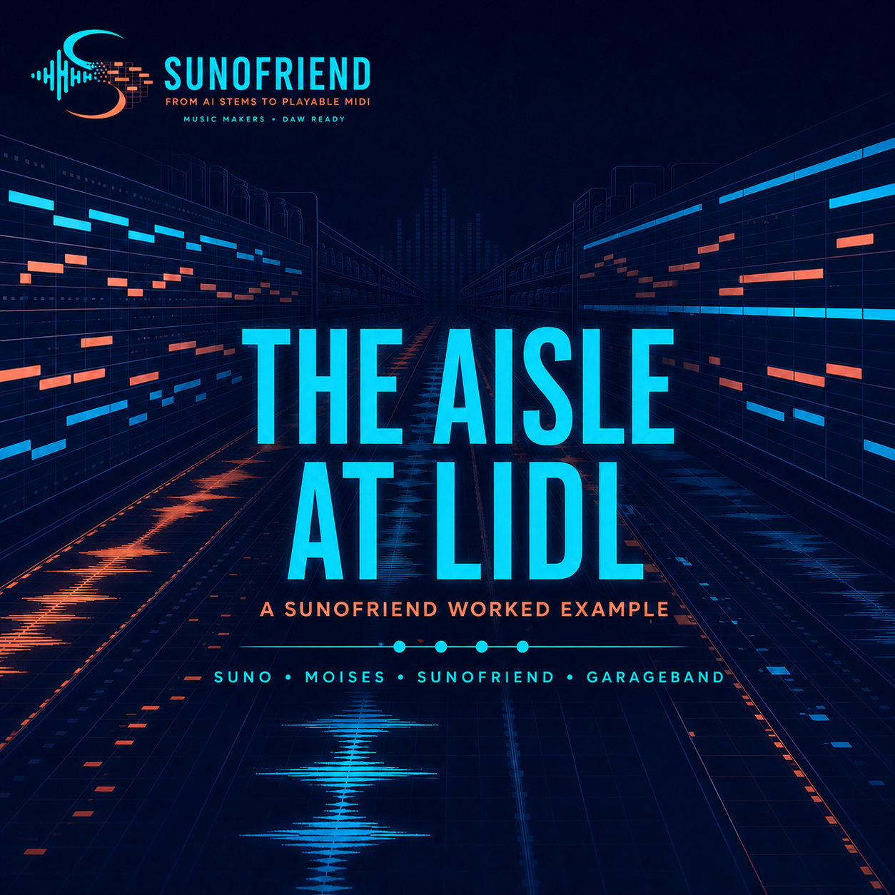

# Sunofriend


Sunofriend converts separated Suno/Moises audio stems into editable,
timing-locked MIDI for GarageBand. It preserves what was actually heard,
separates uncertain alternatives for auditioning, and clearly labels notes
that were repaired or musically inferred.

It complements Suno, Moises and GarageBand rather than replacing them: use
Suno to generate a song, Moises to export stems and chords, Sunofriend to make
clean MIDI resources, and GarageBand to choose instruments and finish the mix.

Sunofriend's main difference is not one transcription model. It preserves and
compares a small set of results from several analytical and AI processes—such
as specialist stem conversion, tracker consensus, conditioned AI and
source-supported repair—because a different method may work best for each
instrument or phrase. The user hears the alternatives and makes the musical
choice; scores and model labels never create an automatic global winner.

## What Sunofriend can do

| Goal | Command | Timing and data contract |
| --- | --- | --- |
| Convert a complete folder of instrumental stems | `listen-all` | Stem-locked MIDI with exact, repair and reconstruct policies |
| Turn lead or backing vocals into playable melodies | `vocal-melody` | pYIN/Basic Pitch consensus, repeated-phrase repair, hummed guidance and editable correction artifacts |
| Compare and conservatively repair vocal trackers | `vocal-trackers` | Immutable pYIN/Basic Pitch evidence, optional RMVPE consensus, and Basic Pitch/GAME boundaries accepted only where pYIN and RMVPE agree on pitch |
| Review a lead melody in musical units | `melody-review` | Hash-checked two-to-eight-bar units, repeat suggestions, MIDI/source auditions, explicit human choices and an unreviewed seed that cannot be applied accidentally |
| Refine one unresolved melody unit | `melody-guide` | A short hum, whistle, single-note rhythm or taps adds a fourth alternative only where the vocal stem supports it |
| Learn review hints from your choices | `melody-profile` | Local, deterministic and advisory ranking built only from explicitly reviewed correction files |
| Apply reviewed melody edits | `melody-apply` | Validated correction JSON becomes tuned GarageBand-ready MIDI |
| Speed up or slow down finished MIDI | `midi-tempo` | Only tempo events change; tracks, notes and groove ticks are untouched |
| Put complete MIDI in a new key and BPM | `midi-transform` | Semitone transposition plus tick-preserving tempo change; channel 10 drums stay fixed |
| Put two performances on one starting bar | `midi-anchor` | Recommended mashup operation: one constant shift preserves natural tempo wander |
| Force stem-derived MIDI onto straight bars | `midi-align` | Experimental 4/4 note-only rebuild through the source metronome map |
| Inventory and sound-match instruments | `instrument-inventory`, `instrument-match` | Installed GarageBand assets and Audio Units, explainable rendered auditions, and optional local OpenL3 evidence |
| Make and function-check an instrument from isolated stem notes | `sample-pack` | GarageBand-selectable AUSampler preset, self-contained SF2 bank, every-performance-pitch usability audition, extraction evidence and advisory sustain-loop auditions |
| Review and apply sampler dynamics | `sample-pack-review`, `sample-pack-apply`, `sample-pack-boundary-review`, `sample-pack-boundary-apply` | Explicit listening gates, reviewed velocity layers/boundaries, SFZ round robin, GarageBand A/B banks and embedded v2 rollback |
| Blind-test reviewed instruments | `sample-pack-ab-review`, `sample-pack-ab-resolve` | Hash-pinned source and neutral Candidate A/B performances with a separate answer key and zero sampler changes |
| Keep MIDI, sound and instrument matches together | `instrument-bundle` | Portable Bundle v1 with performance MIDI, reference audio, rankings, A/B previews and a complete-patch fallback when the source sampler is texture-only |
| Learn from explicit DAW patch choices | `instrument-feedback`, `instrument-profile` | Hash-pinned full-mix/solo decisions become a local advisory role profile with no auto-selection, ranking mutation or playability bypass |
| Store and version reusable parts | `clip-import`, `clip-transform`, `clip-export` | Immutable Clip v1 assets with explicit musical or stem-locked timing |
| Preview or route MIDI to an instrument | `preview`, `play` | FluidSynth WAV preview or CoreMIDI/IAC playback |
| Run an optional local AI transcription challenger | `ai-transcribe` | Isolated worker, explicit local checkpoint, raw candidate, MIDI, hashes and immutable logs |
| Benchmark repeated local AI runs | `ai-benchmark` | Verified path-free timing, memory, chunk and exact-output repeatability report over completed immutable runs |
| Compare one MuScriptor decoding setting | `ai-setting-compare` | Read-only fresh-process beam-size or batch-size 1→2 diagnostic; exactly one semantic setting may change, no MIDI is edited and no winner is selected |
| Blind-test two MIDI candidates on exact source-time loops | `midi-ab-review`, `midi-ab-resolve` | Explicit common time origin, hash-pinned dry same-patch renders, candidate-only fixed-window sample-RMS matching, random hidden per-loop identities, strict reviewed-export verification and no MIDI or default changes |
| Measure exact repeats through one loaded model | `ai-transcribe-session`, `ai-session-benchmark` | Bounded 2–20-request diagnostic session, reused-model warm evidence for requests 2+, and optional two-run fresh-process control; no production cache or promotion |
| Reuse one exact prior MuScriptor result | `ai-transcribe --application-cache-dir`, `ai-cache-benchmark` | Explicit private content-addressed raw-result cache; verified hits start no worker, load no model and run no inference, while current MIDI is rebuilt and cache timing remains separate |
| Compare immutable AI transcription lanes | `ai-matrix` | Path-free per-role quality, label stability, chunk-boundary and cross-lane overlap diagnostics without changing raw MIDI |
| Compare specialist, full-mix and conditioned MIDI by phrase | `hybrid-report` | Read-only S0/M1/M3 agreement and disagreement evidence with explicit verified/unverified lineage boundaries; no MIDI or winner is created |
| Partition one AI result by its reported label | `ai-label-split` | Exact source-event partition plus deterministic requested/complement MIDI auditions and a byte-identical full-candidate control |
| Test one MIDI-defined layer inside a mixed stem | `midi-mask` | Short, local harmonic target plus residual with persisted reconstruction evidence and no automatic promotion |
| Test learned local source cleanup | `ai-cleanup` | Pinned Demucs target plus waveform residual, hard checkpoint verification, deterministic short excerpts and an explicit listening gate |
| Split one reviewed MIDI into audible roles | `midi-role-split`, `midi-role-split-resolve` | Explicit source-event cluster choice, exact primary-note partition, optional independently transcribed residual layer, local A/B review and a hash-verified user-selected recommendation |
| Compare consistent sounds on one fixed MIDI | `timbre-resynthesis` | Level-matched complete-patch, extracted-sampler and source-fitted harmonic-plus-noise auditions with note-by-note silence checks and no MIDI changes |
| Review and hand off multi-process MIDI alternatives in one local site | `workbench` | Loopback-only Project Overview, precise decoded 0.5–15 second per-stem and canonical selected-arrangement loops, exact canonical full-song chunk playback, a bounded full-song timeline, a coarse arbitrary mixer, append-only decisions, private offline review export and an exact-selected-MIDI GarageBand ZIP; no automatic winner or submission endpoint |
| Understand Workbench code and state transitions | `workbench --developer-inspector` | Optional, loopback-only, read-only application operation/state explorer; it is not a line debugger, evaluator, shell or filesystem browser and has no decision, basket, MIDI, render or export effect |
| Learn the workflow and verify one exact GarageBand handoff | `garageband-pack-review`, `garageband-pack-resolve` | Eight-screen interactive tutorial, 10 one-at-a-time comprehension questions, then the two explicit GarageBand and local-usability checks; the resolver re-verifies the downloaded ZIP and has no MIDI, selection, basket, upload or feedback effect |
| Explore reusable Clip v1 parts in Workbench | `workbench --clip-library --phase6-acceptance --phase6-pack` | Phase 6 Increment 6.0 complete: explicit gated read-only browse/search, path-free detail and lineage, neutral audition and deterministic Clip reconstruction; all three flags are required and no Clip, project, decision or basket is changed |
| Propose explicit Clip reuse in Workbench | `workbench --clip-library --phase6-acceptance --phase6-pack --enable-clip-reuse-plan` | Phase 6 Increment 6.1 complete: whole-beat immutable-Clip placements in a separate append-only local proposal with exact restart recovery; no transform, playback, export, current-arrangement or pack effect |
| Create a key- or BPM-transformed Clip alternative | `workbench --clip-library --phase6-acceptance --phase6-pack --enable-clip-transforms` | Phase 6 Increment 6.2a complete: review one same-mode key change or one explicit BPM timing contract, then create one immutable child version; the parent and every project/reuse/pack choice remain unchanged |
| Correct wrong pitches or note attacks in a bounded Clip phrase | `workbench --clip-library --phase6-acceptance --phase6-pack --enable-clip-corrections` | Phase 6 Increments 6.3a–b complete: choose one pitch or attack-velocity patch, inspect up to 64 exact note changes and explicitly create one immutable child; velocity works for drums, while timing, duration, release velocity and the parent remain unchanged |

Development has started on a local-first ensemble of optional transcription
models, phrase-level melody review and learned instrument matching. See the
multi-week **[AI transcription and instrument roadmap](docs/AI_TRANSCRIPTION_ROADMAP.md)**
for Phase 1–7 goals, licence boundaries, success criteria, current checklist
and daily progress log. The measured backend decisions and final listening
gate are in the **[Phase 1 bake-off close-out report](docs/PHASE1_TRANSCRIPTION_BAKEOFF.md)**.
Phase 3 is complete; its implemented instrument features, reproducible golden
evidence and final GarageBand/loop decisions are recorded in the
**[Instrument Intelligence v2 close-out report](docs/PHASE3_INSTRUMENT_INTELLIGENCE.md)**.
Phase 5 now has a useful local Workbench path: existing source and MIDI
artifacts can be reviewed through one loopback-only site, missing comparisons
can be rendered through a consistent cached GM proxy, explicit choices survive
browser/process restarts, and only explicit main/optional decisions become
selected MIDI. GarageBand pack inclusion is a separate saved choice: selected
MIDI and the dry proxy are the safe default, while source audio requires an
explicit opt-in. Phase 5.5 combines the Project Overview with restart-tested
decision safety and Decoded Stem Comparison v1: it resumes into one
state-derived next state/action, shows
truthful per-stem progress without ranking models or exposing technical scores,
and prevents a later **None are usable** or **I cannot tell** outcome from
leaving older MIDI choices active. Its per-stem workspace can also prepare a
precise 0.5–15 second source-versus-MIDI comparison on one decoded Web Audio
clock. Primary candidates are included by default, advanced candidates require
an explicit opt-in, and no play, switch or seek changes a decision or records
an audition event. Phase 5.6 extends that exact transport to a bounded selected
arrangement: the page can prepare the same 0.5–15 second window for
all deduplicated source stems and current explicit main/optional MIDI, then
switch source-only, selected-MIDI, hybrid and main-only groups on one scheduled
clock. Its server-owned manifest prevents the browser from adding arbitrary
tracks. Phase 5.7 adds fixed-window full-song visualization with stale-result
recovery and an exact, chunked full-song transport for those same four
server-owned groups. The arbitrary mute/solo/gain mixer remains a deliberately
coarse HTML-media path; Sunofriend never silently falls back to it when precise
preparation or chunk delivery fails. Phase 5.8 now verifies and explains fresh
subprocess, exact-result cache miss/hit and bounded reused-model-session
provenance. Request one is resident but not warm; only later requests are
reused-model warm, while a cache hit clearly says that no model ran. Workbench
only displays completed evidence and never treats execution reuse as musical
agreement or enables either optimisation. AI candidates carry verified execution/checkpoint
diagnostics; severe decoder failures and zero-note results remain downloadable
evidence but cannot become main or optional choices. The first small-model
M0–M3 matrix also shows that label conditioning can prevent one known full-mix
burst. The private M4 mixed-role review found that two differently conditioned
passes mostly reproduced one line, so Sunofriend now reports candidate-origin
overlap and requires explicit full-mix confirmation for substantially
overlapping selected pairs before handoff. A second private bass/keys/vocal
review found no universal winning lane: the exact
34-note `electric_bass` partition from the metadata-conditioned full-mix pass
was the clear bass choice, while isolated-stem MIDI was the clear keys choice.
The vocal row was marked equivalent, with isolated M3 kept as main and the
38-note M1 sax-labelled partition as optional. These are role-specific golden
results, not an automatic model promotion. Phase 4 has an
evidence-first bass/keys golden, a reviewed pinned Demucs
bass-cleanup challenger, a resolved multi-role MIDI split and a completed
fixed-MIDI timbre comparison. The role review kept the unchanged primary bass
MIDI while retaining the body/pluck split as optional material. The timbre
review preferred the complete General MIDI Synth Bass 2 control; the
source-fitted resynthesis remained a useful consistent alternative, while the
earlier source sampler was rejected. The current experiments, listening order
and promotion rules are in the
**[Cleanup and Neural Timbre Lab](docs/PHASE4_CLEANUP_TIMBRE_LAB.md)**. The
**[Phase 4 stabilization review](docs/PHASE4_STABILIZATION_REVIEW.md)**
compares those executions with the original goals and records the gate before
another model experiment begins. The current Phase 5 programme—including the
completed full-mix/conditioned comparison and local Workbench, followed by
fresh-process and reused-model measurements, an explicit exact-result
application-cache experiment, a completed one-variable beam measurement and
completed blind short-loop review with a resolved private listening result,
plus a completed batch-size 1→2 CPU comparison, the first read-only Phase 5.3
phrase-consensus diagnostic, the multi-process Result Explorer, GarageBand
Pack Composer v1, the explicit disputed-range phrase-review bridge and Project
Overview/Resume v1, Decoded Stem Comparison v1, bounded decoded arrangement
presets, exact canonical full-song chunk transport, verified execution
provenance and Phase 5.9 exact-pack guided acceptance tooling—is
in the
**[Phase 5 multi-process comparison and Result Explorer plan](docs/PHASE5_MUSCRIPTOR_COMMUNITY_PLAN.md)**.
The Phase 5.9 local acceptance gate passed on 22 July 2026: all eight technical
tutorial screens were completed, the quiz scored 10/10 and both six-item human
checks passed without an issue or `cannot_tell` result. The exact pack contained
five selected MIDI payloads, the dry arrangement proxy and no source audio;
the resolver verified its receipt, member set, sizes and hashes while changing
no project state. The first explicitly gated, read-only Phase 6 Clip Library
increment is complete. The separate explicit Clip reuse proposal is also
complete. The first reversible-transform slice is also complete and adds
explicitly reviewed, immutable same-mode key and BPM child versions. The first
two bounded note-correction slices are complete too: a listener can create an
immutable child containing either exact pitch changes or exact Note On attack
velocities, including velocity repair for drum Clips. Broader Phase 6 remains
in progress, and explicit hybrid construction still waits for the
separate Phase 5.3 blind-choice and source-lineage gates. See the
**[Phase 5 local Studio learning and acceptance guide](docs/PHASE5_LOCAL_STUDIO_ACCEPTANCE.md)**.
Developers can follow the code from transcription through append-only state,
exact pack construction and acceptance in the **[Sunofriend technical
tour](docs/TECHNICAL_TOUR.md)**. It also explains the optional Developer
Inspector and the invariants to preserve when adding another analytical or AI
candidate.
The scope and all-or-none launch contract for that work are in
**[Phase 6: Creative Arrangement and Reusable MIDI](docs/PHASE6_CREATIVE_ARRANGEMENT.md)**.
Creative mode remapping, tuning/downbeat transforms, note add/delete,
onset/duration and broader phrase editing, plus Clip reuse beyond the bounded
proposal, remain Phase 6 work, while
cross-DAW and explicitly consented community work is deferred to Phase 7.

For combining songs, first use `midi-transform` to choose a common key, BPM
and tuning, then use `midi-anchor` to place confirmed downbeats on the same
bar. Same-mode key changes are exact semitone shifts, but register, instrument
range and simultaneous chord/melody compatibility still need listening and
arrangement decisions. Use `midi-align` only when a fully straight grid is
more important than preserving the performances' original breathing.

## Hear what it can do

<p align="center">
  
</p>

**[Listen to Version 1 of “The Aisle at Lidl” on SoundCloud](https://soundcloud.com/ezzye-1/the-aisle-at-lidl?si=97cf744ff4a743bca875bec3db88024f&utm_source=clipboard&utm_medium=text&utm_campaign=social_sharing).**

The maintainer wrote the song and has approved it as a public example of a
Suno → Moises → Sunofriend → GarageBand workflow. The repository includes a
compact [worked-example pack](examples/the-aisle-at-lidl/) with repair and
reconstruct MIDI files, role/family alternatives and measured results. The
full stems are intentionally omitted from Git because they total about 765 MB;
the finished audio remains available through SoundCloud.

Ready-to-post artwork and suggested copy for X, Bluesky, Threads, Instagram,
Facebook, WhatsApp and Slack are in the [social media kit](SOCIAL.md). Brand
files and generation notes are under [`assets/`](assets/).

## Use Sunofriend as an AI-agent skill

The repository includes one portable [Sunofriend Agent Skill](skills/sunofriend/)
for Codex and Claude Code. The skill is the conversational front end: it
inventories a stem folder, chooses safe commands, runs capability checks,
keeps source audio local, validates the JSON/MIDI outputs and explains what to
import into a DAW. The packaged Python CLI remains the deterministic audio and
MIDI engine.

The checked-in discovery links expose the same skill without maintaining two
copies:

- Codex reads [`.agents/skills/sunofriend`](.agents/skills/sunofriend).
- Claude Code reads [`.claude/skills/sunofriend`](.claude/skills/sunofriend).

Clone the repository, install Sunofriend as below, start either agent in the
repository and ask, for example:

```text
Use $sunofriend to convert /absolute/path/to/stems into repair-mode
GarageBand-ready MIDI and validate every main part.
```

Installing the Python wheel or `uv` tool installs the deterministic CLI, not
the agent discovery links. Clone-first is therefore the supported skill setup.
To use the same clone from projects elsewhere on the machine, link it into the
two user skill directories (each command fails safely if a skill already
exists there):

```bash
mkdir -p "$HOME/.agents/skills" "$HOME/.claude/skills"
ln -s "$PWD/skills/sunofriend" "$HOME/.agents/skills/sunofriend"
ln -s "$PWD/skills/sunofriend" "$HOME/.claude/skills/sunofriend"
```

Claude Code also supports explicit `/sunofriend ...` invocation. Both tools
can select the skill implicitly for stem-to-MIDI, vocal-melody, tempo,
transposition, mashup-alignment and Clip v1 requests. The skill does not
separate stems, master audio, edit the GarageBand GUI or make audio uploads.
See the current [Codex skill documentation](https://developers.openai.com/codex/skills)
and [Claude Code skill documentation](https://code.claude.com/docs/en/skills)
for personal/global installation options.

## Getting started (macOS)

### 1. Install Sunofriend and its audio tools

Use Python 3.9–3.11; Python 3.11 is the recommended installation target. The
following contributor setup uses the dependency versions tested on Apple
Silicon and installs FluidSynth for offline MIDI previews:

```bash
git clone https://github.com/N9-Developer-Empowerment/sunofriend.git
cd sunofriend
brew install python@3.11 fluid-synth
"$(brew --prefix python@3.11)/bin/python3.11" -m venv .venv
.venv/bin/python -m ensurepip --upgrade
.venv/bin/python -m pip install -c constraints-audio-macos.txt -e '.[all,dev]'
```

For an isolated end-user command rather than an editable development checkout,
install from the cloned repository with `uv`:

```bash
brew install uv fluid-synth
uv tool install --python 3.11 \
  --constraints constraints-audio-macos.txt \
  '.[all]'
sunofriend --version
```

Once a release is published to PyPI, the source argument becomes
`'sunofriend[all]'`. A lightweight install without `[all]` supports pure MIDI
tempo/key/alignment and Clip v1 work, but not audio transcription, preview or
live playback. FluidSynth is deliberately a system dependency rather than a
Python package.

Install the validated GeneralUser GS 2.0.3 SoundFont:

```bash
mkdir -p "$HOME/.local/share/sunofriend/soundfonts"
curl --fail --location \
  "https://raw.githubusercontent.com/mrbumpy409/GeneralUser-GS/684543d5e5efaef08d02be50dcda8d552478fa60/GeneralUser-GS.sf2" \
  --output "$HOME/.local/share/sunofriend/soundfonts/GeneralUser-GS.sf2"
echo "9575028c7a1f589f5770fccc8cff2734566af40cd26ed836944e9a5152688cfe  $HOME/.local/share/sunofriend/soundfonts/GeneralUser-GS.sf2" \
  | shasum -a 256 -c -
```

### 2. Check the installation

```bash
.venv/bin/sunofriend doctor --require convert
```

The command exits successfully when `convert_ready` is true. Use
`--require transcribe` for vocal extraction that does not need FluidSynth,
`--require preview` for offline rendering, `--require playback` for CoreMIDI,
or `--require all` for the complete setup. `listen_ready` remains as a
compatibility alias, while top-level `ready` additionally confirms a live
CoreMIDI destination for `play`. The standard Basic Pitch path uses ONNX
Runtime, so TensorFlow/TFLite warnings are harmless when the transcription or
conversion checks pass.

### 3. Review existing MIDI choices in the local Workbench

The Workbench is the Phase 5 local interface. It does not upload audio, load
third-party scripts or start AI inference. It can explicitly run the existing
FluidSynth preview engine, but every generated file goes into a
content-addressed local cache and discovered MIDI is never changed. Point it
at the original stem folder and one or more narrow directories containing
existing MIDI and optional WAV previews:

Its purpose is to compare results from several processes, not present one
model's transcription as the answer. The current interface provides per-stem
source/candidate playback, explicit main/optional/correction/reject choices,
selected-arrangement audition and an exact-MIDI GarageBand handoff. Phase 5.4
adds two read-only visual views: a current-stem source waveform with coloured
MIDI lanes for comparing processes, and a full-song selected-arrangement
timeline containing every unique source stem plus only the explicit main and
optional MIDI choices. The compare view shows three primary candidates by
default and loads advanced alternatives only when requested; neither view
ranks or changes them. The arrangement view adds temporary show, mute, solo and
level controls plus source-stem, selected-MIDI, hybrid and main-MIDI presets.
Those controls live only in the browser tab and never save feedback or alter
the handoff. Both displays use each file's recorded zero and infer no alignment
offset, so equal displayed seconds are not proof of source/MIDI alignment. The
GarageBand pack composer now makes ZIP inclusion a separate, persistent local
choice instead of inferring it from the arrangement or mixer.

The default **Project overview** is the Phase 5.5 restart/resume surface. It
summarizes only explicit saved decisions, shows one status row per stem and
presents one
next workflow state: compare an undecided stem, revisit a non-terminal decision
with no active part, hear selected parts, compose or resume the pack, or
truthfully stop with no selected MIDI. Any offered action is navigation, not a
score or automatic choice. Reloading restores the URL-hash view/stem, SQLite
decisions, Project Overview state and saved pack basket. It does not restore a
prepared Web Audio transport, decoded chunks, playhead, loop, timeline
viewport/zoom/visibility, show, mute, solo or level controls; those intentionally
start fresh. Connection failures keep navigation
disabled and offer a safe retry with a reminder to use the newest per-launch
URL; nothing is changed by retrying.

```bash
.venv/bin/sunofriend workbench \
  "/absolute/path/to/Song-B minor-113bpm-440hz" \
  --candidate-root "/absolute/path/to/song-midi-output" \
  --open
```

The command prints a `127.0.0.1` URL with a per-launch token. The page shows
the Project Overview first, including inferred key, BPM and tuning, explicit
decisions recorded, selected parts and parts still needing full-mix listening.
A recorded decision means a candidate decision or stem outcome exists; it is
not an accuracy or completion claim. The page then gives each stem no more than three
normal-view candidates. Low-confidence `possible` and `uncertain` files remain
under advanced diagnostics. Choices such as **Use as main**, **Keep optional**,
**Needs correction** and **Reject** are appended to a local SQLite database at
`~/.local/share/sunofriend/workbench/PROJECT_ID/` and restored on the next
launch. **None are usable** and **I cannot tell** are explicit no-selection
barriers: they retain the earlier listening history but deactivate every older
main/optional choice for that stem. A later **Use as main** or **Keep optional**
choice reopens the stem without silently reviving older optional parts; a later
reject/correction does not. Use **Precise short-loop comparison** for the
closest browser A/B. Choose a 0.5–15 second range and prepare the source plus up
to six MIDI candidates. The three primary candidates are included by default;
an advanced candidate joins only after **Include in precise loop** is selected.
Workbench verifies the inputs, renders missing role-neutral MIDI previews and
creates private, content-addressed, verified clips. The source and every
included candidate switch on one decoded Web Audio clock, so they keep one
shared loop and playhead. Every artifact still starts at recorded zero and
Workbench infers no alignment
offset. Preparing, playing, switching, seeking, pausing or stopping this
comparison neither saves a selection nor appends an audition event.

The first Phase 6 increment adds an explicitly gated read-only Clip Library
view. Its launch contract is all-or-none: `--clip-library`,
`--phase6-acceptance` and `--phase6-pack` must be supplied together. The
acceptance result must have passed, and the ZIP must be the exact pack named by
that result. Omitting all three keeps the Phase 5 Workbench unchanged.

```bash
.venv/bin/sunofriend workbench "/absolute/path/to/stems" \
  --candidate-root "/absolute/path/to/results" \
  --catalog "/absolute/path/to/workbench-catalog.json" \
  --state-dir "/absolute/path/to/workbench-state" \
  --clip-library "/absolute/path/to/existing-clip-library" \
  --phase6-acceptance "/absolute/path/to/passed-phase5-acceptance-result.json" \
  --phase6-pack "/absolute/path/to/exact-accepted-garageband-pack.zip" \
  --open
```

This completed first slice is limited to browse/search, path-free details and
lineage, a dry neutral audition and deterministic MIDI reconstruction. The
download is reconstructed from the immutable Clip v1 document; it is not an
original-MIDI byte copy. No transforms, writes, piano-roll editing, placement
or hybrids are enabled. A real local browser check verified 73 Clips in 51
lineages, browse/detail, deterministic MIDI, a dry FluidSynth proxy, a repeat
cache hit, path-free byte-range serving and a Developer Inspector trace with
zero musical or library mutations. See the
[Phase 6 creative-arrangement contract](docs/PHASE6_CREATIVE_ARRANGEMENT.md).

Increment 6.1 adds a separate **Proposed reuse plan** only when the user adds
`--enable-clip-reuse-plan` to that same three-input launch. In **Browse Clips**,
open an exact Clip and enter a target bar/beat; in **Proposed reuse plan**,
inspect or explicitly remove placements. Version 1 places only on whole beats
of a 4/4, 480-TPQ planning grid whose bar 1, beat 1 is recorded zero, not a
confirmed musical downbeat. Reuse v1 does not apply project downbeat evidence;
when such evidence exists, the warning says so explicitly. The server pins the
immutable `clip_id` and object
hash and shows key, BPM, timing, overlap and missing-instrument compatibility
warnings without transforming anything.

```bash
.venv/bin/sunofriend workbench "/absolute/path/to/stems" \
  --candidate-root "/absolute/path/to/results" \
  --catalog "/absolute/path/to/workbench-catalog.json" \
  --state-dir "/absolute/path/to/workbench-state" \
  --clip-library "/absolute/path/to/existing-clip-library" \
  --phase6-acceptance "/absolute/path/to/passed-phase5-acceptance-result.json" \
  --phase6-pack "/absolute/path/to/exact-accepted-garageband-pack.zip" \
  --enable-clip-reuse-plan \
  --open
```

Proposal events are append-only and separate from decisions and the pack
basket. The owner-only database at
`STATE_DIR/phase6-reuse/reuse.sqlite3` is created lazily on the first explicit
action; an empty read creates nothing. Exact project/library/acceptance-pack
binding restores the plan after restart. A conflict reloads current state once
but never automatically retries the user's mutation. Bounds are 64 active
placements, 512 events, 20,000 notes per Clip, 40,000 active note instances
and a 20-minute nominal end. The proposal itself has no transform, render,
play, export, instrument, current-arrangement, pack, feedback or submission
operation. A real local exercise verified place, exact restart recovery,
explicit removal, second restart recovery, append-only history, owner-only
storage, path-free Inspector state and byte-identical decision/library/pack
inputs. Increment 6.1 is complete; broader Phase 6 remains in progress.

Increment 6.2a adds a separate, explicitly enabled transform launch. It is
mutually exclusive with `--enable-clip-reuse-plan`, because the reuse proposal
pins the complete library state while a successful transform deliberately
adds a new library object and catalog row:

```bash
.venv/bin/sunofriend workbench "/absolute/path/to/stems" \
  --candidate-root "/absolute/path/to/results" \
  --catalog "/absolute/path/to/workbench-catalog.json" \
  --state-dir "/absolute/path/to/workbench-state" \
  --clip-library "/absolute/path/to/existing-clip-library" \
  --phase6-acceptance "/absolute/path/to/passed-phase5-acceptance-result.json" \
  --phase6-pack "/absolute/path/to/exact-accepted-garageband-pack.zip" \
  --enable-clip-transforms \
  --open
```

Open a Clip, choose exactly one operation and use **Review temporary
transform**. That projection writes nothing. It shows the exact parent/object
and library pins, before/after key, BPM, timing, duration and pitch facts, plus
alignment or range warnings. Only that current projection enables **Create
immutable Clip version**. A fresh durable action appends one child with an
exact parent, transform recipe and object hash; an exact retry reports the
already-existing child as an idempotent replay and appends nothing. Neither
outcome edits or replaces the parent, chooses a winner, moves a reuse
placement or changes the selected arrangement or GarageBand Pack. The result
panel labels fresh creation and replay separately and exposes the exact
parent/child/object/lineage/library-state evidence.

The first transform slice supports:

- a same-mode key change with an explicit nearest/up/down interval; and
- a BPM change with either **musical** timing, which keeps beats and changes
  elapsed playback time, or **stem-locked** timing, which keeps source seconds
  and changes beat positions for the requested GarageBand tempo.

Use musical timing to make MIDI genuinely faster or slower. It will no longer
line up with untreated audio. Use stem-locked timing when the source audio must
stay at the same seconds; it is a DAW-grid conversion, not an audible speed-up.
One fresh action creates one version, so changing both key and BPM requires
two explicit lineage steps. An exact retry of the same request has all effects
false. A conflict reloads current detail once and never automatically replays
the write. At the accepted 10,000-Clip library boundary the Workbench explains
and disables transform review and creation while existing Clips remain
inspectable, auditionable and exportable. After creating alternatives, restart
Workbench in `--enable-clip-reuse-plan` mode and explicitly place the version
you want.
Major/minor remapping, concert-pitch cleanup and downbeat anchoring remain
deferred: those need a separate musical contract or full MIDI events that Clip
v1 does not currently retain.

The completion exercise used a copy of the accepted Lidl library. A 171-note
B-major bass Clip at approximately 119 BPM produced a musical-timing 125 BPM
child and then a +1-semitone C-major child. The original 10-Clip library stayed
unchanged, the copy contained exactly the two requested additions, both exact
request retries had zero effects, all three lineage versions survived restart,
and the final deterministic MIDI repeated at SHA-256
`42eabbb41cd484d104d67080833710bb240b0d73d817e8af93aa95217b35b502`.
The full project suite passed with 910 tests.

Increments 6.3a and 6.3b add a third separate Clip write launch for
recognition-led pitch and attack-velocity correction. They do not turn the
result explorer into an automatic MIDI repairer. The user chooses one edit
kind and a short exact window, identifies the notes by hearing and by their
visible piano-roll positions, reviews the complete diff and then decides
whether to create a child:

```bash
.venv/bin/sunofriend workbench "/absolute/path/to/stems" \
  --candidate-root "/absolute/path/to/results" \
  --catalog "/absolute/path/to/workbench-catalog.json" \
  --state-dir "/absolute/path/to/workbench-state" \
  --clip-library "/absolute/path/to/existing-clip-library" \
  --phase6-acceptance "/absolute/path/to/passed-phase5-acceptance-result.json" \
  --phase6-pack "/absolute/path/to/exact-accepted-garageband-pack.zip" \
  --enable-clip-corrections \
  --open
```

The correction, transform and reuse-plan flags are mutually exclusive. Each
mode has a different state boundary, and a successful correction changes the
complete library state that the other modes pin. In correction mode:

1. open a Clip and choose **Wrong pitch** or **Attack loudness (MIDI
   velocity)**; pitch is unavailable for drum-family Clips, while attack
   velocity supports drums and pitched instruments;
2. load a phrase of at most 32 quarter-note beats and 15 rendered seconds;
3. select no more than 64 exact existing notes and set either replacement
   pitches, with a maximum two-octave move, or exact attack velocities from
   1–127;
4. use the temporary review and inspect every numeric before/after value plus
   the operation-specific warnings; and
5. use **Create immutable corrected Clip** only when that exact projection is
   intended.

Pitch and velocity never share one draft, projection or child. Reset the
current draft before changing edit kind, or create one child and apply the
second operation as another explicit lineage step. The phrase view and
projection are temporary and write nothing. A fresh create
appends one deterministic child version; an exact retry verifies the existing
child and has zero effects. The parent, timing, note durations, microtiming,
source-second alignment, key, chords, instrument, provenance, current
arrangement, reuse proposal and GarageBand Pack remain unchanged. Pitch patches
also preserve velocity; attack-velocity patches preserve pitch.
The browser accepts a review or result only when its kind-specific schema,
request pins, exact correction/diff, deterministic child identity and complete
effect map agree. Reapplying an unchanged value is a UI no-op and keeps an
already reviewed projection valid; no missing diff rows are reconstructed in
the browser.
Sunofriend rejects a pitch edit that would introduce an ambiguous same-pitch
MIDI overlap or duplicate onset. The exact correction summary remains visible
from the created child's lineage after restart.

For an attack-velocity child, only `ClipNote.velocity` changes. Pitch, onset,
duration, source seconds, microtiming, release velocity, articulation and all
Clip metadata remain exact. MIDI velocity is note-on intensity, not dB, track
volume, CC7/CC11 expression or a guarantee of perceived loudness. A GarageBand
patch may also change brightness or switch sample layers. Notes whose exact
exported channel/onset/pitch would collapse with another Note On remain visible
but cannot be velocity-edited, because changing either source note would not
have a one-to-one audible result.

Correction mode also verifies that every retained note, chord and tempo event,
tempo value, time signature and text meta-event can be encoded by the existing
deterministic Standard MIDI File writer. It bounds parent Clips to 20,000 notes
and 20,000 chords and the exact four-byte MIDI variable-length tick limit. An
unexportable parent fails before preview rather than creating a child that
GarageBand cannot read.

The correction slices still exclude note insertion or deletion, timing,
duration, release velocity, continuous expression, split/merge, quantisation,
repeated-phrase propagation, automatic scale snapping and hybrids. Those are
separate musical operations and need their own evidence and review contracts.
To hear a created correction, inspect its child and use the existing neutral
audition; listening is still not a vote or preference signal.

The completed real-library exercise used a fresh copy of the accepted Lidl
library. An eight-beat window over the 1,727-note keys Clip exposed 22 editable
notes. A deliberate smoke edit changed one B3 note (MIDI 59) to C-sharp 4
(MIDI 61), appended only child
`sf-correction-daa1ce4dca1cd99823af371ffd16ffad9f3a5df387eaaa167245b4daec1767e6`,
and left the source library and copied parent byte-identical. Exact replay had
zero effects, the one-note diff survived restart, every correction response
was path-free and repeated MIDI reconstruction was byte-identical at SHA-256
`ce1edbc85f44b5c37cdb0576c89ef5cd2eee74afe7c9ee6f904ca248f866d4a8`.
The full repository suite passed with 943 tests.

The 6.3b real-library exercise used a fresh copy of the accepted 12-Clip Lidl
library and its drum-channel Snare Clip. A five-note window changed one exact
MIDI pitch-38 hit from attack velocity 101 to 89. The copy grew to 13 Clips;
the source library and copied parent stayed byte-identical; normalized MIDI
changed only that one channel-9 Note On velocity; exact replay had zero
effects; restart recovered the same −12 diff; and two deterministic exports
matched at SHA-256
`f8570c9af8636e3cfeb1605082616a3e1e72f0bdd546b764baf055bca9abbc4c`.
The complete repository suite passed with 955 tests; the single warning is the
existing `resampy`/`pkg_resources` deprecation notice.

The disclosed **Compatibility fallback** keeps the older browser-media players
for environments where decoded audio cannot be prepared. It is synchronised in
seconds, not sample-accurate, and its controls are also feedback- and
event-free. **Render neutral preview** gives candidates for one stem the same
local SoundFont, gain and role-based GM program; it is renderer-consistent but
deliberately does not peak-normalise away MIDI expression. Precise preparation
fails closed unless every candidate preview uses the current SoundFont and
neutral-renderer policy. The renderer copies verified MIDI and SoundFont bytes
to owner-only temporary snapshots, while decoded cropping does the same for the
source and preview audio; those snapshots are removed before results are
published. Primary candidate audio preloads metadata for quick comparison;
advanced alternatives do not preload audio until used, which keeps larger
result spaces responsive.

If a requested loop extends beyond available source or preview audio,
Workbench pads that track's end with generated silence and identifies its
duration in a warning that remains visible while the prepared loop is current.
Do not judge that disclosed padding as a missing transcription. The
private decoded-loop cache is rebuildable: it retains at most 32 recent windows
or 256 MiB, so an older prepared loop may be evicted and prepared again. One
request is also capped at 2 GiB across source audio, candidate MIDI, the
SoundFont and neutral previews, with oversized declared inputs rejected before
preview rendering. Generated loop audio is capped at 64 MiB.
Decoded arrangement excerpts use the same window, input and output bounds and
allow at most 24 total source/MIDI tracks. Stem and arrangement excerpts share
the 32-entry/256 MiB private rebuildable-cache quota; no lane is silently
omitted when a request is too large. Shorten the window if decoded output would
exceed 64 MiB; reduce active optional MIDI lanes if the arrangement exceeds 24
tracks. A project with more than 24 unique source files cannot use this bounded
precise path, but its coarse full-song mixer remains available.

The **Visual result explorer** above those players is evidence, not an editor
or recommendation. Click its common elapsed-seconds axis to move the playhead.
The source lane is a bounded integer-PCM WAV min/max envelope, including the 24-bit
WAVE_EXTENSIBLE files commonly produced by FFmpeg/Moises; unsupported audio
containers remain available to the existing audio player while the visual
explorer says that their waveform is unavailable. MIDI rectangles come from
each file's embedded tempo map and retain per-track titles, channels, programs,
pitches and velocities. They represent note-on/off events only, so sustain,
controller and pitch-bend expression is not drawn. All displayed source and
MIDI inputs are rechecked against their catalogued hashes.

Phase 5.7 keeps long songs usable with a fixed-width viewport rather than a
song-width canvas. Use **Fit song**, **4×** or **16×**, page earlier/later, or
centre the window on the playhead. Only waveform bins and MIDI notes that
overlap the visible window are painted, backing-canvas size is capped and the
device-pixel ratio is bounded. This is drawing virtualisation only: the browser
still downloads and parses the complete server-bounded timeline JSON and builds
its indexes. Per-candidate visual evidence is limited to 20,000 notes and 8 MiB;
one timeline request accepts at most 12 candidates, while the ordinary view
starts with at most three primary candidates. The arrangement visualization is
limited to 24 distinct source lanes, 24 selected MIDI lanes and 40,000 rendered
MIDI notes in total. Oversized evidence fails explicitly; it is never replaced
with an undisclosed coarser projection.

Visualization refreshes cancel older requests and reject stale responses. If a
refresh fails but the last verified timeline still matches the current
selection, it remains visible, is marked stale and offers **Retry visual
evidence**. Otherwise the page shows an explicit unavailable state while audio,
decisions and export continue to work. Canvas context loss likewise exposes a
recovery state and redraws after restoration. This compatible in-tab visual is
not persisted across a browser reload.

For an explicitly linked lead-vocal experiment, **Disputed phrase ranges**
connects the existing S0/M1/M3 diagnostic report to its exact pre-built phrase
review. **Set compare loop** moves the shared playhead to that range without
playing or saving anything; **Open existing phrase review** opens the matching
Basic Pitch/GAME-boundary/combined review unit, with guide-assisted included
only when that review supplies it. The disagreement count identifies
where to listen, not which process is accurate. The bridge itself never chooses
a Workbench candidate, creates hybrid MIDI, appends a Workbench event or changes
a GarageBand pack. Choices made in the separate phrase-review page remain in
its existing reviewed-JSON/export workflow and are not imported or applied
automatically.

MIDI files above 8 MiB or candidates above 20,000 notes remain downloadable
and auditable but are shown as explicitly unavailable visual lanes. The moving
playhead is a lightweight overlay, so ordinary playback does not redraw every
note on every audio progress event. Opening an advanced lane verifies the
source identity once and reuses the already loaded source projection instead
of rebuilding the full waveform.

The **Hear selected arrangement** page includes only the active explicit main
choice and explicit optional choices. Full-mix confirmation is stored with a
`full_mix` listening context. Its full-song explorer shows the source stems and
selected MIDI as separate lanes with one playhead, loop and fit/4×/16× views.
Use **Prepare selected MIDI sounds locally** when a selected lane has no neutral
preview; an existing unnormalised preview is not silently substituted. Source
and MIDI levels are not matched. For a recognisable 0.5–15 second section, use
**Prepare precise arrangement loop**. The server re-derives a path-free,
context-neutral manifest from the current saved state, deduplicates byte-identical
source stems, keeps each selected MIDI lane distinct and supplies the exact
source-only, selected-MIDI, hybrid and main-only groups. All tracks start at
recorded zero; no offset or downbeat is inferred. Group switches are scheduled
on one decoded Web Audio clock, but unity-gain tracks are not level matched and
a dense hybrid can clip. This is not a blind or loudness-matched preference
test.

There are three deliberately distinct arrangement playback paths:

1. **Precise short arrangement loop (Phase 5.6):** a 0.5–15 second decoded
   source-only, selected-MIDI, hybrid or main-only preset on one Web Audio
   clock.
2. **Precise full-song preset (Phase 5.7):** the same four canonical,
   server-owned rosters streamed as exact integer-frame, non-looping chunks on
   one clock. Only the current and next decoded chunks are retained.
3. **Coarse full-song/custom mixer:** separate HTML media elements with
   arbitrary visibility, mute, solo and 0–100 attenuation. They share elapsed
   seconds but are not sample accurate.

The exact full-song path does not add an arbitrary precise mixer. Its request
contains only the current selection-manifest hash and one of the four preset
names; the browser cannot inject track IDs, roles, groups or gains. Every track
starts at recorded zero. The first source fixes the anchor sample rate, the
longest source fixes the end, deterministic integer frame conversion aligns
each chunk and shorter audio is padded with disclosed silence. Tracks remain
separate PCM16 at unity gain, so a dense hybrid can clip; nothing is level
matched or limited. Up to the first two chunks are primed, then the next ready
chunk is scheduled at the exact boundary. If a required chunk is not ready,
playback stops truthfully at the last verified boundary. A chunk that completes
late enables explicit **Play**; an absent or failed chunk enables **Retry**.
Neither path auto-restarts, and no coarse player is started silently.
If the remembered preset has no current tracks, Workbench selects the first
available canonical preset, so a source-only project opens ready to prepare.

Full-song precise presets accept at most 24 tracks, a 20-minute longest source
and 2 GiB of aggregate verified input across song-clock sources plus relevant
selected MIDI, SoundFont and neutral previews. Source and preview geometry is
limited to mono/stereo at 8–96 kHz. Chunks are at most five seconds and may be
shortened to stay within 32 MiB of aggregate PCM16 output and 192 MiB of projected
two-chunk decoded float memory; a stream has at most 480 chunks. Decoded chunks
share the rebuildable 32-entry/256 MiB cache with short precise loops. A server
launch retains at most 16 active stream-plan capabilities and 768 generated
media capability records; an evicted URL returns 404 and can be recovered by
preparing again. These are explicit failures, not permission to omit a lane or
fall back to coarse playback.

Full-song input snapshots use a separate owner-only disk LRU of eight streams
or 2 GiB; the stream just prepared is retained even when it alone exceeds that
quota. Prepare/reprepare fully verifies hashes. Within the same server process,
up to eight verified streams can use cheap file-identity/stat checks for later
chunks instead of rehashing the whole song every five seconds. Any drift drops
that fast path and returns to full verification; missing or altered evidence
fails closed.

Pressing coarse Play or changing its audio preset, mute, solo or gain stops any
prepared precise arrangement transport so the playback contracts cannot be
confused. Timeline visibility is display-only and does not take over playback.
Precise preparation accepts only the current manifest hash, checks again after
the relevant rendering, planning or chunk work before media URLs are
registered, and returns a conflict if another tab changed the selection.
Changing a precise full-song preset creates a new immutable stream and resets
its temporary playhead.
Reloading resets all temporary audition state. Only buttons under
**Save after listening** append a decision.

The arrangement also reports every selected MIDI
pair with the same candidate-origin source audio. It flags a
substantial-overlap warning when at least eight exact-pitch attacks match within
80 ms and those
matches cover at least 80% of each candidate. AI MIDI uses its verified run
source SHA-256; non-AI MIDI without that provenance falls back to the
review-stem source SHA-256. This is a
conservative doubled-line review heuristic, not an accuracy, separation or
preference score. It never removes duplicate notes, merges tracks or changes a
selection, and the arrangement remains available for listening. Before the
**GarageBand pack** can include a substantially overlapping pair, use the
arrangement page to save the latest decision for **both** candidates in
`full_mix` context.

Open **Compose GarageBand pack** after selecting MIDI. Its safe default checks
every active main/optional MIDI file plus the clearly labelled dry proxy pair,
while leaving every source stem unchecked. You may export a smaller MIDI
subset, omit the proxy, or separately opt in and check particular source stems.
The checked basket is saved locally in its own append-only state and does not
change musical decisions, review completion or contribution data. **Build this
exact pack** saves the displayed basket, rechecks its selection/plan hashes and
copies the checked MIDI and source bytes without modification. The generated
ZIP uses deterministic Workbench-generated names, a path-free receipt and
path-free setup instructions. Rejected, needs-correction, superseded and
unreviewed candidates remain excluded. Exact copied MIDI and explicitly opted-in
source audio are not metadata-scrubbed and may retain embedded producer
metadata, so inspect the ZIP before sharing it. The earlier source-free
`sunofriend.workbench-garageband-handoff.v1` endpoint remains compatible.
If no active MIDI remains, Pack Composer explains that no parts are ready and
links back to Project Overview instead of presenting an unusable empty build.

After a pack is built, open **Guided tutorial, 10-question quiz and acceptance
review**. The page follows one fixed sequence:

1. Read all eight short tutorial screens explaining the multi-process result
   space, decisions, audition state, exact pack, timing and instruments.
2. Answer exactly 10 questions, one at a time. A checked answer includes an
   explanation; all 10 must be correct before acceptance unlocks.
3. Complete **Human check 1 of 2** while importing that exact ZIP into
   GarageBand, setting the displayed BPM, confirming drum routing where
   applicable and listening at the beginning, middle and end.
4. Complete **Human check 2 of 2** by confirming the local project was
   intentionally chosen and authorised, then exercising Workbench without
   editing JSON.
5. Export the private reviewed JSON, then resolve it against the exact ZIP you
   downloaded:

```bash
.venv/bin/sunofriend garageband-pack-resolve \
  "/absolute/path/to/garageband_pack_acceptance.reviewed.json" \
  "/absolute/path/to/sunofriend-garageband-pack.zip" \
  --out "/absolute/fresh/path/phase5-acceptance-result.json"
```

The resolver rebuilds the neutral review seed, stream-verifies the ZIP member
set and hashes, recomputes the quiz and checks that each human outcome matches
its answers. The path-free result is `passed`, `needs_changes` or `incomplete`.
Free-text notes remain only in the private reviewed JSON. If a catalog did not
pin a downbeat, a listening pass is labelled `reviewer-observation-only`; it
does not invent downbeat metadata. This workflow records evidence only: it does
not edit MIDI, promote a candidate, change decisions or pack choices, start
Phase 6 automatically, upload audio or record telemetry.

The 22 July 2026 close-out produced `passed`: eight tutorial screens complete,
10/10 on the quiz and two six-item human checks passed with no issues or
`cannot_tell` answers. The accepted pack contained five selected MIDI payloads,
the dry proxy and no source audio. Its downbeat evidence remains correctly
labelled `reviewer-observation-only`. This opens only the read-only Clip entry
gate; it does not open hybrid construction.

If you already have a downloaded pack but not the automatically generated
page, create the same fresh local review explicitly:

```bash
.venv/bin/sunofriend garageband-pack-review \
  "/absolute/path/to/sunofriend-garageband-pack.zip" \
  --out-dir "/absolute/fresh/path/phase5-pack-review"
```

When a discovered candidate belongs to a completed `ai-transcribe` run, its
card also shows the verified model/config, requested and detected labels, note
density, five-second boundary summary, warnings and real-time factor. A severe
decoder burst or a zero-note result is diagnostic-only: the Workbench leaves
its original files available for investigation but disables preview and
main/optional selection. Ordinary label leakage remains auditionable because
the useful musical line may have been assigned the wrong broad family.

The same card now explains five verified execution states without making them
sound like musical scores:

- **Fresh subprocess** ran its own worker, model load and inference.
- **Exact-result cache miss** ran fresh inference and published or verified a
  private cache entry.
- **Exact-result cache hit** ran no worker, model load or inference; its time is
  lookup/materialisation/post-processing pipeline time.
- **Bounded session request 1** had a resident model but no prior transcription,
  so it is not warm.
- **Reused-model warm** applies only to request 2 and later in a fully verified
  closed bounded session, with the application cache disabled.

Workbench starts none of these mechanisms; it only revalidates and displays
completed local evidence. Every card says that execution provenance is not
musical agreement and that no optimisation was enabled by Workbench. Missing
or changed session/run/worker-response/performance evidence fails closed.

Inspect discovery without starting the site:

```bash
.venv/bin/sunofriend workbench "/absolute/path/to/stems" \
  --candidate-root "/absolute/path/to/results" \
  --inspect
```

Export the exact current private review without launching the local server:

```bash
.venv/bin/sunofriend workbench "/absolute/path/to/stems" \
  --candidate-root "/absolute/path/to/results" \
  --catalog "/absolute/path/to/the-reviewed-catalog.json" \
  --state-dir "/absolute/path/to/workbench-state" \
  --export-review "/absolute/fresh/path/workbench-review.json"
```

Reuse the same project, every candidate root, optional `--catalog` and
`--state-dir` used for the reviewed session; changing a catalog prompt or
listening focus creates a different review identity. Omit `--catalog` only when
the reviewed session also used automatic discovery. The output path must not
already exist. This command reads the same append-only SQLite decisions, writes
atomically and exits without opening a browser or starting an HTTP server. The
JSON is a private archive: unlike the separate contribution preview, it may
contain absolute local paths and free-text notes.

Automatic discovery is intentionally conservative. If filenames do not make
the source/candidate role clear, provide an explicit
`sunofriend.workbench-catalog.v1` JSON through `--catalog`; candidate files
must still be inside the project or an explicitly named `--candidate-root`.
Role tags are one-line musical descriptions of at most 80 characters, not file
references. New path-like roles are rejected. A legacy saved role
that contains a POSIX, home-relative, Windows, UNC or relative local path is
kept in private history and the full private review, while path-free browser,
timeline and pack surfaces use **custom role**, including ZIP names and
generated proxy-MIDI track names.
For a focused experiment, each catalog stem may also supply a plain-language
`review_question` and a `listening_focus` list. The page shows these prompts
without preselecting a candidate or turning them into scoring criteria. Their
hash is part of the local review identity, so changing the question starts a
fresh decision row instead of reusing an answer to an older task. Full prompt
text stays in the private export and is excluded from contribution preview.
The browser can export the complete local review JSON and separately previews
the metadata-only fields that a future opt-in contribution could contain.
Submission is not implemented or enabled in this slice. Existing preview WAVs
are not assumed to be comparable, so prefer the cached neutral previews before
treating sound differences as a MIDI preference. An optional `--soundfont`
pins a specific local GM bank; otherwise the normal
`SUNOFRIEND_SF2`/installed GeneralUser-GS lookup is used.

An existing Phase 5 lead-vocal disagreement report can be linked only through
an explicit catalog stem. Include all exact S0/M1/M3 MIDI files as candidates
and add:

```json
{
  "phrase_review_link": {
    "hybrid_report": "/absolute/path/to/hybrid-report.json",
    "phrase_review_manifest": "/absolute/path/to/phrase_review.json"
  }
}
```

Both JSON files, the three MIDI files and the review package must stay inside
the project or an explicitly named `--candidate-root`. Sunofriend verifies the
report, source, candidate, review-manifest, phrase geometry and exposed audio
hashes before the site starts. It does not search for or guess a phrase review.
The existing review page is private and may contain local paths; the loopback
server gives it a fresh per-launch capability URL and serves only its pinned
HTML and semantically allow-listed source, MIDI-only and overlay WAV
auditions—never the manifest, MIDI, correction seed or arbitrary neighbouring
files.

See the [Workbench guide](docs/WORKBENCH.md) for the catalog schema, decision
semantics, handoff contents, privacy boundary and current Phase 5 limits.

### Optional: run a Phase 1 AI transcription challenger

The experimental AI runtime is isolated from the stable Python 3.9 CLI. Set
it up and check it independently:

```bash
brew install uv
scripts/setup-ai-runtime.sh
.venv/bin/sunofriend ai-doctor --require muscriptor
```

MuScriptor code is installed, but its gated CC-BY-NC-4.0 checkpoint is not
downloaded or accepted for you. After you have personally accepted those
terms and placed the checkpoint on disk, transcribe a short authorised excerpt
with an explicit local path:

```bash
.venv/bin/sunofriend ai-transcribe \
  "/absolute/path/to/lead-vocal.wav" \
  --checkpoint "/absolute/path/to/accepted/model.safetensors" \
  --out-dir "/absolute/path/to/work/ai-bakeoff/my-song" \
  --bpm 119 \
  --start-seconds 30 \
  --end-seconds 45 \
  --device auto
```

The standard small-model location is
`~/.local/share/sunofriend/models/muscriptor-small/model.safetensors`. Once it
exists, verify both code and weights with:

```bash
.venv/bin/sunofriend ai-doctor --require muscriptor-checkpoint
```

At that location `--checkpoint` may be omitted. Another accepted local
checkpoint must have an adjacent valid `config.json` whose `model_type` is
`muscriptor` and whose `variant` is `small`, `medium` or `large`; pass the
checkpoint through `--checkpoint` or `SUNOFRIEND_MUSCRIPTOR_MODEL`.

Every MuScriptor run records the adjacent model `config.json` hash and the
effective batch, beam, CFG, sampling and model-size settings. The pinned 0.2.1
runtime processes independent five-second chunks and does not expose prelude
forcing; `--prelude-forcing` therefore fails clearly instead of recording a
feature that did not run. The conservative baseline is batch 1, beam 1 and CFG
1.0.

After producing fresh immutable lanes from the same backend, checkpoint, model
config, worker, model/runtime version and execution settings, build one report
using the model-neutral quality schema. Each lane value is a completed run
directory and the report path must not exist:

```bash
.venv/bin/sunofriend ai-matrix \
  --lane "M0=/absolute/path/to/full mix unconditioned/RUN" \
  --lane "M1=/absolute/path/to/full mix discovered labels/RUN" \
  --lane "M2=/absolute/path/to/full mix known labels/RUN" \
  --lane "M3-bass=/absolute/path/to/isolated bass/RUN" \
  --lane "M3-keys=/absolute/path/to/isolated keys/RUN" \
  --out /absolute/path/to/reports/small-model-matrix.json
```

`ai-matrix` rechecks source, worker, checkpoint, model config, request, all raw
artifacts, candidate and MIDI hashes. It reports quality per instrument,
requested/detected-label
differences, five-second-boundary activity and same-pitch/onset overlap between
full-mix and isolated-role lanes. These are diagnostics, not an automatic
accuracy score or winner; audition safe candidates in the Workbench. Every M4
lane must use the same source audio, excerpt and positive BPM, request exactly
one distinct role, and share the matrix's normal execution/checkpoint controls.
The additional M4 overlap report shows possible duplicated or relabelled notes,
not correct separation.

When one M4 pass contains both its requested label and off-role labels, create
an auditable listening derivative without re-running the model:

```bash
.venv/bin/sunofriend ai-label-split \
  "/absolute/path/to/completed/M4-run" \
  --label clean_electric_guitar \
  --out-dir "/absolute/path/to/fresh-label-split"
```

This writes `requested-label.mid`, `unexpected-label-complement.mid`, a
byte-identical `unchanged-full-candidate.mid` and an exact source-index JSON
partition. Byte-identical `source-request.json` and `source-candidate.json`
controls let Workbench prove that the partition still matches the verified raw
candidate; they are private provenance and can contain local paths, so do not
publish them. It is a partition of model-reported labels, not audio/source
separation or proof of a physical instrument. The JSON accounts for every raw
event exactly. Its audition MIDI uses integer pitch and a 1/480-beat tick grid;
the report records pitch/time quantisation, duplicate-onset collapse and
same-pitch overlap truncation instead of claiming those renders are lossless.
Keep the full candidate as the mandatory control and retain the complement. A
requested label with zero events is no-evidence and the Workbench blocks it
from audition and main/optional use; a non-empty derivative remains
review-required and is never promoted automatically.

#### Compare S0, M1 and M3 by musical phrase

Use `hybrid-report` after the three existing MIDI candidates have been put on
the same excerpt timeline and each has its matching evidence. It starts no AI
model and emits no MIDI:

```bash
.venv/bin/sunofriend doctor --require convert

.venv/bin/sunofriend hybrid-report \
  "/absolute/path/to/exact-source-excerpt.wav" \
  --role lead \
  --bpm 119 \
  --candidate "S0=/absolute/path/to/specialist.mid" \
  --evidence "S0=/absolute/path/to/specialist-provenance.json" \
  --candidate "M1=/absolute/path/to/full-mix-label.mid" \
  --evidence "M1=/absolute/path/to/ai_label_split.json" \
  --candidate "M3=/absolute/path/to/conditioned-stem.mid" \
  --evidence "M3=/absolute/path/to/review-projection.json" \
  --phrase-review "/absolute/path/to/phrase_review.json" \
  --out "/absolute/fresh/path/hybrid-report.json"
```

Lane names are exact and case-sensitive. Version 1 is lead-melody only, so
`--role` must be `lead`. S0 is the specialist Sunofriend MIDI plus provenance
v1, whose `source_stem` must resolve to the exact WAV passed to this command;
M1 is an exact model-label audition derivative from a MuScriptor full-mix
run; M3 is the timeline-projected conditioned-stem MIDI. The source WAV, BPM
and phrase review must describe the same zero-based excerpt timeline. The
output is path-free through schema-owned field projection and records exact
pitch/onset matches within 80 ms, cross-phrase matches, same-note
boundary/duration disputes, octave-equivalent disputes, lane-only notes,
duplicates, raw source support, validated repetition evidence and the phrases
with most disagreement. Segmentation length states/warnings and repetition
lag/duration ratios are recomputed from the phrase geometry before publication.
Notes in phrase-review gaps are counted explicitly.

The verifier can hash-check S0 and M3 against the supplied source bytes and can
check M1's rendered MIDI hash and tick-level note signatures. It also validates
the no-mutation claims and exact-label bookkeeping recorded by the supplied
manifests. It cannot prove that M1's pinned full mix was derived from this song,
because the current artifacts do not contain a reproducible mix-lineage
manifest. It likewise cannot compare M3 with its original pre-projection MIDI,
because that payload is not an input. Both limitations are written into the
report and printed as `lineage_status` by the command; do not describe either
relationship as verified. A later lineage manifest must pin the input stems,
time window, mix graph/gain/codec and output before that claim can be upgraded.

This is diagnostic evidence, not a majority vote. Agreement does not prove a
note is correct; raw spectrum support can reward harmonics or bleed; octave
equivalence remains a disagreement; and chord evidence is marked unavailable
until an exact excerpt timeline is hash-pinned. The v1 command never changes a
candidate, chooses a winner, writes a hybrid MIDI, updates the Workbench or
changes a default. A later increment will turn the highest-value disagreement
phrases into an explicit listening review before any H1 challenger is built.

For an independent vocal-specific result, install GAME's pinned official
v1.0.3 small ONNX release explicitly, then run the same authorised excerpt:

```bash
scripts/setup-game-model.sh
.venv/bin/sunofriend ai-doctor --require game

.venv/bin/sunofriend ai-transcribe \
  "/absolute/path/to/lead-vocal.wav" \
  --backend game \
  --out-dir "/absolute/path/to/work/ai-bakeoff/my-song/game" \
  --bpm 119 \
  --instrument voice \
  --start-seconds 30 \
  --end-seconds 45 \
  --language en \
  --device cpu \
  --seed 0
```

The setup script clones the tagged MIT-licensed GAME code and downloads the
official release asset only when the script is deliberately invoked. It pins
the tag commit, release ZIP SHA-256 and all six extracted component hashes.
Inference itself accepts only the existing local ONNX directory, defaults to
`~/.local/share/sunofriend/models/game-1.0.3-small-onnx/GAME-1.0.3-small-onnx`,
and never contacts the network. Override that location with `--checkpoint` or
`SUNOFRIEND_GAME_MODEL`.

GAME preserves its floating MIDI pitch and separate voiced/unvoiced regions in
`candidate.raw.json`; the playable MIDI rounds pitch only at the final MIDI
boundary. Its diffusion boundary decoder is stochastic unless seeded, so
Sunofriend defaults to and records `--seed 0`. `--boundary-threshold`,
`--boundary-radius-ms`, `--presence-threshold` and `--game-steps` expose the
official inference controls for deliberate bake-offs. GAME currently runs
through ONNX Runtime's CPU provider; `mps` is rejected rather than silently
falling back.

RMVPE is the independent frame-level F0 challenger. Its setup is also a
separate, explicit network action:

```bash
scripts/setup-rmvpe-model.sh
.venv/bin/sunofriend ai-doctor --require rmvpe

.venv/bin/sunofriend ai-transcribe \
  "/absolute/path/to/lead-vocal.wav" \
  --backend rmvpe \
  --out-dir "/absolute/path/to/work/ai-bakeoff/my-song/rmvpe" \
  --bpm 119 \
  --instrument "lead vocal" \
  --start-seconds 30 \
  --end-seconds 45 \
  --device cpu
```

This pins `rmvpe-onnx==0.2.3`, the MIT-labelled
`lj1995/VoiceConversionWebUI` model revision
`b2c8cae96e3b05de46d36c5ef9970ef6cbccafba`, and checkpoint SHA-256
`5370e71ac80af8b4b7c793d27efd51fd8bf962de3a7ede0766dac0befa3660fd`.
The authors' reference code is Apache-2.0; the ONNX adapter and labelled model
distribution are MIT. The model stays outside the repository. Normal
diagnostics and inference accept only the existing local `.onnx` file and do
not contact the network.

`rmvpe.frames.json` preserves every model F0 and confidence observation at
about 10 ms resolution. `candidate.raw.json` contains a conservative,
deterministic note draft produced from those frames using a confidence gate,
five-frame median smoothing, short same-pitch gap bridging, pitch hysteresis
and minimum-note cleanup. Tune that explicitly with
`--confidence-threshold`, `--minimum-note-ms`, `--maximum-gap-ms` and
`--pitch-change-semitones`. The frame artifact is the primary model evidence;
the decoded notes are Sunofriend's versioned adapter output, not note
boundaries supplied by RMVPE.

PESTO is the small optional second F0 oracle. It is useful for independent
pitch-class evidence, not as another automatic winner. Install its LGPL-3.0
package in the isolated runtime, fetch the pinned checkpoint explicitly and
run it on the same short excerpt:

```bash
scripts/setup-pesto-model.sh
.venv/bin/sunofriend ai-doctor --require pesto

.venv/bin/sunofriend ai-transcribe \
  "/absolute/path/to/lead-vocal.wav" \
  --backend pesto \
  --out-dir "/absolute/path/to/work/ai-bakeoff/my-song/pesto" \
  --bpm 119 \
  --instrument "lead vocal" \
  --device cpu
```

The setup pins `pesto-pitch==2.0.1` and `mir-1k_g7.ckpt` SHA-256
`16c32e06ddd950e3e4866dfa3c7f8a87c4988f8adf43e57977b189f031f26f3e`.
Every run preserves `pesto.frames.json` plus the untouched activation matrix
in `pesto.activations.npy`. Use `--pesto-step-ms`, `--pesto-reduction`,
`--pesto-chunks` and the shared frame-to-note controls only for deliberate
bake-offs. Phase 1 retains PESTO as a vocal F0 oracle and rejects its decoded
MIDI for the current bass golden; it is not part of automatic consensus.

Demucs is the optional Phase 4 learned-cleanup challenger. Its code is MIT,
but the official repository does not state separate terms for the pretrained
checkpoint. Sunofriend therefore keeps the checkpoint external, uses it only
for private local evaluation, and never vendors or redistributes it. After
reading that notice, install the exact official `htdemucs` checkpoint and
verify both code and weights explicitly:

```bash
SUNOFRIEND_ACCEPT_DEMUCS_PRIVATE_EVALUATION=1 \
  scripts/setup-demucs-model.sh
.venv/bin/sunofriend ai-doctor --require demucs
```

This pins `demucs==4.0.1`, model signature `955717e8` and checkpoint SHA-256
`8726e21a993978c7ba086d3872e7608d7d5bfca646ca4aca459ffda844faa8b4`.
The normal AI runtime setup installs code only; model setup is a separate,
deliberate action.

Add a repeated `--instrument "exact MuScriptor name"` to restrict the model.
Every invocation creates a new run directory and refuses to overwrite an old
one. It contains the request, raw and validated candidates, `candidate.mid`,
worker logs, source/checkpoint hashes and a final `run.json`. It now also
writes:

- `candidate.quality.json`, which flags decoder bursts, implausible density,
  duplicate rectangles, extreme polyphony and restricted-label leakage;
- `candidate.programs.json`, which maps each model role to a conservative
  zero-based General MIDI audition program without changing any note or raw
  model evidence;
- `candidate.expression.json`, containing note-local source-energy evidence;
- `candidate.expression.mid`, with relative source-derived velocities when
  the model supplies none; and
- for MuScriptor, `muscriptor.performance.json`, containing fresh-process
  audio-preparation, model-load, inclusive-transcription, first-note,
  first-completed-chunk, chunk-count and process-RSS evidence. Inclusive
  transcription is iteration of MuScriptor's lazy `model.transcribe` result,
  so it includes the backend's preprocessing, condition construction and
  decoding; it is not a model-forward-only timer. Timing stays outside
  `candidate.json`, so repeated deterministic note output can still be compared
  byte for byte.

Frame-producing backends may declare additional immutable evidence. RMVPE adds
`rmvpe.frames.json`; PESTO adds `pesto.frames.json` and
`pesto.activations.npy`. Every artifact is confined to the run directory and
included with its own hash in `run.json`.

The raw candidate is never mutated. `candidate.mid` therefore keeps neutral
velocity when a backend supplies none, while the separate expression MIDI is
the more playable audition. A model alias such as `small` or a URL is
deliberately rejected so inference cannot trigger an unrecorded checkpoint
download. Neither MIDI has undergone Sunofriend melody repair. Do not promote
or audition a candidate whose quality status is `review-required` until its
warnings have been understood; extreme polyphony can overload a synth.

Compare two or more completed, exactly comparable MuScriptor repetitions
without launching a model:

```bash
.venv/bin/sunofriend ai-benchmark \
  --run "/absolute/path/to/repetition-01/RUN_DIR" \
  --run "/absolute/path/to/repetition-02/RUN_DIR" \
  --out "/absolute/fresh/path/small-cpu-fresh.json"
```

`ai-benchmark` reuses the strict immutable-run verifier and requires the same
source hash, requested and actually processed excerpt, BPM, requested roles,
device, checkpoint, model config, worker, execution profile, platform/
architecture, Python, PyTorch and MuScriptor versions. It reports pipeline,
worker and inclusive-transcription real-time factors; model-load and first-note
times; chunks; process peak RSS; five-second-boundary diagnostics; and exact
candidate/MIDI repeatability. Every real-time factor uses actual processed
audio duration verified from the pinned source frames, including an excerpt
clipped at end-of-file. Repetition timestamps must be timezone-aware and their
execution windows must not overlap, so a contended concurrent run cannot be
presented as a first-versus-later comparison. The output is
path-free, written only to a fresh path and cannot promote a musical candidate.
Legacy runs remain comparable only while every hash-pinned external source,
checkpoint, config and worker file is still unchanged; older historical
goldens whose external worker has since changed cannot be re-verified. A pre-
session/cache v1 manifest that lacks the newer execution fields is accepted
only when it records a successful non-empty subprocess command and contains no
session or application-cache evidence; the report labels that legacy evidence
explicitly. A legacy run without performance evidence is reported as
unavailable rather than guessed.

Current runs are one fresh worker process and one model load per repetition.
The operating-system file cache is uncontrolled, so a second run is **not** a
warm-model benchmark. On the first 15-second Lidl small-model CPU baseline,
two repetitions produced byte-identical 107-note MIDI. Median pipeline time
was `5.189 s` (RTF `0.346`), worker subprocess time `5.115 s`, model load
`0.291 s`, inclusive transcription `3.655 s` (RTF `0.244`), first completed
note `1.580 s`, first completed five-second chunk `2.541 s`, and process peak
RSS about `1.06 GiB`. The first/later wall ratio was `1.117`; that difference
is evidence under an uncontrolled OS cache, not a claimed warm-start gain. The
five reviewed Phase 5.1 selections and GarageBand handoff hashes remained
unchanged.

#### Compare beam 1 with beam 2

`ai-setting-compare` answers one narrow question at a time without launching a
model. First create at least two independent fresh-process controls with
`--beam-size 1` and at least two challengers with `--beam-size 2`. Keep the
source bytes, actual excerpt, BPM, ordered roles, checkpoint, model config,
worker, runtime, device, model size, batch size, CFG, temperature, sampling/EOS
policy and five-second chunk policy identical. Then pass the completed run
directories printed by `ai-transcribe`:

```bash
SOURCE="/absolute/path/to/fixed-15-second-source.wav"
CHECKPOINT="/absolute/path/to/accepted/model.safetensors"
RUN_ROOT="/absolute/path/to/fresh/beam-runs"

for REPETITION in 01 02; do
  .venv/bin/sunofriend ai-transcribe "$SOURCE" \
    --checkpoint "$CHECKPOINT" \
    --out-dir "$RUN_ROOT/beam1-repeat-$REPETITION" \
    --bpm 119 \
    --instrument voice \
    --instrument drums \
    --instrument electric_bass \
    --start-seconds 0 --end-seconds 15 \
    --device cpu --model-size small \
    --beam-size 1 --batch-size 1 --cfg-coef 1.0
done

for REPETITION in 01 02; do
  .venv/bin/sunofriend ai-transcribe "$SOURCE" \
    --checkpoint "$CHECKPOINT" \
    --out-dir "$RUN_ROOT/beam2-repeat-$REPETITION" \
    --bpm 119 \
    --instrument voice \
    --instrument drums \
    --instrument electric_bass \
    --start-seconds 0 --end-seconds 15 \
    --device cpu --model-size small \
    --beam-size 2 --batch-size 1 --cfg-coef 1.0
done

.venv/bin/sunofriend ai-setting-compare \
  --setting beam-size \
  --control-run "$RUN_ROOT/beam1-repeat-01/RUN_DIR" \
  --control-run "$RUN_ROOT/beam1-repeat-02/RUN_DIR" \
  --challenger-run "$RUN_ROOT/beam2-repeat-01/RUN_DIR" \
  --challenger-run "$RUN_ROOT/beam2-repeat-02/RUN_DIR" \
  --out "/absolute/fresh/path/beam1-vs-beam2.json"
```

Replace each `RUN_DIR` placeholder with the immutable child directory printed
by that invocation. Use the complete ordered role list needed by the real test;
the three roles above keep the example short. Run all four serially and do not
add `--application-cache-dir`.

The v1 verifier accepts only current, cache-disabled `fresh-subprocess` runs
that each loaded the model, executed inference and contain verified performance
evidence. It requires exact raw candidate, normalized candidate, note payload,
MIDI, derived-artifact and note-count repeatability within each arm. Session
runs, every application-cache-enabled run, overlapping execution windows,
legacy manifests, a non-repeatable arm, no beam change, beam values other than
1→2 and every second request/execution difference are rejected.

Candidate JSON and raw-candidate hashes normally differ between arms because
they record beam/strategy provenance. The report therefore compares a separate
canonical note-payload hash and the MIDI hash before saying whether musical
output changed. Labels, automated quality, chunk-boundary activity, timing and
memory remain diagnostics; none proves which result is more accurate. Runs are
sequential, but their order is not randomized and the operating-system file
cache remains uncontrolled, so timing ratios are observations rather than a
causal speed claim.

The report copies no audio or MIDI, omits local paths, commands, timestamps and
caller-supplied run IDs, and changes no candidate, Workbench decision, preset or
default. Hashes and runtime identity may still identify private material or a
machine, so path-free does not mean anonymous or approved for publication. If
the note payload or any auditionable MIDI differs, a same-patch,
same-render-policy preview is a useful preliminary check, but it does not
satisfy the promotion gate. Before
considering any default change, compare the same source-aligned loop with the
same renderer and patch and separately verify the candidates are level-matched.
Beam 1 remains the conservative baseline until that explicit listening gate
prefers beam 2 without an unacceptable stability or resource regression.

On the private 15-second Lidl M2 small-CPU golden, both repetitions within each
arm were exact. Beam 1 produced 107 notes; beam 2 produced 124, including a new
12-note `voice` label, 14 more `electric_bass` notes and 11 fewer `flutes`
notes. Ninety same-pitch/same-label onsets matched within 80 ms (84.1% of beam
1 and 72.6% of beam 2). Both arms remain `review-required` because restricted
label leakage was present, so these differences do not establish accuracy.
The ordered golden observed a beam-2 median pipeline time of `32.787 s` versus
`5.282 s` for beam 1 (`6.207×`), inclusive transcription was `31.177 s`
versus `3.824 s` (`8.152×`), first completed note was `10.909 s` versus
`1.554 s`, and peak RSS
was about `1.49 GB` versus `1.17 GB`. The musical outputs differ, so the
preliminary same-patch Workbench pair cannot close the separately verified
level-matched listening gate; beam 1 remains the default.

#### Blind-review two MIDI candidates on exact source-time loops

Use `midi-ab-review` when two different MIDI files need a stricter musical
comparison than the normal Workbench audition. Supply one or more
non-overlapping source-time intervals. Each interval must last from 0.5 to 15
seconds, stay inside the reference WAV and include a short statement of what to
listen for:

```bash
.venv/bin/sunofriend doctor --require preview

.venv/bin/sunofriend midi-ab-review \
  "/absolute/path/to/source.wav" \
  "/absolute/path/to/beam-1.mid" \
  "/absolute/path/to/beam-2.mid" \
  --interval 0.0 5.0 "opening attacks and missing bass notes" \
  --interval 10.0 15.0 "recognisable contour and distracting extra notes" \
  --bpm 119 \
  --midi-time-at-source-start 0 \
  --gm-program 4 \
  --soundfont "/absolute/path/to/pinned-bank.sf2" \
  --question "Which candidate is more musically useful?" \
  --out-dir "/absolute/fresh/path/beam-listening-review"
```

`--midi-time-at-source-start` is required. It declares the candidate MIDI time
that corresponds to reference-WAV time zero and must land exactly on a source
sample frame. Use `0` only when the WAV and both MIDI files share the same
excerpt origin; Sunofriend applies the supplied origin to both candidates and
never infers an alignment offset. `--gm-program` is zero-based and defaults to
4. `--soundfont` and `--question` are optional; normal SoundFont discovery is
used when no bank is supplied. The output directory must be fresh. The builder
preserves both input MIDI files, rewrites only private neutral audition proxies
and renders A and B with the same pinned dry FluidSynth executable, SF2, GM
program, sample rate and gain. Each source and candidate file is cut at the
corresponding exact rounded frame bounds under that explicit alignment.

Within each loop, only the two candidate renders are level-matched: the louder
candidate is attenuated to the quieter candidate's fixed-window sample RMS.
The reference source is intentionally left at its original level. No candidate
is amplified and no limiter, compression, EQ, time shift or time stretch is
used. Both candidate windows must reach at least -60 dBFS RMS or the package is
rejected. This is sample-RMS matching, **not** LUFS, true-peak or
perceived-loudness matching; judge notes, pitch, timing, contour and clutter
rather than loudness alone.

Open `midi_ab_review.html` without opening the separate
`midi_ab_answer_key.json`. For every loop, listen to the source, Candidate A
and Candidate B, tick all three **I heard...** boxes, choose A, B,
**Equivalent**, **Neither** or **I cannot tell**, and optionally add a private
note. Mark all choices reviewed, then export `midi_ab_review.reviewed.json`.
If an embedded browser blocks downloads from a local `file://` page, open the
same HTML in Safari, Chrome or Firefox; the package remains entirely local.
Audio automatically loops, and source/A/B share a playhead only inside their
own review unit. A secret random nonce assigns A/B separately per loop; only a
public nonce commitment appears in the seed and page, while the nonce and
identity mapping remain in the answer key. Resolve the hidden identities only
after export, supplying the original unchanged package directory as a separate
trust anchor:

```bash
.venv/bin/sunofriend midi-ab-resolve \
  "/absolute/path/to/midi_ab_review.reviewed.json" \
  --package-dir "/absolute/fresh/path/beam-listening-review" \
  --out "/absolute/fresh/path/beam-listening-result.json"
```

The resolver compares the reviewed export with the original seed, key,
manifest, audio and inputs. Only review status/count, the heard flags, choice
and notes may change. It rejects changed timing/focus/geometry, swapped A/B
slots or candidates moved across units before reporting per-loop identities
and preference counts. Normal browser JSON export may rewrite an equal finite
number's spelling, such as `0.0` to `0`; this is accepted without accepting a
boolean, string, different numeric value or structural change. Neither command
edits MIDI, selects a Workbench candidate, promotes a preset or changes a
default.

The Phase 5.2 private package now exists under ignored
`work/ai-bakeoff/lidl-phase5-beam-rms-review-v4/`, commitment
`b5e3556f70560c86cbe79fbcc4bb7d9a8362c67824beed203bffa0675162dd10`.
It contains exact 0.20–3.50, 3.50–7.50 and 11.60–15.00 second windows at 48
kHz, explicit common origin `0`, GeneralUser-GS program 4 and SoundFont hash
`9575028c7a1f589f5770fccc8cff2734566af40cd26ed836944e9a5152688cfe`.
FluidSynth 2.5.6 is pinned by hash
`93589cfaf73a5aaaaf37dd313be4d815fb2ced8f0e8ae641b0e1d0026e546911`;
every final A/B PCM RMS pair is equal to six decimal places and unclipped. The
resolved review found the opening and final loops equivalent and marginally
preferred beam 1 on the 3.50–7.50 second loop. Beam 2 won no loop. Resolution
reported zero MIDI edits, source mutations, selection changes, promotions and
default changes, so beam 1 remains the conservative default. The standalone
page still switches browser media at a shared position per unit rather than
decoded sample accuracy. Workbench now has separate one-clock decoded
transports for bounded per-stem comparisons and canonical selected-arrangement
excerpts and exact chunked full-song canonical presets. Arbitrary precise
custom mixes remain deferred; the existing mute/solo/gain full-song mixer is
explicitly coarse.

#### Compare batch size 1 with batch size 2

The same comparator has an explicit `--setting batch-size` mode. Create at
least two independent batch-1 controls and two batch-2 challengers with beam 1,
greedy decoding, sampling disabled and every other input and setting unchanged.
Keep the current independent five-second chunk policy fixed in both arms:

```bash
.venv/bin/sunofriend ai-setting-compare \
  --setting batch-size \
  --control-run "/absolute/path/to/batch1-repeat-01/RUN_DIR" \
  --control-run "/absolute/path/to/batch1-repeat-02/RUN_DIR" \
  --challenger-run "/absolute/path/to/batch2-repeat-01/RUN_DIR" \
  --challenger-run "/absolute/path/to/batch2-repeat-02/RUN_DIR" \
  --out "/absolute/fresh/path/batch1-vs-batch2.json"
```

Batch mode retains the same fresh-process, repeatability, non-overlap, cache
and one-variable checks as beam mode. It additionally requires batch 1→2 with
beam fixed at 1/greedy and rejects a changed chunk size or chunk policy.
MuScriptor reports progress after a generation batch, so the first positive
event means one completed five-second chunk for batch 1 but two for batch 2.
The report records that progress geometry and omits
`time_to_first_completed_chunk` from direct comparison instead of comparing
unlike milestones.

On the private 15-second, three-chunk CPU golden, both fresh repetitions in
each arm were exact. Batch 1 and batch 2 both produced 107 notes; the canonical
note payload, base MIDI, expression MIDI and every auditionable MIDI were
identical, with 107/107 same-pitch/same-label onset matches. Raw and normalized
candidate JSON differed only in execution/progress provenance, so no listening
review is needed for this setting decision. In the ordered runs, batch 2 had a
median pipeline time of `8.792904 s` versus `5.282282 s` (`1.664603×`),
inclusive transcription of `7.058380 s` versus `3.824411 s` (`1.845612×`)
and peak RSS of `1,566,097,408` versus `1,173,610,496` bytes (`1.334427×`).
Run order was not randomized and the operating-system cache was uncontrolled,
so these are observations rather than causal speed claims. The installed
runtime does not expose MPS, and the fixed five-second chunk setting is not a
supported comparison variable. The report made zero mutations, selections or
promotions; batch 1 remains the default.

#### Measure exact repeats through one loaded MuScriptor model

`ai-transcribe-session` measures the next, deliberately narrow speed question:
what changes when one accepted local MuScriptor checkpoint is loaded once and
the **same** transcription request is executed serially several times? It is a
bounded diagnostic harness, not a multi-song worker, role queue, background
service or content cache. One parent command owns one worker over an inherited
Unix socket pair, opens no listening port, accepts 2–20 copies of one fixed
source/roles/excerpt/request, then exits.

Run the normal checkpoint preflight, then use a fresh output directory:

```bash
.venv/bin/sunofriend --version
.venv/bin/sunofriend ai-transcribe-session --help
.venv/bin/sunofriend ai-session-benchmark --help
.venv/bin/sunofriend ai-doctor --require muscriptor-checkpoint

.venv/bin/sunofriend ai-transcribe-session \
  "/absolute/path/to/fixed-source.wav" \
  --checkpoint "/absolute/path/to/accepted/model.safetensors" \
  --out-dir "/absolute/fresh/path/small-cpu-session" \
  --bpm 119 \
  --instrument electric_bass \
  --instrument acoustic_piano \
  --start-seconds 30 \
  --end-seconds 45 \
  --device cpu \
  --beam-size 1 \
  --batch-size 1 \
  --cfg-coef 1.0 \
  --model-size small \
  --repetitions 3

.venv/bin/sunofriend ai-session-benchmark \
  "/absolute/fresh/path/small-cpu-session" \
  --out "/absolute/fresh/path/small-cpu-session-report.json"
```

Model loading and worker startup are measured separately. Request 1 already
has a resident model, but it has no prior transcription to reuse, so it is
neither a warm-request result nor a cold-start claim. Only requests 2 and later
are reused-model warm requests. There is no application content cache:
`cache_hits` remains zero and the operating-system file cache remains
uncontrolled.

For a direct fresh-process control, run the exact same source, excerpt, BPM,
roles, checkpoint and decode options through `ai-transcribe` at least twice.
Use the completed run directories printed by those commands—not merely their
parent output directories—as `--fresh-run` values:

```bash
.venv/bin/sunofriend ai-transcribe \
  "/absolute/path/to/fixed-source.wav" \
  --backend muscriptor \
  --checkpoint "/absolute/path/to/accepted/model.safetensors" \
  --out-dir "/absolute/fresh/path/fresh-control-1" \
  --bpm 119 \
  --instrument electric_bass \
  --instrument acoustic_piano \
  --start-seconds 30 \
  --end-seconds 45 \
  --device cpu --beam-size 1 --batch-size 1 --cfg-coef 1.0 \
  --model-size small

.venv/bin/sunofriend ai-transcribe \
  "/absolute/path/to/fixed-source.wav" \
  --backend muscriptor \
  --checkpoint "/absolute/path/to/accepted/model.safetensors" \
  --out-dir "/absolute/fresh/path/fresh-control-2" \
  --bpm 119 \
  --instrument electric_bass \
  --instrument acoustic_piano \
  --start-seconds 30 \
  --end-seconds 45 \
  --device cpu --beam-size 1 --batch-size 1 --cfg-coef 1.0 \
  --model-size small

.venv/bin/sunofriend ai-session-benchmark \
  "/absolute/fresh/path/small-cpu-session" \
  --fresh-run "/absolute/path/printed/by/fresh-control-1" \
  --fresh-run "/absolute/path/printed/by/fresh-control-2" \
  --out "/absolute/fresh/path/small-cpu-session-vs-fresh.json"
```

Fresh controls are optional, but supplying them requires at least two exact,
comparable fresh-process runs. The verifier requires exact candidate JSON,
MIDI and note-count repeatability before reporting warm-to-fresh timing ratios.
The ordinary `ai-benchmark` intentionally rejects session repetitions because
its contract is fresh-process-only.

The private session tree is path-bearing and should stay local:

```text
small-cpu-session/
├── session.request-template.json
├── session.started.json
├── session.ready.json
├── worker.stdout.log
├── worker.stderr.log
├── repetition-001/
│   ├── request.json
│   ├── worker.response.json
│   ├── candidate.raw.json
│   ├── candidate.json
│   ├── candidate.mid
│   ├── muscriptor.performance.json
│   └── run.json
├── repetition-002/
├── repetition-003/
├── session.closed.json
└── session.json
```

Each repetition remains a normal immutable MuScriptor run. Before successful
close, the worker re-hashes the fixed source, checkpoint and adjacent model
config. Every request is byte-matched to the startup template, and the separate
verifier rechecks the pinned worker and template. Its report JSON contains
no local paths, but its content hashes and detailed runtime/hardware identity
can still identify private material or a machine; path-free does not mean
anonymous or publication-approved. Neither command downloads a model, changes
checkpoint terms, mutates MIDI, promotes a candidate or changes a saved
Workbench decision.

The real 15-second Lidl small-CPU gate now passes. Three session requests and
two new final-worker fresh controls each produced the same 107-note candidate
JSON and byte-identical MIDI
(`9bc1ede96cf8be5704573456753f7892748c14ecbe1b1c294249afb0c45d4e05`).
Model load was `0.279 s`; request 1 pipeline time was `3.983 s`; and the two
true reused-model warm requests had a `3.681 s` median pipeline time (RTF
`0.245`). The fresh controls had a `5.193 s` median pipeline time, giving an
observed warm/fresh pipeline ratio of `0.709`. Inclusive transcription changed
far less (`0.976` warm/fresh ratio), so the result is an end-to-end observation
under an uncontrolled OS file cache, not proof that model reuse alone caused
the difference. Session RSS is cumulative process high-water evidence: it rose
from `1,062,928,384` bytes after startup to `1,157,365,760` bytes at close and
is not a per-request allocation or standalone leak measurement.

#### Reuse an exact MuScriptor result without running the model again

The application cache answers a different question from the bounded session:
can an exact deterministic request reuse verified raw model output from an
earlier run? It is explicit, private and disabled unless
`--application-cache-dir` is supplied. It is not resident-model reuse, a
background service, the Workbench neutral-preview cache or the uncontrolled
operating-system file cache.

Run one miss followed by two exact hits. Keep the source, ordered instruments,
excerpt, BPM, checkpoint, device and decode options identical, use the same
private cache directory, and let every invocation create a fresh immutable run:

```bash
PRIVATE_CACHE="/absolute/private/path/muscriptor-cache"
install -d -m 700 "$PRIVATE_CACHE"

.venv/bin/sunofriend ai-transcribe \
  "/absolute/path/to/fixed-source.wav" \
  --backend muscriptor \
  --checkpoint "/absolute/path/to/accepted/model.safetensors" \
  --out-dir "/absolute/fresh/path/cache-miss" \
  --application-cache-dir "$PRIVATE_CACHE" \
  --bpm 119 \
  --instrument electric_bass \
  --instrument acoustic_piano \
  --start-seconds 30 \
  --end-seconds 45 \
  --device cpu --beam-size 1 --batch-size 1 --cfg-coef 1.0 \
  --model-size small

.venv/bin/sunofriend ai-transcribe \
  "/absolute/path/to/fixed-source.wav" \
  --backend muscriptor \
  --checkpoint "/absolute/path/to/accepted/model.safetensors" \
  --out-dir "/absolute/fresh/path/cache-hit-1" \
  --application-cache-dir "$PRIVATE_CACHE" \
  --bpm 119 \
  --instrument electric_bass \
  --instrument acoustic_piano \
  --start-seconds 30 \
  --end-seconds 45 \
  --device cpu --beam-size 1 --batch-size 1 --cfg-coef 1.0 \
  --model-size small

.venv/bin/sunofriend ai-transcribe \
  "/absolute/path/to/fixed-source.wav" \
  --backend muscriptor \
  --checkpoint "/absolute/path/to/accepted/model.safetensors" \
  --out-dir "/absolute/fresh/path/cache-hit-2" \
  --application-cache-dir "$PRIVATE_CACHE" \
  --bpm 119 \
  --instrument electric_bass \
  --instrument acoustic_piano \
  --start-seconds 30 \
  --end-seconds 45 \
  --device cpu --beam-size 1 --batch-size 1 --cfg-coef 1.0 \
  --model-size small
```

The first exact request is a cache miss. It starts one fresh worker and stores
an entry only after successful verification. The entry contains only
`candidate.raw.json` and the original `muscriptor.performance.json`; source
audio, the checkpoint and derived MIDI are not cache payloads. A verified hit
copies those two artifacts into a new run without hard links, starts no worker,
loads no model and executes no inference. Sunofriend then repeats its current
quality checks, GM mapping, source-expression recovery and MIDI writing.
Sunofriend creates a missing cache root with owner-only permissions and rejects
an existing root that grants any group or other access; `install -d -m 700`
makes that privacy boundary explicit. Keep the cache root outside every
immutable run-output tree: the cache and output roots may not contain one
another.

The path-free key binds source content and audio layout, ordered roles, excerpt,
BPM, decode options, checkpoint/config/worker content, runtime/package identity
and effective device. Moving identical bytes to another path can still hit;
changing BPM or role order deliberately creates another key. Stochastic
MuScriptor sampling is not accepted. A corrupt, linked or inconsistent entry
fails closed instead of silently falling back to inference.

Every successful stored miss, concurrent equivalent miss and verified hit adds
both `cache.entry.json` and `cache.performance.json`. A failed cache-enabled
run can have `cache.performance.json` without a verified entry manifest. On a
hit, the copied
`muscriptor.performance.json` still describes the original fresh inference;
it is never current hit timing. Current lookup, copy, post-processing and
pipeline times live in `cache.performance.json`. Verify one stored miss and at
least two ordered hits without launching a model:

```bash
.venv/bin/sunofriend ai-cache-benchmark \
  --miss-run "/absolute/path/to/completed/cache-miss/RUN_DIR" \
  --hit-run "/absolute/path/to/completed/cache-hit-1/RUN_DIR" \
  --hit-run "/absolute/path/to/completed/cache-hit-2/RUN_DIR" \
  --out "/absolute/fresh/path/cache-benchmark.json"
```

Use the completed run directories, not merely their parent output directories.
`ai-cache-benchmark` requires one `miss-stored` run, at least two
`verified-hit` runs and exact raw-candidate, candidate-JSON, base/expression
MIDI, expression-JSON, quality, program-mapping and note-count repeatability.
Its report omits filesystem paths and caller-supplied run IDs, but its content
hashes, timestamps and runtime identity may still identify private material or
a machine; this is not publication consent. The fresh-process `ai-benchmark`
rejects every cache-enabled run. `ai-matrix` rejects cache hits: use the
original fresh miss
as musical evidence and the cache benchmark only for reuse timing. No cache
operation promotes a musical candidate or changes a saved Workbench decision.

If two identical misses race, exactly one publishes the entry. The other is
recorded as `miss-verified-existing`: it did run inference, verified the
winner's raw candidate as identical and retained its own performance evidence,
but it is not the required `miss-stored` control for `ai-cache-benchmark`.

The private 15-second Lidl M2 gate passed with one `6.295 s` fresh miss and a
`1.078 s` median across two verified hits (observed hit/miss pipeline ratio
`0.171`). Both hits started no worker and ran no inference. All 107-note raw,
normalized, base-MIDI, expression-MIDI, quality and program-mapping controls
matched exactly. This is one-machine end-to-end evidence under an uncontrolled
OS file cache, not a general speed guarantee or an accuracy improvement.

After a short bake-off has shown that MuScriptor is useful for the material,
MuScriptor and GAME can also be requested directly from the normal vocal
workflow:

```bash
.venv/bin/sunofriend vocal-melody \
  "$STEMS/My Song-vocals-B major-119bpm-440hz.wav" \
  --role lead \
  --out-dir "$OUT/vocal_melody/lead" \
  --muscriptor \
  --game \
  --game-language en \
  --game-seed 0
```

This writes `variants/lead_vocal-muscriptor.mid` and
`variants/lead_vocal-game.mid` (or the corresponding backing-vocal files),
note provenance and separate immutable `ai-runs/<backend>/<run-id>/` records.
Either flag may be used alone. Both GarageBand variants use separately recorded
source-expression velocity layers; provenance identifies recovered velocity
and GAME's original floating pitch, while each raw null-velocity candidate
remains unchanged. They are explicit challengers: neither silently replaces
the deterministic primary or correction-page seed. A `review-required`
quality result is surfaced in `vocal_summary.json`.

For backing vocals, treat GAME and MuScriptor as alternative monophonic
dominant lines and retain Sunofriend's separate polyphonic `harmony-stack`.
The Lidl backing golden gave GAME much stronger onset coverage while
MuScriptor retained better timing and contour, so there is deliberately no
automatic winner or merge. GAME records its language, thresholds, D3PM
schedule, seed and model bundle hash in the summary. CPU is the default for
MuScriptor because it was faster than MPS for the first 15-second golden; use
`--muscriptor-device auto` or `mps` to re-test other hardware and models. The
MuScriptor checkpoint remains optional, gated and CC-BY-NC-4.0; neither model
bundle is included in Sunofriend's Apache-2.0 package.

RMVPE remains outside the automatic `vocal-melody` primary, but its saved
frames can now be compared safely with independent pYIN and Basic Pitch
records:

```bash
.venv/bin/sunofriend vocal-trackers \
  "$STEMS/My Song-vocals-B major-119bpm-440hz.wav" \
  --role lead --bpm 119 --tuning-hz 440 \
  --rmvpe-frames "$RMVPE_RUN/rmvpe.frames.json" \
  --game-candidate "$GAME_RUN/candidate.json" \
  --out-dir "$OUT/vocal-tracker-runs"
```

`vocal-trackers` creates a fresh immutable run. `pyin.evidence.json` retains
every continuous F0 frame and the named contour-to-note adapter;
`basic-pitch.evidence.json` retains the raw note events and exact packaged
model hash. Each has its own MIDI and source comparison. RMVPE is accepted
only when its adjacent immutable `run.json` proves that it analysed the exact
same WAV SHA-256. The optional `consensus.evidence.json` then aligns all three
trackers on the pYIN timeline and records every observation, selected source,
agreement, solo frame, dispute and no-agreement frame. Its MIDI is always an
experimental `review-required` challenger; none of the inputs is modified or
deleted. `--game-candidate` is optional and requires RMVPE. Both saved AI
inputs must belong to completed immutable runs for the exact same WAV and
must match the checkpoint hashes recorded in their adjacent manifests.

When RMVPE is present, Sunofriend also tests note boundaries from raw Basic
Pitch and, when supplied, GAME. A boundary is accepted only where pYIN and
RMVPE are both voiced, agree within 70 cents, support enough of the proposed
note and support its edges. Pitch comes from the equal pYIN/RMVPE midpoint;
tracker confidence values are deliberately not compared as though they shared
one calibrated scale. The run publishes `boundary-basic-pitch.candidate.mid`,
`boundary-game.candidate.mid`, `boundary-repair.candidate.mid` and a complete
`boundary-repair.evidence.json` audit with accepted/rejected reasons and
ranked phrases. These are review candidates, not edits to any raw model file.

On the Lidl goldens, raw Basic Pitch was stronger than consensus v1. Lead
Basic Pitch emitted 71 raw notes with possible-onset F1 `0.4058`, chroma
`0.9323` and supported-note ratio `0.6197`; the 35-note consensus scored
`0.2542`, `0.9253` and `0.3714`. Backing Basic Pitch emitted 52 polyphonic
hypotheses with strong-onset F1 `0.3733`; reducing the three trackers to one
14-note consensus line lost useful harmony evidence. All evidence, evaluation
and MIDI files were byte-identical in fresh repeat runs. The decision is to
keep raw Basic Pitch, pYIN and RMVPE independently auditionable and not promote
consensus v1 into `vocal-melody`. The conservative boundary experiment reduced
the lead to 23 notes and raised strong-onset F1 from consensus's `0.1481` to
`0.3810`, with possible-onset F1 `0.3396` and chroma `0.8872`; it is a useful
phrase-review option, not a new primary. On backing vocals it retained only six
notes and zero supported-note ratio. That negative result is intentional:
retain raw polyphonic Basic Pitch and the normal backing harmony stack rather
than replacing either with a sparse monophonic boundary repair.

### 3. Prepare a stem export

Put one song's files in a folder whose name includes its key, BPM and tuning:

```text
My Song-B major-119bpm-440hz/
├── My Song-kick-B major-119bpm-440hz.wav
├── My Song-snare-B major-119bpm-440hz.wav
├── My Song-hat-B major-119bpm-440hz.wav
├── My Song-bass-B major-119bpm-440hz.wav
├── My Song-keys-B major-119bpm-440hz.wav
├── My Song-metronome-B major-119bpm-440hz.wav   # optional
└── My Song-chords.pdf                            # optional
```

Recognised stem tokens are `kick`, `snare`, `hat`, `cymbals`, `toms`,
`other_kit`, `bass`, `keys`, `piano`, `strings`, `lead`, `synth` and
`metronome`. The chord filename must contain `chords`. If key or BPM is not in
the folder name, provide `--key "B major"` and `--bpm 119` explicitly.

Lead and backing vocal stems use the separate `vocal-melody` workflow. They are
not added automatically to `listen-all`, because continuous vocal pitch and
polyphonic harmony need different evidence and uncertainty rules.

### 4. Convert your first song

Start with `repair`, the conservative default:

```bash
STEMS="/absolute/path/to/My Song-B major-119bpm-440hz"
OUT="work/my-song-v2"

.venv/bin/sunofriend listen-all "$STEMS" \
  --out-dir "$OUT" \
  --conversion-mode repair
```

Sunofriend discovers the stems, chord PDF and metronome, evaluates each MIDI
against its source stem, and prints the exact GarageBand tempo. The first build
looks like this:

```text
work/my-song-v2/
└── mode_repair/
    ├── full_arrangement.mid
    ├── kick_listened.mid
    ├── kick_provenance.json
    ├── kick_evaluation.json
    ├── ...other parts...
    ├── variants/
    └── listen_all_summary.json
```

### 5. Import into GarageBand

1. Set GarageBand to the exact `set GarageBand tempo to` value printed by
   Sunofriend before importing anything.
2. Place the audio stems and MIDI regions at the same project timeline origin.
3. Leave MIDI quantisation off and disable audio tempo-follow/stretching for
   the stems.
4. Import `mode_repair/full_arrangement.mid`, or import individual
   `<part>_listened.mid` files when you want separate control.
5. Choose the real GarageBand patch by ear. Audition family, `possible` and
   `uncertain` alternatives from `mode_repair/variants/` separately.

## How to

### Turn lead or backing vocals into an instrumental melody

Use `vocal-melody` for an isolated `vocals` or `backing_vocals` stem:

```bash
.venv/bin/sunofriend vocal-melody \
  "$STEMS/My Song-vocals-B major-119bpm-440hz.wav" \
  --role lead \
  --out-dir "$OUT/vocal_melody/lead"

.venv/bin/sunofriend vocal-melody \
  "$STEMS/My Song-backing_vocals-B major-119bpm-440hz.wav" \
  --role backing \
  --out-dir "$OUT/vocal_melody/backing"
```

Add `--muscriptor` when the optional AI runtime and accepted checkpoint are
available and you want its model-backed melody beside these deterministic
variants. Inspect `vocal_summary.json` under `ai_challengers.muscriptor` for
the exact checkpoint hash, raw candidate, run manifest, note count and tuned
GarageBand MIDI path.

The default lead path compares the continuous pYIN contour with independent
Basic Pitch note hypotheses. Agreement increases confidence; disagreement is
kept below the clean threshold rather than silently choosing a tracker. The
recommended melody is accompanied by strict, simplified and gently quantised
choices. When a weak source note completes a phrase that is already repeated
with at least three clean note anchors, `phrase_repaired` promotes that
observed note and records the repeated offset in provenance. No chord or key
rule invents the missing note.

Each run also writes `melody_correction.html` and `melody_corrections.json`.
The local HTML page overlays the waveform, F0 contour and MIDI notes; it can
transpose, move, resize, split, merge or remove notes and export reviewed JSON:

```bash
.venv/bin/sunofriend melody-apply \
  "$HOME/Downloads/melody-corrections-edited.json" \
  --out "$OUT/vocal_melody/lead/reviewed-lead.mid"
```

When `vocal-trackers` has produced an agreed-F0 boundary repair, use
`melody-review` for an easier recognition-first choice:

```bash
.venv/bin/sunofriend melody-review \
  "$OUT/vocal-tracker-runs/RUN_ID" \
  --out-dir "$OUT/lead-phrase-review" \
  --minimum-bars 2 \
  --maximum-bars 8 \
  --beats-per-bar 4
```

The command verifies the source WAV and every input evidence hash, requires a
fresh output and currently accepts lead vocals only. Open
`melody_phrase_review.html` locally. Consecutive note clusters are grouped into
two-to-eight-bar review units and the least-confident units appear first. Bar
duration comes from BPM; this does not pretend the excerpt begins on a known
downbeat. Each unit retains its source-cluster indices and has raw Basic Pitch,
GAME-boundary and combined agreed-F0 choices with a small piano roll, MIDI-only
audio and a source-plus-MIDI overlay. A missing GAME unit is shown as zero
notes and silence rather than invented evidence. Scores are clues, not
automatic winners. Short excerpts or isolated clusters that cannot reach the
minimum are retained with an explicit warning.

When two units have the same absolute-pitch sequence, contour intervals, note
count and closely matching source timing, a **Conservative repeat suggestion**
appears. It is only a suggestion: click **Apply this unit's current choice to
repeat unit …** to confirm it. Sunofriend copies the alternative name, not the
notes, so the target continues to use its own source-backed pitch, timing and
expression. Octave-transposed contours, unequal note counts, sparse phrases
and timing mismatches are rejected. The exported JSON records the source unit,
repeat metrics and fixed policy; `melody-apply` rejects altered evidence or a
propagated choice that no longer matches its source. If no strong pair exists,
the review page shows no propagation control.

Select or explicitly accept every review unit, export
`melody-corrections-reviewed.json`, then use the normal command:

```bash
.venv/bin/sunofriend melody-apply \
  "$HOME/Downloads/melody-corrections-reviewed.json" \
  --out "$OUT/vocal_melody/lead/reviewed-lead.mid"
```

After you have several explicitly reviewed correction files, build a fresh
local profile and use it to put the most similar past choice at the top of a
separate history panel:

```bash
.venv/bin/sunofriend melody-profile \
  "$HOME/Downloads/song-a-melody-corrections-reviewed.json" \
  "$HOME/Downloads/song-b-melody-corrections-reviewed.json" \
  --out "$OUT/my-melody-review-profile-v1.json"

.venv/bin/sunofriend melody-review \
  "$OUT/vocal-tracker-runs/ANOTHER_RUN_ID" \
  --ranking-profile "$OUT/my-melody-review-profile-v1.json" \
  --out-dir "$OUT/another-lead-phrase-review"
```

`melody-profile` accepts only complete phrase-review corrections whose every
choice was explicitly reviewed. Manual choices have full weight; choices that
you explicitly propagated to a repeated unit have half weight. Older reviewed
files without unit context still contribute global counts and produce a
warning. The displayed scores are relative similarity to your local review
history, not confidence or proof of correctness. They never reorder the audio
cards, change the `combined` default, mark a choice reviewed or select a melody
automatically. Profiles and review packages are write-once: to add more choices,
rebuild from all wanted correction files at a new path. No profile or correction
is written outside the paths you provide.

If none of the three automatic versions is recognisable, select **None are
close — add a short guide**, export the unresolved review for its audit, and
record only that numbered unit. You can hum or whistle its contour, play its
rhythm repeatedly on one note, or tap its rhythm:

```bash
.venv/bin/sunofriend melody-guide \
  "$OUT/lead-phrase-review" \
  --unit 2 \
  --guide "$GUIDES/lead-unit-02-hum.wav" \
  --guide-kind hum \
  --search-seconds 0.75 \
  --out-dir "$OUT/lead-unit-02-guided-review"
```

`--guide-kind` accepts `hum`, `whistle`, `contour`, `single-note` or `tap`.
Hum, whistle and contour recordings contribute rhythm and pitch direction;
single-note and tap recordings contribute rhythm only. In every case the
emitted MIDI pitch is remeasured from the original vocal stem. A guide with no
source support produces a zero-note fourth alternative and cannot invent a
melody. The command verifies the complete parent review, tracker run and pYIN
evidence, writes a fresh child review and leaves all automatic candidates
unchanged. Open the new `melody_phrase_review.html`, compare the new **Short
guide + source contour** choice with the original three. This v1 command
evaluates one guide for one unit per child review; use the existing repeatable
`vocal-melody --guide-snippet` workflow when several guided excerpts must be
combined into one full-song candidate.

The generated seed is deliberately `unreviewed`; `melody-apply` refuses it,
an unresolved unit, an incomplete set of choices, or a correction whose source
SHA-256 no longer matches. The resulting `.correction.json` audit retains the
selected alternative for every unit and its original cluster indices. Raw
tracker artifacts are never modified.

If automatic extraction cannot tell which continuous line you intend, record
a rough hum against the same song and use it as a guide:

```bash
.venv/bin/sunofriend vocal-melody \
  "$STEMS/My Song-vocals-B major-119bpm-440hz.wav" \
  --role lead \
  --guide "$HOME/Music/my-song-hummed-guide.wav" \
  --prefer-guide \
  --out-dir "$OUT/vocal_melody/guided-lead"
```

Sunofriend searches a small time offset and constant register difference, but
retains a guide note only where the source contour supports it. Use
`--guide-offset-seconds` when the recording offset is known. Backing vocals
also publish a dominant line, top line and full harmony stack when the audio
supports them. A noise-floor stem remains `no-evidence`.

You do not need to hum a complete song. For a more manageable workflow, cut a
10–15 second reference excerpt, record a matching hum (or `oo`, `la`, whistle,
or single-note instrument), and supply the approximate excerpt start time in
the full song. Repeat `--guide-snippet` for as many sections as needed:

```bash
.venv/bin/sunofriend vocal-melody \
  "$STEMS/My Song-vocals-B major-119bpm-440hz.wav" \
  --role lead \
  --guide-snippet "$GUIDES/verse-reference.wav" "$GUIDES/verse-hum.wav" 42.5 \
  --guide-snippet "$GUIDES/chorus-reference.wav" "$GUIDES/chorus-hum.wav" 87.0 \
  --prefer-guide \
  --out-dir "$OUT/vocal_melody/snippet-guided-lead"
```

The start time may be approximate: Sunofriend searches two seconds either side.
It finds a separate comfortable-register transposition for every snippet, then
remeasures each accepted pitch in the complete vocal stem. `snippet_guides`
contains only the accepted short sections; `snippet_patched` retains the
automatic full-song melody and replaces only notes overlapping accepted hums.
With `--prefer-guide`, the safer full-song `snippet_patched` result becomes the
primary MIDI and correction-page seed.

For easier tracking, use headphones, start the reference and recording at the
same phrase boundary, keep the source tempo, and sing a steady open vowel such
as `oo`. The pitch may be in any comfortable octave. Rhythm and the direction
of the tune matter more than vocal quality; uncertain notes still cannot bypass
the source-vocal evidence gate.

The command honours tuning in the folder name. A source recorded at A=429, for
example, receives a stem-matching pitch bend of about -43.83 cents plus a
separate A=440 concert-pitch file. See [Vocal melody extraction](docs/VOCAL_MELODY.md)
for the signal model, variants, metrics and GarageBand workflow.

### Choose how much Sunofriend may change

| Mode | Use it when | Main-output policy |
| --- | --- | --- |
| `exact` | You want only confident audio evidence | No theory-generated pads or pattern completion |
| `repair` | You want a faithful but cleaner conversion | Confidence-backed pitch, timing, register and recurring-pattern repairs |
| `reconstruct` | A stem is weak and you want a creative replacement | Clearly labelled chord, bass and drum-pattern inference is allowed |

Every mode owns a separate directory, so comparing them cannot overwrite a
previous result. Using the `STEMS` and `OUT` variables from the first
conversion:

```bash
.venv/bin/sunofriend listen-all "$STEMS" \
  --out-dir "$OUT" --conversion-mode exact
.venv/bin/sunofriend listen-all "$STEMS" \
  --out-dir "$OUT" --conversion-mode reconstruct
```

The results are in `mode_exact/`, `mode_repair/` and `mode_reconstruct/`.

### Worked example: The Aisle at Lidl

The committed [example pack](examples/the-aisle-at-lidl/) contains the selected
MIDI outputs. The ignored local golden `work/Lidl-B major-119bpm-440hz` contains
two kick and snare timbres, a walking bass, layered keys and separator
artefacts. Substitute your own export when the local audio is absent. This
command deliberately requests `pads` as well, demonstrating that repair mode
reports and skips a part that would require reconstruction:

```bash
LIDL_STEMS="work/Lidl-B major-119bpm-440hz"
LIDL_OUT="work/lidl-v2"

.venv/bin/sunofriend listen-all "$LIDL_STEMS" \
  --out-dir "$LIDL_OUT" \
  --parts bass,cymbals,hat,keys,kick,other_kit,pads,snare,strings,toms \
  --conversion-mode repair \
  --max-iterations 2
```

This run detects an average grid BPM of `118.926`, prints GarageBand tempo
`119`, and publishes nine usable tracks; pads are correctly skipped because
repair mode does not invent a missing pads stem. Current golden results are:

| Part | Main result | Useful alternatives |
| --- | ---: | --- |
| Kick | 240 hits: 177 deep + 63 high | 12 `possible` hits |
| Snare | 249 hits: 122 body + 127 bright | 50 `possible` hits |
| Hat | 484 hits: 337 closed + 147 open | 69 `possible` hits |
| Cymbals | 18 hits: 3 crash + 15 ride | 6 `possible` hits |
| Toms | 91 classified hits | 7 `possible` hits |
| Other kit | 189 classified mixed-kit hits | 182 `uncertain`, 42 `possible` |
| Bass | 191-note contour-clean line | 204 `raw_verified`, 191 `root_safe` |
| Keys | 1,227 notes: 533 melody + 694 accompaniment | 251 `uncertain` |
| Strings | 277 source-observed notes | Reconstruct separately when desired |

The selected part files are under
`mode_repair/selected_bass-cymbals-hat-keys-kick-other-kit-pads-snare-strings-toms/`.
Its arrangement and summary sit one level higher in `mode_repair/`, prefixed
with `selected_arrangement_` and `listen_all_summary_` respectively.

### Lidl reconstruction without doubled chords

For the same Lidl song, reconstruct only the parts that benefit from musical
inference:

```bash
.venv/bin/sunofriend listen-all "$LIDL_STEMS" \
  --out-dir "$LIDL_OUT" \
  --parts hat,bass,keys,strings,pads \
  --conversion-mode reconstruct \
  --max-iterations 1
```

The resulting arrangement contains 521 hats, a 191-note chord-root-safe bass,
533 melody-role keys notes and 340 pad notes. The 694-note keys accompaniment
and 61-note reconstructed strings part remain audition choices rather than
doubling the chart harmony in the arrangement. Hat provenance distinguishes
468 observed, 16 repaired and 37 inferred hits; all reconstructed bass, pads
and strings notes are explicitly labelled `inferred`.

Files are under `mode_reconstruct/selected_bass-hat-keys-pads-strings/`; the
GarageBand arrangement is
`mode_reconstruct/selected_arrangement_bass-hat-keys-pads-strings.mid`.

### Speed up or slow down finished MIDI tracks

Use `midi-tempo` after stem conversion when you want the same notes, bars and
groove to play at a new tempo. This example turns every MIDI file under a song
output—including nested variants—from 113 BPM into 125 BPM:

```bash
.venv/bin/sunofriend midi-tempo \
  work/my-song-v2/mode_repair \
  --from-bpm 113 \
  --to-bpm 125 \
  --out work/my-song-125bpm
```

The command preserves the relative directory layout and changes only MIDI
tempo events. Note and controller ticks, bars, durations in beats, track names,
channels, programs, velocities, pitch bends, automation and other MIDI
metadata remain unchanged. At 125 BPM the elapsed duration is `113 / 125 =
0.904` of the original, so the result is 9.6% shorter while retaining the same
musical structure.

For just the combined arrangement:

```bash
.venv/bin/sunofriend midi-tempo \
  work/my-song-v2/mode_repair/full_arrangement.mid \
  --from-bpm 113 \
  --to-bpm 125 \
  --out work/my-song-125bpm/full_arrangement.mid
```

Slowdown uses the same command with a lower target—for example
`--from-bpm 125 --to-bpm 100`. You may omit `--from-bpm` when every input MIDI
contains one unambiguous tempo at tick zero; specifying it is safer because it
catches accidental files from another song. For tempo-less MIDI it declares
the tempo supplied by the original DAW project; without it, the Standard MIDI
File default of 120 BPM is used. Existing outputs are protected unless
`--overwrite` is supplied. With no `--out`, Sunofriend creates a sibling file
or directory whose name ends in the target BPM.

Set GarageBand to **125 BPM before importing** the transformed files and place
all tracks at the same project origin. Leave quantisation off if you want to
retain the original groove. This is an intentional speed change: the new MIDI
will no longer align with the original 113 BPM audio stems unless those stems
are separately time-stretched by the same ratio. Provenance/evaluation
sidecars are therefore not copied into a directory retime.

### Put complete MIDI songs in one key and tempo

Use `midi-transform` when a complete multitrack file or output tree needs both
key and BPM changes. Unlike Clip v1, it patches the Standard MIDI File without
rebuilding its tracks, controllers or metadata. This C-major-to-G-major example
uses the nearest downward interval and changes 85 BPM to 89 BPM:

```bash
.venv/bin/sunofriend midi-transform \
  work/song-c-major-85bpm/full_arrangement.mid \
  --out work/song-g-major-89bpm/full_arrangement.mid \
  --from-bpm 85 --to-bpm 89 \
  --semitones -5 \
  --concert-pitch
```

Pitched note-on/off events move by the requested semitones; General MIDI
channel 10 drum notes do not. The operation rejects an out-of-range pitch
rather than clipping it. Tempo events change at unchanged ticks, preserving
bars, groove, programs, controllers, automation and velocities.

`--concert-pitch` removes only the exact constant RPN/pitch-bend tuning setup
written by Sunofriend when it is safe to do so. The JSON report says how many
setups were removed. Unknown or expressive pitch bends are retained, so a
request is not itself proof that a third-party MIDI file is at A=440. Raw
transposition also does not rewrite key-signature or chord-text metadata;
Sunofriend-generated stem MIDI currently contains neither.

### Give two performances a common starting downbeat

Changing BPM preserves each performance's tempo wander, so two independently
performed songs can still start on different downbeats and drift later. Use
`midi-anchor` to place a confirmed downbeat at a shared bar without quantising
or flattening the groove:

```bash
.venv/bin/sunofriend midi-anchor \
  work/song-c-major-85bpm/full_arrangement.mid \
  --out work/song-g-major-89bpm/bar-aligned.mid \
  --source-downbeat-seconds 0.79987 \
  --from-bpm 85 --to-bpm 89 \
  --target-downbeat-beat 4 \
  --semitones -5 --concert-pitch
```

In 4/4, output beat 4 is the start of bar 2, leaving a one-bar count-in for
pickups. The command first performs the raw key/tempo/tuning transform and then
adds one constant tick offset to musical notes, timed controllers, automation
and markers. Tick-zero conductor and instrument setup remains at tick zero.
The audit reports the source tick, target tick and applied shift.

Use a metronome click plus drum phase to confirm the source downbeat; the first
detected click is not necessarily beat 1 of a bar. Later song sections may
still need manual region alignment because one constant shift deliberately
retains both performances' different rubato shapes.

### Experiment with a completely straight bar grid

`midi-align` non-linearly maps a stem-derived MIDI performance through its
metronome click map onto an exact straight grid:

```bash
.venv/bin/sunofriend midi-align \
  work/song-c-major-85bpm/full_arrangement.mid \
  --metronome work/song-c-major-85bpm/metronome.wav \
  --source-bpm 85 --target-bpm 89 \
  --source-downbeat-beat 1 --count-in-bars 1 \
  --semitones -5 \
  --out work/song-g-major-89bpm/grid-locked.mid
```

This is a creative, 4/4, note-only rebuild at 480 PPQ. It preserves track
names, channels, initial programs, note-on velocities and within-beat
placement, but discards controllers/sustain, later bank/program changes,
pitch bend, aftertouch, SysEx, release velocity, and key/chord/lyric/marker
metadata. Playback assumes an A=440 receiver. Grid locking can flatten useful
tempo breathing or magnify a wrongly decoded pickup, so audition a short
section before processing a whole song. Prefer `midi-anchor` for the first
mashup pass.

### Re-run only the parts you want to improve

`--parts` is comma-separated. The output directory suffix is sorted so the
same selection always has the same location:

```bash
.venv/bin/sunofriend listen-all "$STEMS" \
  --out-dir "$OUT" \
  --parts kick,bass,keys \
  --conversion-mode repair \
  --evaluate-variants
```

This writes part files beneath `mode_repair/selected_bass-keys-kick/`, plus
`mode_repair/selected_arrangement_bass-keys-kick.mid` and
`mode_repair/listen_all_summary_bass-keys-kick.json`. Other full or selected
builds remain untouched.

### Convert and diagnose one stem

Use `listen` when you are tuning one problem part. Substitute the real path to
one of your stems:

```bash
STEM="/absolute/path/to/My Song-B major-119bpm-440hz/My Song-kick-B major-119bpm-440hz.wav"

.venv/bin/sunofriend listen "$STEM" \
  --kind kick \
  --bpm 119 \
  --out-dir work/single-kick \
  --conversion-mode repair \
  --evaluate-variants
```

The main MIDI is `work/single-kick/mode_repair/kick_listened.mid`. Provenance,
iteration history, evaluation and conversion summary files are beside it;
alternatives are under `mode_repair/variants/`.

Single-stem bass, lead or synth repair can also use explicit theory and timing
inputs. Use `--conversion-mode reconstruct` instead when you explicitly want a
chart-built replacement such as pads:

```bash
.venv/bin/sunofriend listen path/to/bass.wav \
  --kind bass --bpm 119 --key "B major" \
  --chords-pdf path/to/chords.pdf \
  --metronome path/to/metronome.wav \
  --out-dir work/single-bass \
  --conversion-mode repair
```

### Evaluate MIDI without reconverting it

```bash
.venv/bin/sunofriend evaluate \
  "$STEM" \
  work/single-kick/mode_repair/kick_listened.mid \
  --kind kick \
  --out work/single-kick/kick-check.json

jq '{
  notes: .note_count,
  strong_f1: .onsets.strong.f1,
  possible_f1: .onsets.possible.f1,
  timing_p95_ms: .onsets.timing.absolute_error_p95_ms,
  drift_ms: .onsets.timing.drift_ms,
  families: .drums.family_counts
}' work/single-kick/kick-check.json
```

For the Lidl kick golden, this reports possible-tier F1 `0.8511`, timing p95
`16.34 ms`, drift `-2.79 ms`, and the two kick-family counts shown above.

### Test a MIDI-defined layer inside a mixed pitched stem

Phase 4's experimental `midi-mask` command uses one aligned MIDI track as a
transparent time-and-pitch query. It opens narrow bands around the guide notes
and their harmonics, writes the proposed target, and defines the residual as
the original excerpt minus that target. It is a DSP baseline for later cleanup
models—not a claim that it has recovered the physical original instrument.

Use it on a focused excerpt of at most 60 seconds and a fresh output path:

```bash
.venv/bin/sunofriend midi-mask \
  path/to/keys.wav \
  work/ai-run/candidate.mid \
  --track-index 2 \
  --start-seconds 200 \
  --end-seconds 216 \
  --out-dir work/keys-electric-piano-mask
```

Multi-track MIDI requires an explicit zero-based `--track-index`; the command
lists the available note-bearing track names if it is omitted. The output has
`source-excerpt.wav`, `target.wav`, `residual.wav`, a zero-based
`guide-excerpt.mid` and `midi_mask.json`. The report pins every input/output
hash, measures the persisted PCM24 reconstruction error and confirms that the
source WAV and guide MIDI were not changed.

If the tonal target loses useful attacks, test a separate broadband-onset
challenger rather than altering the first result:

```bash
.venv/bin/sunofriend midi-mask \
  path/to/keys.wav \
  work/ai-run/candidate.mid \
  --track-index 2 \
  --start-seconds 200 \
  --end-seconds 216 \
  --transient-ms 45 \
  --transient-strength 0.35 \
  --out-dir work/keys-electric-piano-mask-with-transients
```

Compare source, target and residual by ear, then transcribe them separately.
Shared harmonics and simultaneous attacks can enter the target; a cleaner
numeric pitch score does not justify replacing the original stem or MIDI.

### Test pinned learned cleanup against the DSP baseline

`ai-cleanup` is the learned Phase 4 challenger. It accepts a mono or stereo
44.1 kHz excerpt of at most 60 seconds, verifies the complete checkpoint hash
before permitting PyTorch checkpoint deserialisation, and runs `htdemucs` on
CPU with zero random shifts. It never downloads a model during inference:

```bash
.venv/bin/sunofriend ai-doctor --require demucs

.venv/bin/sunofriend ai-cleanup \
  path/to/bass.wav \
  --target bass \
  --start-seconds 192 \
  --end-seconds 208 \
  --out-dir work/bass-demucs-cleanup
```

The fresh output contains the deterministic PCM24 source excerpt, learned
`target.wav`, waveform-defined `residual.wav`, untouched float32 model array,
worker request/result and logs, and `ai_cleanup.json`. The report records
source/checkpoint hashes, runtime, model version, energy, clipping, persisted
target-plus-residual error and every zero-mutation effect. A failed worker also
retains its run record rather than deleting evidence.

Treat all four Demucs roles (`bass`, `drums`, `other`, `vocals`) as broad
source families, not proof of an original patch. Re-transcribe the unchanged
source, target and residual with the same transcriber, compare them with the
MIDI-mask baseline, and require listening before promotion. On the private
Slayyyter bass golden, Demucs was perfectly repeatable and improved some
MuScriptor support/octave metrics, but did not win every metric; it remains a
listening challenger rather than the default.

### Split a reviewed stem into separate MIDI roles

`midi-role-split` addresses a different problem from source cleanup: one
separator stem can contain two audible musical roles. It consumes the
hash-pinned `source_event_clusters.json` produced by `instrument-match` and an
explicit cluster chosen from listening. It never guesses which cluster is the
main role.

An optional secondary MIDI can come from separately transcribing a musical
target/residual. This is useful when the second role overlaps the first and a
single monophonic transcription can only alternate between them:

```bash
.venv/bin/sunofriend midi-role-split \
  work/bass-target-ai/candidate.mid \
  work/bass-target-match/source_event_clusters.json \
  --body-cluster I1 \
  --secondary-midi work/bass-residual-ai/candidate.expression.mid \
  --secondary-audio work/bass-cleanup/residual.wav \
  --cleanup-review ~/Downloads/ai_cleanup_review.reviewed.json \
  --body-name "Synth Bass Body" \
  --body-program 39 \
  --pluck-name "Synth Pluck Challenger" \
  --pluck-program 28 \
  --out-dir work/bass-two-role-review
```

The output retains the unchanged primary MIDI, body-only and complement-only
tracks, a strict two-track partition that preserves every primary pitch,
onset, duration and velocity, and—when supplied—a second two-track challenger
using the independent residual transcription. General MIDI Synth Bass 2 and
Muted Guitar are deliberately contrasting audition proxies, not identifications
of the original patches. Open `midi_role_split_review.html`, judge recognition
and usefulness, and export the reviewed JSON before choosing a result for the
arrangement.

Resolve the completed export against the unchanged source directory:

```bash
.venv/bin/sunofriend midi-role-split-resolve \
  ~/Downloads/midi_role_split_review.reviewed.json \
  work/bass-two-role-review \
  --out-dir work/bass-two-role-resolution
```

The resolver requires every sound to be explicitly reviewed, validates the
review seed, source report, input and artifact hashes, and then follows the
overall decision. For `keep_primary`, `strict_partition` or
`independent_pluck`, it copies the exact selected source MIDI to
`recommended.mid`; it does not re-transcribe or edit it. `none` produces no
recommended MIDI. Individual body or pluck auditions can still be marked
useful without overriding the overall arrangement decision.

### Compare timbre without changing the MIDI

`timbre-resynthesis` fits one consistent harmonic-plus-noise profile to a
monophonic source excerpt and renders the accepted MIDI through it. The same
notes are also rendered through a dependable complete General MIDI patch and,
optionally, an earlier source-derived SF2:

```bash
.venv/bin/sunofriend timbre-resynthesis \
  work/bass-target.wav \
  work/bass-resolution/recommended.mid \
  --gm-program 39 \
  --source-soundfont work/bass-samples/sunofriend-instrument.sf2 \
  --source-soundfont-program 0 \
  --out-dir work/bass-fixed-midi-timbre-review
```

Every candidate is level-matched against the same source activity and checked
across every MIDI note for functional silence. Open
`timbre_resynthesis_review.html` and judge tone, consistency and musical use.
This is a deterministic 44.1-kHz harmonic-plus-noise baseline inspired by the
interpretable synthesis structure used by DDSP. It is not a neural model, does
not identify the source instrument and does not yet create a GarageBand plug-in
or sampler. A later model must beat this baseline and a normal complete patch
using the identical MIDI.

### Preview or play MIDI through GarageBand

Render an offline WAV with the configured SoundFont:

```bash
.venv/bin/sunofriend preview \
  work/single-kick/mode_repair/kick_listened.mid \
  --out work/single-kick/kick-preview.wav
```

To hear the same MIDI through a Sunofriend source-derived instrument, provide
the bundle or sample pack's self-contained SF2 explicitly:

```bash
.venv/bin/sunofriend preview \
  work/instrument-bundle/performance.mid \
  --soundfont work/instrument-bundle/source-instrument/sunofriend-instrument.sf2 \
  --out work/instrument-bundle/source-instrument-preview.wav
```

This is an offline comparison only. In GarageBand, load the neighbouring
`sunofriend-instrument.aupreset` through AUSampler so that the preset resolves
the same SF2 bank.

Or play the MIDI into an armed GarageBand software-instrument track:

```bash
.venv/bin/sunofriend midi-ports
.venv/bin/sunofriend play \
  work/single-kick/mode_repair/kick_listened.mid \
  --port "GarageBand Virtual In"
```

Replace `GarageBand Virtual In` with the exact or uniquely matching destination
shown by `midi-ports`. `play` auditions the notes; it does not start recording
in GarageBand.

### Discover, match and make instruments

See what is already available before downloading anything:

```bash
.venv/bin/sunofriend instrument-inventory \
  --out work/instruments/installed.json
```

Then compare an aligned stem/MIDI pair with the installed GarageBand/Logic
sample assets and role-appropriate rendered instruments:

```bash
.venv/bin/sunofriend instrument-match \
  "$LIDL_STEMS/Lidl-bass-B major-119bpm-440hz.wav" \
  examples/the-aisle-at-lidl/midi/repair/bass-contour-clean.mid \
  --kind bass \
  --out-dir work/instruments/lidl-bass
```

The output is a GarageBand audition guide, JSON evidence, a relative timbre
graph and the best General MIDI proxy MIDI/WAV pairs. Scores shortlist the
candidates examined; they are not certainty percentages. Factory-family
matches include related installed sampler-preset names where available.
`listen-all` also records an exact `instrument_match_command` for every
successful part.

It also writes `source_event_clusters.json` and a
`source_event_clusters.svg` pitch/timeline view. These group MIDI-aligned
events into candidate timbre families and articulation shapes and flag rare
events for listening. They are advisory: no MIDI note, instrument rank or
sample is changed. With `--embedding-model`, OpenL3 supplies 30% of the event
identity distance while the existing explainable features retain 70%.

The companion `source_event_dynamics.json` and
`source_event_dynamics.svg` look for repeated events that may support quiet
and loud sample layers or alternate round-robin samples. Comparisons stay
inside one timbre family, MIDI note and articulation group. A two-layer
candidate needs at least eight events, at least four and 20% of the unit on
each side, and at least 3 dB between the two median source levels. Alternate
samples are chosen only from at least three isolated events and exclude the
most distant 20% from selection. This is listening evidence only: MIDI notes
and velocities, sample selection, SoundFont zones and drum mappings all remain
unchanged.

For drum roles, the same command also writes a separate channel-10
`drum_family_mapping.proposed.mid`, rendered WAV, per-family candidate report
and assigned one-shot auditions. It never overwrites the input MIDI. Each
timbre family is split by its existing MIDI note first, so useful kick, snare,
hat, tom or cymbal distinctions cannot be collapsed by one broad audio
cluster. A valid existing role note changes in the proposal only when the
alternative reaches a relative score of 55 and leads by at least eight points;
these are conservative policy guardrails, not confidence calibration.

```bash
.venv/bin/sunofriend instrument-match \
  "$LIDL_STEMS/Lidl-kick-B major-119bpm-440hz.wav" \
  examples/the-aisle-at-lidl/midi/repair/kick.mid \
  --kind kick \
  --out-dir work/instruments/lidl-kick-families
```

Listen to `drum_family_mapping.proposed.wav` before importing its MIDI into
GarageBand, then try the intended GarageBand drum kit: GM note timbre varies
by kit. Outliers and unanalyzed hits retain their original notes. `--no-gm`
disables this proposal.

For an independent learned timbre comparison, explicitly install the pinned
OpenL3 music checkpoint and supply its local path. This adds a separate
audition order without changing the default spectral/dynamics/attack ranking:

```bash
scripts/setup-openl3-model.sh

OPENL3="$HOME/.local/share/sunofriend/models/openl3-music-mel128-emb512-3/openl3-music-mel128-emb512-3.onnx"

.venv/bin/sunofriend instrument-match \
  "$LIDL_STEMS/Lidl-bass-B major-119bpm-440hz.wav" \
  examples/the-aisle-at-lidl/midi/repair/bass-contour-clean.mid \
  --kind bass \
  --out-dir work/instruments/lidl-bass-openl3 \
  --embedding-model "$OPENL3"
```

Matching remains offline and never fetches a model implicitly. The output adds
`openl3_embedding_evidence.json` and `gm_embedding_auditions/`; the evidence
pins the OpenL3 and SoundFont hashes and records every aligned active-window
comparison. These are relative shortlist scores, not confidence percentages.
The checkpoint weights are CC-BY-4.0; see the
[OpenL3 project](https://github.com/marl/openl3) and
[Essentia model catalogue](https://essentia.upf.edu/models.html).

If the stem has isolated notes and you have the right to sample it, make a
portable sample instrument:

```bash
.venv/bin/sunofriend sample-pack \
  "$LIDL_STEMS/Lidl-bass-B major-119bpm-440hz.wav" \
  examples/the-aisle-at-lidl/midi/repair/bass-contour-clean.mid \
  --kind bass \
  --name "Lidl Walking Bass" \
  --out-dir work/sample-packs/lidl-bass
```

The self-contained sample bank is `sunofriend-instrument.sf2`; it embeds the
samples, MIDI root pitches, key ranges and measured cents corrections.
GarageBand's AUSampler preset chooser does not directly select raw SF2 files,
so on macOS Sunofriend also creates `sunofriend-instrument.aupreset`, a small
GarageBand-selectable wrapper that points AUSampler to that bank. Keep both
files at their generated paths. Sunofriend also writes the source-quality
24-bit WAV zones, portable SFZ, JSON report, `garageband-audition.mid`, and an
audition WAV rendered from the exact generated SF2. Overlapping notes are
rejected unless deliberately enabled.

The sample pack carries the same source-event JSON/SVG and marks exactly which
events became zones. Outliers remain eligible in v1 so a rare musically useful
articulation cannot disappear automatically. Append `--embedding-model
"$OPENL3"` when the optional learned clustering evidence is wanted.
It also carries the dynamics JSON/SVG, but Sample Instrument v2 does not turn
its candidate layers or alternates into zones automatically.
For pitched samples it also writes `source_sample_loops.json`,
`source_sample_loops.svg` and raw repeated-loop WAVs under `loop-auditions/`
when a sample is long enough to analyse. These rank post-attack/pre-release
boundary candidates using waveform and spectral continuity. They are listening
evidence only: the generated SF2 and SFZ remain unlooped, and drum/percussion
one-shots are marked not applicable.

Building a valid SF2 does not prove that it is a usable main instrument.
Instrument Usability Gate v1 checks the generated key/velocity zones against
every note in the supplied MIDI and checks whether the one-shot audio lasts
long enough to make those notes audible. It writes `instrument_usability.json`
and `instrument-usability-audition.mid` (plus a WAV unless `--no-preview`). The
audition plays every distinct performance pitch and then four velocity probes.
`review-required` means the functional checks passed but tone and musical fit
still need listening. `texture-only` means at least one note is unmapped or the
audio is too short: use a complete GarageBand/GM instrument as the main sound
and, if useful, keep the source sampler only as a quiet duplicate texture.
Failed or inconclusive pitch detection remains review evidence; it does not by
itself discard a noisy or percussive sample.

To load it in GarageBand:

1. Drag `garageband-audition.mid` into the Tracks area to create a software
   instrument track, then select that track.
2. Open Smart Controls and replace the instrument plug-in with **AU Instruments
   > Apple > AUSampler > Stereo**.
3. Open AUSampler's preset menu (normally labelled **Manual**), choose its
   load/open setting command, and select `sunofriend-instrument.aupreset`.
   Do not select the `.sf2` bank directly; GarageBand greys it out in this
   preset chooser.
4. Play `instrument-usability-audition.mid` first. Silence or abruptly cut-off
   notes are functional failures, not subjective timbre choices.
5. If the report says `texture-only`, put a normal complete GarageBand patch on
   the main MIDI track. Use the AUSampler track only as an optional quiet layer.
   Otherwise, audition the whole song before saving a custom patch.

By default, one sample covers no more than six semitones on either side, and
stable pitched samples are corrected by up to 99 cents. Use `--max-transpose`
to narrow the mapping, `--no-auto-tune` to retain the raw sample tuning, or
`--no-preview` when FluidSynth is unavailable. Separator bleed, effects and
transitions are baked into samples, so audition carefully and sample only
recordings you own or may legally reuse. Sample Instrument v2 does not
automatically enable sustain loops, velocity layers or round-robin playback.
Its loop and dynamics reports are evidence-led starting points for listening,
not applied sampler mappings. A low loop-continuity score is not proof that a
repeat is musically seamless.

To turn only choices you have actually heard into a separate Sample Instrument
v3 experiment, create a local review:

```bash
.venv/bin/sunofriend sample-pack-review \
  work/sample-packs/lidl-bass \
  --out-dir work/sample-reviews/lidl-bass-v1
```

Open `sample_pack_review.html`. Every candidate now has three pinned auditions:
the exact normalised one-shot, a four-beat excerpt at the stem's shared level
so its source rhythm and bleed remain audible, and a role-aware normalised
audition. Drum/percussion candidates play a repeated two-bar rhythm at the
MIDI's initial tempo; pitched candidates play a short sampler-style pitch
phrase. These contexts are listening evidence only and never choose a sample.
Explicitly accept or reject every unit, choose one primary event per layer and
optionally check other acceptable recordings. If two candidate units share a
MIDI pitch, accept at most one. Export the reviewed JSON, then apply it to a
fresh output:

```bash
.venv/bin/sunofriend sample-pack-apply \
  "$HOME/Downloads/sample_pack_review.reviewed.json" \
  --name "Lidl Walking Bass Reviewed" \
  --out-dir work/sample-packs/lidl-bass-v3
```

Apply refuses an unreviewed document, an unknown event, two accepted units at
one pitch, or changed source, MIDI, v2 sample, SF2, cluster, dynamics or review
audio evidence. The original v2 directory is never edited. The v3 output
always contains the reviewed SF2/AUSampler bank, one common audition MIDI,
optional rendered WAVs, and a self-contained `baseline-v2/` rollback. It adds
velocity zones only when the review accepts layers. It adds sequence round
robin to the SFZ and separate GarageBand A/B banks only when the review accepts
alternate source events. Portable SF2 has no round-robin opcode, so any
GarageBand alternatives remain separate banks rather than pretending to switch
automatically. The report and README state the actual applied feature counts;
rejected proposals are never described as active sampler features.

Apply also creates a musical performance A/B from the reviewed pack's real
source MIDI. It chooses the shortest bar-aligned 8-, 12- or 16-bar window that
covers the source pitch palette where possible, then prefers note density and
the earliest tie. `garageband-performance-ab.mid` retains the selected notes,
velocities and rhythm, shifts the excerpt to bar 1, and routes it to channel 1
for the custom AUSampler bank. Compare `garageband-performance-source.wav`,
`baseline-v2/garageband-performance-v2.wav` and
`garageband-performance-v3.wav`. The source MIDI is hash-checked and never
edited.

To avoid knowing which performance is v2 or v3, build one blinded page from
one or more completed v3 packs:

```bash
.venv/bin/sunofriend sample-pack-ab-review \
  work/sample-packs/lidl-snare-v3 \
  work/sample-packs/lidl-hats-v3 \
  work/sample-packs/lidl-toms-v3 \
  --out-dir work/sample-reviews/lidl-phase3-blind-ab
```

Open `sample_ab_review.html` without opening its separate answer key. The page
copies and pins the source reference plus neutral Candidate A/B performance
WAVs; accepted velocity sweeps use the same hidden mapping. Choose Candidate
A, Candidate B, equivalent or neither for every instrument, mark the page
reviewed and export its JSON. Resolve the labels only after exporting:

```bash
.venv/bin/sunofriend sample-pack-ab-resolve \
  "$HOME/Downloads/sample_ab_review.reviewed.json" \
  --out work/sample-reviews/lidl-phase3-blind-result.json
```

The resolver verifies the unchanged v3 reports, copied WAV manifest and
answer-key hash. Neither command edits MIDI, samples, zones or either bank.

When the review accepts a velocity layer, apply additionally creates
`garageband-velocity-sweep.mid`. It plays coarse quiet-to-loud steps plus dense
steps immediately below and above every accepted boundary. The v2 and v3 WAVs
make the sample switch audible while keeping the reviewed mapping untouched.
Use the sweep to decide whether a separate explicit boundary review is needed;
Sunofriend does not move a boundary from this audition automatically.

If the transition sounds abrupt—or the two sources sound like different
instruments—compare complete mapping choices in a separate, hash-pinned
review. This never preselects even the current mapping:

```bash
.venv/bin/sunofriend sample-pack-boundary-review \
  work/sample-packs/lidl-other-kit-v3 \
  --out-dir work/sample-reviews/lidl-other-kit-boundaries-v1
```

Open `sample_boundary_review.html` in a normal browser. First compare the lower
and upper accepted events with one identical, constant-velocity repeated beat;
this exposes pitch, tone and texture without a MIDI-level change. Then compare
the same velocity ramp through every complete mapping. Choices include the
lower event at all velocities, the upper event at all velocities and each
two-event boundary. The page reports the real source-MIDI velocity range and
warns when a proposed layer would never trigger. Choose exactly one mapping,
mark it reviewed and export the JSON. Keeping the current mapping is also an
explicit choice. Apply only that export to another fresh directory:

```bash
.venv/bin/sunofriend sample-pack-boundary-apply \
  "$HOME/Downloads/sample_boundary_review.reviewed.json" \
  --out-dir work/sample-packs/lidl-other-kit-boundary-reviewed-v3
```

Apply verifies the source v3 report, SF2, SFZ, reviewed decisions, every
source sample, source MIDI/cluster record and every candidate
MIDI/bank/preset/WAV hash. It then rebuilds all v3 artifacts from the original
reviewed sample decisions plus only the selected mapping. A single-source
choice deactivates one already accepted event; it never invents a replacement
or modifies sample audio. It refuses unreviewed, legacy-v1, unknown or modified
choices. The source v3 and source MIDI remain unchanged.

For the normal end-to-end handoff, combine the performance, sound and matches
in one Instrument Bundle v1:

```bash
.venv/bin/sunofriend instrument-bundle \
  "$LIDL_STEMS/Lidl-bass-B major-119bpm-440hz.wav" \
  examples/the-aisle-at-lidl/midi/repair/bass-contour-clean.mid \
  --kind bass \
  --name "Lidl Walking Bass" \
  --out-dir work/instrument-bundles/lidl-bass
```

The bundle contains `performance.mid`, a local `source-reference.wav`, the
complete match report, the source-derived SF2/AUSampler instrument when safe
isolated notes exist, full-performance and explainable/learned best-GM previews
where requested and available, plus `instrument_recipe.json`. Append
`--embedding-model "$OPENL3"` to carry the optional OpenL3 evidence and preview.
Apple factory content is never
copied: its result is a local patch shortlist. If safe sampling is impossible,
the bundle is explicitly `partial` but still retains the editable MIDI, source
reference and match evidence.

If an SF2 is successfully built but fails the usability gate, the bundle build
can still be `complete` while `source_instrument_status` is `texture-only`.
Its recipe then makes a complete GarageBand/GM patch primary and labels the
sampler as an optional layer. Playability is evaluated before timbre similarity:
a close-sounding bank that drops notes is not a usable main instrument.

Record a real GarageBand listening decision only after trying the patch in the
arrangement, then build an explicit local profile:

```bash
.venv/bin/sunofriend instrument-feedback \
  work/instrument-bundles/song-keys \
  --patch "Small Time Piano" \
  --decision preferred \
  --context full-mix \
  --compared-with sunofriend-instrument \
  --notes "Consistent tone and every note audible" \
  --out work/instrument-feedback/song-keys-small-time-piano.json

.venv/bin/sunofriend instrument-profile \
  work/instrument-feedback/song-keys-small-time-piano.json \
  --out work/instrument-feedback/my-patch-profile.json

.venv/bin/sunofriend instrument-bundle STEM.wav PART.mid \
  --kind keys \
  --preference-profile work/instrument-feedback/my-patch-profile.json \
  --out-dir work/instrument-bundles/song-keys-profiled
```

Feedback pins the source Bundle report, recipe and performance-MIDI hashes and
changes none of them. Profiles are deterministic, use only explicitly supplied
reviewed files and have no hidden store. A full-mix preferred choice has weight
1, an acceptable choice 0.5, solo listening half the corresponding full-mix
weight, and rejection negative weight. The profiled bundle displays the
history-first patch separately; factory, GM and OpenL3 orders remain unchanged,
the patch is not selected automatically, and the usability gate still wins.

GarageBand can install its additional Apple sound library and compatible
third-party 64-bit Audio Unit instruments. Sunofriend inventories locally
exposed instruments but does not download plug-ins or write private Apple
patch files. The generated SF2 uses the public sound-bank interface supported
by Apple's sampler. The full method, installation links, score meanings and audition
workflow are in [Instruments and sound matching](docs/INSTRUMENTS.md).

### Store, find and transform reusable MIDI clips

Archive generated parts with exact source timing and musical beat positions:

```bash
LIBRARY="$HOME/.local/share/sunofriend/library"

.venv/bin/sunofriend listen-all "$STEMS" \
  --out-dir "$OUT" \
  --parts bass,keys \
  --conversion-mode repair \
  --library "$LIBRARY"

.venv/bin/sunofriend clip-list \
  --library "$LIBRARY" --role bass --key "B major"
```

Copy a returned clip ID into these commands:

```bash
.venv/bin/sunofriend clip-show CLIP_ID --library "$LIBRARY"

.venv/bin/sunofriend clip-transform CLIP_ID \
  --library "$LIBRARY" \
  --target-key "G major" \
  --target-bpm 124 \
  --timing-mode musical \
  --out work/variants/bass-g-major-124.mid

.venv/bin/sunofriend clip-export CLIP_ID \
  --library "$LIBRARY" \
  --timing-mode auto \
  --out work/variants/bass-original-timing.mid
```

Use `musical` timing to preserve bars/beats at a new BPM. Use `stem_locked` to
preserve exact source seconds against the original stems.

## Outputs, instruments and provenance

### Output layouts

- A full batch writes parts, `full_arrangement.mid`, variants and
  `listen_all_summary.json` directly under `<out>/mode_<mode>/`.
- A selected batch writes its part files under
  `<out>/mode_<mode>/selected_<sorted-parts>/`; its uniquely named arrangement
  and summary are in `<out>/mode_<mode>/`.
- A single `listen` run writes its part, provenance, evaluation and conversion
  summary under `<out>/mode_<mode>/`, with alternatives under `variants/`.

Re-running one scope replaces only that scope's generated files. A disappeared,
silent or failed stem cannot leave an obsolete MIDI or arrangement looking
current, and another conversion mode cannot overwrite the result.

### What each instrument gets

| Stem | Conversion behaviour and audition outputs |
| --- | --- |
| Drums | Stereo/multiband onset evidence, `main` and `possible` tiers, measured source confidence and GM family tracks |
| Kick/snare | Deep/high kick and body/bright snare alternatives retain distinct timbres |
| Hats/cymbals/toms | Closed/open, ride/crash and floor/low/mid/high family tracks; recurring hat repair is mode-controlled |
| `other_kit` | Mixed events are classified as kicks, snares, hats, toms or crashes; unknowns stay `uncertain` |
| Bass | Hybrid Basic Pitch + pYIN contour with `raw_verified`, `contour_clean` and `root_safe` choices |
| Keys/piano | Polyphonic evidence separated into melody, accompaniment and `uncertain`; chords constrain accompaniment only |
| Lead/synth | Audio evidence cleaned against the metronome, key and chord chart in repair/reconstruct modes |
| Strings | Source-pitch transcription in exact/repair; reconstruct publishes a chart-based part but keeps it outside the default arrangement for auditioning |
| Pads | Reconstruct-only chart voicings aligned to keys activity; exact/repair do not invent a missing pads stem |

Near-silent separation bleed is skipped. In reconstruct arrangements, keys use
the melody role with chart pads, while reconstructed strings remain
audition-only to avoid doubled or tripled harmony.

### Provenance and semantic reports

Each primary MIDI has `<part>_provenance.json`; every alternative has its own
sidecar under `variants/`. Every note is labelled `observed`, `repaired` or
`inferred`, with confidence tier and instrument family when available.
`confidence_basis` distinguishes measured drum evidence from policy or
aggregate weights.

The independent evaluator reports strong/possible precision, recall and F1;
p50/p95/p99 timing error and full-song drift; drum-family distributions; and
pitched chroma, pitch support, octave accuracy, contour, density and polyphony.
Use `--evaluate-variants` to generate the same report for every alternative.
Use `--no-evaluate` only for a faster exploratory conversion; do not combine
it with `--evaluate-variants`.

When a library is enabled, variants are linked to their primary clip but do not
inherit its FluidSynth score. Their own semantic report is the valid comparison.

## How the refinement loop works

`listen` transcribes a single stem by actually listening to it, then iteratively
refines the result:

1. **Transcribe** — drums via onset detection (~6 ms resolution, velocity from hit
   energy, closed/open hat and tom pitch classification); keys/synth/bass via
   Spotify basic-pitch (polyphonic ML transcription with octave-ghost filtering).
2. **Render** — the candidate MIDI is played back headlessly through FluidSynth +
   a GM SoundFont (the "proxy instrument" — no GarageBand involved).
3. **Compare** — rendered audio vs. the original stem in *feature space* (onset
   times for drums, chroma + onsets for pitched), never raw waveforms, so the
   comparison is less timbre-sensitive. SoundFont attacks, envelopes and
   harmonics can still influence the score, so the permanent GarageBand A/B
   listening check remains important.
4. **Adjust** — supported edits can repair pitch/semitone, octave, timing,
   duration and velocity/dynamics. SoundFont tail peaks are not allowed to
   delete source-observed drum events. Each pitched edit records confidence and
   rationale in the iteration JSON; then the loop repeats until stable.

The automatic repair policy is deliberately conservative. Chord/theory-built
bass, lead, synth and pad parts keep their generated pitch, timing, duration,
grid and note count; stem evidence may refine expression only. Automatic
pitched-note insertion is currently disabled for every pitched part because
the detector cannot safely decide which voice owns a new note. Layered
keys/piano evidence is instead split into melody, accompaniment and uncertain
role tracks.

Supported single-stem kinds are `kick`, `snare`, `hat`, `cymbals`, `toms`,
`other_kit`, `keys`, `piano`, `synth`, `lead`, `pads` and `bass`.

## Configuration and troubleshooting

`SUNOFRIEND_FLUIDSYNTH` overrides the FluidSynth binary. `SUNOFRIEND_SF2`
overrides the default SoundFont, and `SUNOFRIEND_LIBRARY` overrides the default
Clip library location. `listen-all` archives clips only when `--library` is
supplied; the Clip commands themselves also honour `SUNOFRIEND_LIBRARY`.

- If `doctor` reports `render_ready: false`, check FluidSynth and the SoundFont
  path or checksum.
- If `doctor` reports `midi_ready: false` with `midi_check_skipped: true`, the
  selected offline check intentionally did not initialise CoreMIDI; run
  `doctor --require playback` (or the default/all check) before troubleshooting
  live MIDI. If `midi_check_skipped: false`, enable an IAC Driver bus in Audio
  MIDI Setup, or open GarageBand so that it exposes its virtual destination.
- If `doctor` reports `version_consistent: false`, reinstall the editable/tool
  package so the command and source checkout use the same release.
- If metadata cannot be inferred, add `--bpm` and `--key` instead of renaming
  the source files.
- If a run is slow, omit `--evaluate-variants`; use `--no-evaluate` only during
  quick experiments.
- If `instrument-match` cannot render GM auditions, run
  `doctor --require preview` or add `--no-gm` to compare installed factory
  samples only.

### Inspect an existing GarageBand project

Read the supported metadata and instrument evidence from an existing project
without modifying its private project data:

```bash
.venv/bin/sunofriend garageband-info "$HOME/Music/GarageBand/Move your body.band"
```

## GarageBand MIDI Clip v1 reference

Clip v1 stores two explicit timing contracts:

- `stem_locked` preserves exact source seconds so MIDI continues to match its
  original stems, including pickups and measured beat wander.
- `musical` preserves bars/beats and changes elapsed time at a new BPM.

`listen-all --library` can capture both because it has the source audio and
warped beat grid. `clip-import` can only derive seconds from the MIDI file's
tempo events; it cannot recreate alignment to audio that was never supplied.
`clip-export --timing-mode auto` follows the contract stored with the clip.

The earlier worked example shows search, key/BPM transformation and export.
Use `clip-import` for an existing MIDI and `clip-instrument` to save the patch
that worked best in GarageBand:

```bash
LIBRARY="$HOME/.local/share/sunofriend/library"

.venv/bin/sunofriend clip-import \
  work/my-song-v2/mode_repair/full_arrangement.mid \
  --library "$LIBRARY" --key "B major" --tag released

.venv/bin/sunofriend clip-instrument CLIP_ID \
  --library "$LIBRARY" \
  --suggest "Upright Jazz Bass" --suggest "Sub Bass"
```

Both commands create immutable, auditable clip versions. The local library
uses SQLite for search metadata and SHA-256-addressed JSON objects for complete
musical documents. This boundary can later map to DynamoDB metadata and S3
objects without changing the Clip v1 schema.

For stem-locked GarageBand imports, follow the tempo, shared-origin,
quantisation and audio-stretch checklist in Getting started.

## Legacy remake command

The legacy grid-based workflow is retained for compatibility and can run
without the audio/ML extras. It is designed for EDM, hip-hop and club tracks
where drums and bass matter most. It uses separated stems as timing guides and
Moises chords as harmonic structure rather than attempting a literal
performance transcription:

- Kick, snare, hats, cymbals, toms, and other kit stems are detected, quantized, and exported as clean drum MIDI.
- Bass MIDI follows bass/kick rhythmic activity and uses the current chord root.
- Pad/chord MIDI is generated from the Moises chord PDF using smooth voicings.
- A full multitrack MIDI file combines drums, bass, and pads.

From the project folder:

```bash
.venv/bin/sunofriend remake \
  "$HOME/Downloads/Get This Party Start_reference_24bit_44hz_target-14-G major-150bpm-440hz" \
  --out-dir work/get-this-party-start-remake \
  --style edm
```

Outputs:

- `kick_clean.mid`
- `snare_clean.mid`
- `hats_clean.mid`
- `cymbals_clean.mid`
- `toms_clean.mid`
- `other_kit_clean.mid`
- `drums_clean.mid`
- `bass_clean.mid`
- `pads_chords.mid`
- `full_arrangement.mid`
- `chords_extracted.csv`
- `quality_report.json`

Set the GarageBand project tempo to the BPM in `quality_report.json`, then import either `full_arrangement.mid` or the separate MIDI files.

## Contributing and compatibility testing

Sunofriend needs testing beyond the current GarageBand, Suno and Moises
workflow. Contributions are especially useful from people using other DAWs,
music software, hardware MIDI instruments, AI music generators and stem
separators.

Before changing a workflow contract, read the
[technical tour](docs/TECHNICAL_TOUR.md). It follows the real call paths,
append-only state fold, privacy boundary, tests and safe method for adding a
new transcription or review candidate. Run Workbench with
`--developer-inspector` when an application-level operation/state trace would
make the change easier to reason about.

Please try the MIDI in [`examples/the-aisle-at-lidl/`](examples/the-aisle-at-lidl/)
or convert your own authorised stems, then report timing, tempo, key, patch,
import or musical-quality issues. The [contributor guide](CONTRIBUTING.md)
describes a short compatibility test and the evidence to collect.

Use the **[DAW / AI compatibility report](https://github.com/N9-Developer-Empowerment/sunofriend/issues/new?template=daw-ai-compatibility.yml)**
for results from Logic Pro, Ableton Live, FL Studio, REAPER, Cubase, Studio One,
Pro Tools, Bitwig, Ardour, LMMS, other AI generators/separators, or hardware.
Use a normal GitHub bug report for implementation defects. Please share only
audio and project material that you own or have permission to distribute.

## Tests

```bash
.venv/bin/python -m pytest
.venv/bin/python -m ruff check src tests
```

The optional local goldens use ignored source/output assets. Move Your Body
checks all 299 kick events; guards precision/recall, median and p95 timing
error, and four-segment drift; verifies
archive/export keeps the real source-second lead-in; and prevents a
theory-generated bass from accepting a role-unsafe high note. Lidl is the
noisy-stem semantic golden: it checks two kick families against an independent
audio reference, drum uncertainty quarantine, mixed-kit classification,
bass alternatives, keys role separation and reconstruct-mode provenance. When
those private assets are absent (for example in CI), only the relevant golden
checks skip; portable synthetic tests still exercise missed/extra/mistimed
notes, stereo cancellation, family classification, octave errors and contour.

## License

Sunofriend is available under the [Apache License 2.0](LICENSE).
