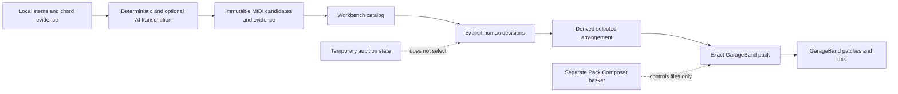

# Sunofriend technical tour

This tour is for a developer who wants to understand, review and extend
Sunofriend rather than merely operate it. It starts with the system model and
then follows real code paths. The aim is to make the next design idea easier to
form without hiding uncertainty behind a large generated diff.

The optional **Developer Inspector** described below is a small learning
environment for the Workbench. It exposes application operations and state
transitions. It is not a Python line debugger, evaluator, shell, SQL editor or
filesystem browser.

## The system in one picture



There is deliberately no single arrow labelled “choose the best model.” A
specialist converter, analytical tracker, conditioned AI run or reviewed
repair can be useful for a different instrument or phrase. Sunofriend retains
those alternatives and asks the listener to decide.

The most important architectural separation is:

| Layer | Durable? | What it means |
| --- | --- | --- |
| Source and candidate evidence | Content-addressed | What was analysed or generated |
| Decision event history | Append-only SQLite | What the listener explicitly decided |
| Derived current selection | Recomputed | Which current main and optional parts are active |
| Pack Composer basket | Separately append-only | Which eligible files enter one ZIP |
| Audition and view controls | Browser/process memory | What is playing or visible now |
| Generated previews and streams | Rebuildable cache | Listening aids, not preference evidence |

## 1. CLI and application entry points

### Intuition

The CLI is an adapter over deterministic operations. A command validates its
arguments, calls the relevant module and prints or writes the operation's
result. Code that performs musical analysis should not be reimplemented inside
an argument handler.

### Code path

1. [`cli.build_parser`](../src/sunofriend/cli.py) declares the public command
   surface.
2. [`cli.main`](../src/sunofriend/cli.py) parses the request and dispatches to
   a narrow `_run_*` adapter.
3. The adapter calls an application module such as
   [`listen_all.run_listen_all`](../src/sunofriend/listen_all.py),
   [`pipeline.run_remake`](../src/sunofriend/pipeline.py) or
   [`workbench_server.run_workbench`](../src/sunofriend/workbench_server.py).
4. The operation returns structured evidence. The CLI reports it and preserves
   its exit status.

### Invariant

CLI names, options, exit codes and JSON schemas are compatibility surfaces.
Private helpers beginning with `_` are not an integration API.

### Tests to read

- [`tests/test_cli_basics.py`](../tests/test_cli_basics.py)
- [`tests/test_listen_all_contract.py`](../tests/test_listen_all_contract.py)
- [`tests/test_pipeline.py`](../tests/test_pipeline.py)

## 2. Instrumental transcription and provenance

### Intuition

An isolated stem contains imperfect evidence. `exact`, `repair` and
`reconstruct` describe different claims about a note. The system must not turn
a plausible reconstruction into an observed fact merely because it sounds
musical.

### Code path

1. [`listen_all.run_listen_all`](../src/sunofriend/listen_all.py) inventories
   supported stems and creates one bounded output tree.
2. Drum roles use
   [`transcribe_drums.transcribe_drum_stem_detailed`](../src/sunofriend/transcribe_drums.py),
   which measures onset and spectral evidence before assigning drum-family
   pitches.
3. Pitched roles use
   [`transcribe_pitched.transcribe_pitched_stem`](../src/sunofriend/transcribe_pitched.py).
   Bass contour selection and keys-role separation remain explicit specialist
   policies rather than generic “music intelligence.”
4. [`conversion.provenance_for_notes`](../src/sunofriend/conversion.py) and
   `write_note_provenance` preserve the source of each published decision.
5. Evaluation and report artifacts are written beside MIDI rather than folded
   into one opaque score.

### Invariant

Source files are not replaced. Published variants retain their policy and
provenance, and uncertain alternatives remain inspectable.

### Tests to read

- [`tests/test_listen_all_contract.py`](../tests/test_listen_all_contract.py)
- [`tests/test_pipeline.py`](../tests/test_pipeline.py)
- [`tests/test_drums_v2.py`](../tests/test_drums_v2.py)
- [`tests/test_pitched_v2.py`](../tests/test_pitched_v2.py)

## 3. Vocals and optional AI challengers

### Intuition

Singing produces a continuous pitch contour, while MIDI requires discrete note
boundaries. Sunofriend therefore separates pitch observations, boundary
hypotheses, decoded notes, repeated-phrase repair and human correction. Model
agreement is evidence, not certainty.

### Code path

1. [`vocal.extract_consensus_pitch_frames`](../src/sunofriend/vocal.py)
   combines independent frame evidence while retaining disagreement.
2. [`vocal.transcribe_vocal_melody`](../src/sunofriend/vocal.py) converts the
   contour into a conservative editable melody.
3. [`vocal.repair_repeated_phrases`](../src/sunofriend/vocal.py) may restore
   only source-supported material.
4. Phrase review and guide modules publish separate alternatives for explicit
   correction; they do not rewrite raw tracker evidence.
5. Optional model requests are described by immutable types in
   [`ai_runtime.py`](../src/sunofriend/ai_runtime.py) and executed through the
   isolated [`ai_worker.py`](../src/sunofriend/ai_worker.py). Checkpoint,
   request, runtime and output hashes remain part of the run evidence.

### Invariant

AI output is a separately auditionable challenger. Cache reuse, model reuse,
label agreement and faster execution do not promote a musical candidate.

### Tests to read

- [`tests/test_vocal.py`](../tests/test_vocal.py)
- [`tests/test_vocal_trackers.py`](../tests/test_vocal_trackers.py)
- [`tests/test_ai_runtime.py`](../tests/test_ai_runtime.py)
- [`tests/test_ai_matrix.py`](../tests/test_ai_matrix.py)

## 4. Building the Workbench catalog

### Intuition

The Workbench does not transcribe audio. It presents already existing evidence
through a verified catalog. A catalog record binds an identity to exact bytes,
so a file that changes underneath a review fails closed.

### Code path

1. [`workbench_catalog.build_workbench_catalog`](../src/sunofriend/workbench_catalog.py)
   reads the project and explicitly supplied candidate roots or catalog.
2. Source and MIDI records contain size and SHA-256 evidence.
3. Candidate ordering and the primary/advanced split are deterministic display
   policy, not a preference ranking.
4. [`workbench_catalog.public_catalog`](../src/sunofriend/workbench_catalog.py)
   removes private paths before browser presentation.
5. [`workbench_catalog.media_files`](../src/sunofriend/workbench_catalog.py)
   creates the allow-list from which the loopback server can serve media.

### Invariant

The browser cannot nominate an arbitrary local path. Changed, missing or
out-of-root evidence is rejected rather than silently rediscovered.

### Tests to read

- [`tests/test_workbench.py`](../tests/test_workbench.py)
- [`tests/test_workbench_privacy.py`](../tests/test_workbench_privacy.py)
- [`tests/test_workbench_ai_execution_provenance.py`](../tests/test_workbench_ai_execution_provenance.py)

## 5. Append-only decisions and derived state

### Intuition

The SQLite database records what happened. It does not store one mutable
“answer” row. Current state is a fold over the event history, which makes
superseded choices and terminal no-selection barriers explainable.

### Code path

1. [`WorkbenchStore.append`](../src/sunofriend/workbench_store.py) validates and
   inserts one `candidate_decision`, `stem_outcome`, `role_tag` or historical
   `candidate_auditioned` event.
2. [`WorkbenchStore.events`](../src/sunofriend/workbench_store.py) reads the
   ordered history.
3. [`WorkbenchStore.current_state`](../src/sunofriend/workbench_store.py) folds
   that history over the current catalog.
4. A later main choice makes the earlier main inactive without deleting its
   event.
5. `none_usable` and `cannot_tell` clear active main/optional selections. A
   later explicit main or optional choice clears the barrier but does not
   resurrect older optional choices.
6. [`workbench_home.build_workbench_home`](../src/sunofriend/workbench_home.py)
   derives path-free progress and one navigation-only next action.

### Worked state example

```text
event 1: Candidate A -> optional       active: A optional
event 2: Candidate B -> main           active: A optional, B main
event 3: stem -> none_usable           active: none
event 4: Candidate C -> main           active: C main only
```

Event 3 does not delete events 1 and 2. Event 4 does not revive Candidate A.

### Invariant

Existing decision rows are never updated or deleted. Current exportability is
derived from the latest valid state, not from the presence of an old positive
event.

### Tests to read

- [`tests/test_workbench.py`](../tests/test_workbench.py)
- [`tests/test_workbench_home.py`](../tests/test_workbench_home.py)
- [`tests/test_workbench_export.py`](../tests/test_workbench_export.py)

## 6. Loopback server, browser and privacy boundary

### Intuition

Workbench is a private local presentation layer. The server owns file and
selection identities; the browser receives bounded projections and random
capability URLs. Browser controls do not become authority merely because they
are convenient to manipulate.

### Code path

1. [`workbench_server.create_workbench_server`](../src/sunofriend/workbench_server.py)
   binds only to `127.0.0.1` and creates a per-launch token.
2. Request handlers validate exact key sets, identifiers and current hashes.
3. [`workbench_privacy.path_free_browser_state`](../src/sunofriend/workbench_privacy.py)
   removes path-like role values from the browser projection without rewriting
   private history.
4. The browser loads the packaged
   [`workbench.html`](../src/sunofriend/workbench.html), transport JavaScript and
   visualization JavaScript.
5. Playback, zoom, lane visibility, mute, solo and attenuation remain
   temporary browser state. They append no decision and never enter a pack.

### Invariant

GET, navigation, retry and audition controls have zero musical, feedback and
export effects. There is no upload or submission endpoint.

### Tests to read

- [`tests/test_workbench_privacy.py`](../tests/test_workbench_privacy.py)
- [`tests/test_workbench_home_ui.py`](../tests/test_workbench_home_ui.py)
- [`tests/test_workbench_decoded_ui.py`](../tests/test_workbench_decoded_ui.py)
- [`tests/test_packaged_workbench_resources.py`](../tests/test_packaged_workbench_resources.py)

## 7. Timelines, transport and rebuildable artifacts

### Intuition

Visual and audible comparisons are views of evidence. They must stay useful
for long songs without becoming a hidden editor or selection system.

### Code path

1. [`workbench_timeline.build_stem_timeline`](../src/sunofriend/workbench_timeline.py)
   projects a bounded source waveform and unchanged MIDI note rectangles.
2. [`workbench_timeline.build_arrangement_timeline`](../src/sunofriend/workbench_timeline.py)
   uses only the server-derived active selection.
3. [`WorkbenchArtifacts`](../src/sunofriend/workbench_artifacts.py) renders
   content-addressed neutral previews and exact decoded loops or chunks.
4. Precise comparison and canonical arrangement transports use one Web Audio
   clock. The arbitrary full-song mixer is explicitly coarser HTML-media
   playback.
5. Cache eviction loses no musical decision. An artifact can be rebuilt from
   verified source records and current state.

### Invariant

Timeline construction, rendering, play, switch, seek and cache activity do not
rank candidates or alter source MIDI. Stale work cannot replace evidence for a
newer selection.

### Tests to read

- [`tests/test_workbench_timeline.py`](../tests/test_workbench_timeline.py)
- [`tests/test_workbench_decoded_loop_server.py`](../tests/test_workbench_decoded_loop_server.py)
- [`tests/test_workbench_decoded_stream_server.py`](../tests/test_workbench_decoded_stream_server.py)
- [`tests/test_workbench_transport_js.py`](../tests/test_workbench_transport_js.py)
- [`tests/test_workbench_visualization_js.py`](../tests/test_workbench_visualization_js.py)

## 8. Exact GarageBand pack and acceptance boundary

### Intuition

The final ZIP is a reproducible handoff, not a render of whatever happened to
be audible in the browser. Musical selection and file inclusion remain two
separate explicit acts.

### Code path

1. [`workbench_artifacts.selected_candidates`](../src/sunofriend/workbench_artifacts.py)
   derives active main/optional parts from current state.
2. `garageband_pack_plan` derives eligible files and the safe source-audio
   default.
3. [`canonical_garageband_pack_basket`](../src/sunofriend/workbench_artifacts.py)
   validates one explicit basket. Its revision is stored separately from
   musical events.
4. `build_garageband_pack` verifies current catalog and selection evidence,
   copies numbered MIDI byte-for-byte, optionally creates a clearly labelled
   proxy and writes the receipt.
5. [`verify_garageband_pack_archive`](../src/sunofriend/garageband_pack_acceptance.py)
   independently verifies member identities, sizes and hashes without
   extracting the ZIP.
6. [`resolve_garageband_pack_acceptance_review`](../src/sunofriend/garageband_pack_acceptance.py)
   checks the user's reviewed export against those exact bytes. It changes no
   project state.

### Invariant

Rejected, unreviewed, needs-correction and superseded MIDI cannot enter the
pack. Numbered selected MIDI is unchanged. Source audio is excluded unless the
user separately opts in.

### Tests to read

- [`tests/test_workbench_pack_store.py`](../tests/test_workbench_pack_store.py)
- [`tests/test_workbench_pack_artifacts.py`](../tests/test_workbench_pack_artifacts.py)
- [`tests/test_workbench_pack_server.py`](../tests/test_workbench_pack_server.py)
- [`tests/test_garageband_pack_acceptance.py`](../tests/test_garageband_pack_acceptance.py)

## 9. Clip library, reuse proposal and immutable transforms

### Intuition

A Clip is a canonical musical document, not the original Standard MIDI File
byte stream. Reuse, transformation and current-song selection are three
different state planes. The Workbench must never turn “I listened to this
Clip” into “replace the song with it,” or turn “create an alternative” into a
mutation of its parent.

### Code path

1. [`MidiClip`](../src/sunofriend/clip.py) stores notes, chords, instrument,
   timing, provenance and immutable lineage. `MidiClip.child()` allocates a
   child revision with an exact parent and `TransformRecipe`.
2. [`ClipLibrary`](../src/sunofriend/library.py) keeps searchable SQLite
   metadata beside content-addressed canonical JSON objects. Normal Phase 6
   browse uses independent application and SQLite read-only guards.
3. [`WorkbenchClipService`](../src/sunofriend/workbench_clips.py) verifies the
   passed acceptance result, exact accepted ZIP, complete catalog, every object
   hash and every parent relationship before returning path-free browse/detail
   projections or rebuildable audition artifacts.
4. [`WorkbenchClipReuseService`](../src/sunofriend/workbench_reuse.py) stores
   explicit immutable-object placements in a separate append-only proposal.
   It pins the complete library state but never writes that library.
5. [`WorkbenchClipTransformService`](../src/sunofriend/workbench_transform.py)
   first constructs an in-memory, zero-effect before/after projection for one
   same-mode key or BPM request. Only an exact projection hash, parent object
   and expected library state can authorise creation.
6. The controlled library append compares the catalog state while holding the
   SQLite write transaction, writes one immutable child object/row and removes
   an unreferenced staged object if the transaction fails. The read service
   adopts the new state only after re-verifying that every prior object is
   unchanged and the expected child is the sole addition.
7. `workbench_server.py` exposes the transform routes only behind
   `--enable-clip-transforms`. That flag and `--enable-clip-reuse-plan` are
   mutually exclusive because the latter deliberately pins the entire library
   generation.
8. `workbench_clips.js` keeps form drafts and projections in browser memory.
   Editing invalidates a projection; a conflict reloads detail once and never
   retries a create request.
9. [`WorkbenchClipCorrectionService`](../src/sunofriend/workbench_correction.py)
   opens under its own `--enable-clip-corrections` gate. It projects an exact
   half-open 480-TPQ note window, binds each note index to the complete parent
   object/note payload and accepts one bounded explicit correction kind. The
   published pitch-v1 serializer remains frozen; an explicit velocity request
   dispatches to
   [`WorkbenchClipVelocityCorrectionService`](../src/sunofriend/workbench_velocity.py),
   which changes attack velocity only and also supports drum Clips. Increment
   6.3c is complete with the separate
   [`WorkbenchClipDeletionCorrectionService`](../src/sunofriend/workbench_deletion.py):
   `note_delete_patch` retains operation `delete_clip_notes` and removes only
   explicitly marked existing notes from pitched or drum Clips. Before
   projection every policy proves that all retained note, chord, tempo and
   metadata events fit the deterministic Standard MIDI File encoding limits.
   Increment 6.3d dispatches `note_onset_shift_patch` to
   [`WorkbenchClipOnsetCorrectionService`](../src/sunofriend/workbench_onset.py).
   It moves 1–64 exact existing pitched or drum intervals to explicit integer
   targets within ±480 ticks and makes no timing inference or quantisation.
   Increment 6.3e dispatches `note_end_shift_patch` to
   [`WorkbenchClipDurationCorrectionService`](../src/sunofriend/workbench_duration.py).
   It keeps Note On fixed and moves only 1–64 explicit Note Off events within
   ±480 ticks, with a minimum one-tick duration.
10. A correction projection changes nothing. Exact creation reuses the
    sole-child compare-and-swap, while a recognized correction recipe can be
    revalidated only through the service-level restart verifier, which rebuilds
    the historical window hash and operation-specific before/after summary from
    its exact retained parent. One child is pitch, attack velocity, deletion or
    onset or note-end shift, never a mixture. Pitch, velocity, onset and
    note-end shift retain note count. Deletion requires
    1–64 exact refs, at least one surviving note, unchanged beat/export/source
    horizons and normalized child MIDI equal to normalized parent MIDI minus
    exactly the named intervals. Duplicate, cascade, horizon and only-note
    cases are blocked. Every survivor plus chords, tempo, key, instrument and
    provenance is asserted unchanged.
    Onset shift moves Note On and Note Off by one equal non-zero delta of no
    more than 480 ticks, preserves MIDI duration, pitch and expression, and
    requires both intervals inside the phrase window. Musical mode preserves
    duration beats and microtiming; stem-locked mode requires zero microtiming
    and preserves source duration. Both paths round-trip to exact ticks and
    retain beat/export/source horizons.
    Note-end shift leaves Note On fixed, changes duration and Note Off only,
    and requires both source and target intervals in the window. Musical mode
    changes duration beats and recomputes source end; stem-locked mode requires
    zero microtiming, changes source end at export BPM and derives duration
    beats. The next same-pitch onset and all horizons remain fail-closed.

The 6.3c browser interaction keeps focus separate from intent: focusing or
navigating a piano-roll note changes no draft, **Mark for removal** changes the
temporary draft, **Review temporary note removal** is zero-write and only
**Create immutable corrected Clip** may append a child. It makes no noise
classification, draft audition, ranking, selection, placement or export. The
public window, diff and restart-summary serializers also redact path-like
articulation values. Normalized cascade and beat/export/source-horizon
regressions fail before child creation. The copied-Lidl completion exercise
removed one exact channel-9 Snare interval, changed Clip and normalized-MIDI
counts from 249 to 248, replayed with every effect false and reconstructed
deterministic child MIDI at SHA-256
`1e3e20d607c62b7b6c06d210b9f3fa90c1f126166aadcf86d82d870d83f5535c`.
The focused integrated suite passed 81 tests, the independent audit passed 49
and the complete repository suite passed 970 tests. The single warning is the
existing `resampy`/`pkg_resources` deprecation notice. Increment 6.3c is
complete; broader Phase 6 remains in progress.

The 6.3d browser interaction adds **Move existing note earlier or later**. A
user applies an exact `target_start_tick`, reviews the signed tick and
export-time delta, then explicitly creates an immutable child. Typing or focus
alone does not alter the draft. Row eligibility reports only
`context-note-outside-window`, `duplicate-export-note-on`,
`normalized-lifetime-dependent` or
`unsupported-stem-locked-microtiming`; target overlap/cascade, window escape,
negative/VLQ overflow and global-horizon movement fail the request. Preview is
all false; fresh creation may set only library/child/correction/onset/timing
effects, and replay/restart are all false. The capability remains v2 with
generic `timing: false`; the explicit onset kind and 480-tick maximum are the
client feature test. Pitch, velocity and deletion public contracts remain
frozen. Increment 6.3e now completes the separately bounded note-end/duration
slice. Release velocity, note insertion and continuous expression remain
deferred.

The completed 6.3d exercise used
`work/ai-bakeoff/lidl-phase6-onset-smoke-v1`. Parent Keys Clip
`a6112b69031a233a54531128dca4925f32d5b3b32ce5552daaa6393d0138d8aa`
(object
`d37975c915e790e290650cf5b48e316c19318c28bd1a50c3de342e889180356a`)
produced child
`sf-correction-495e77ba31528090cc979465459d50acf9ad8f4e36f8a783e9f30398703d5727`
(object
`e70a297a01be3a086f5fa05e8dabb47975e6b634dd1adfc4e8c17565524932a2`).
The 12-Clip source stayed unchanged and only the copy grew to 13. Both Clips
have 1,727 notes; channel-1 pitch 66 moved 442–873→472–903, +30 ticks or
+31.512625 ms, while retaining its exact 431-tick duration and the existing
462.6458333333333-beat, 222070-tick and 233.26695445833332-second horizons.
Fresh creation set exactly `library_mutated`, `child_clip_created`,
`correction_applied`, `note_onset_changed` and `note_timing_changed`; replay
and restart were all false. Parent and child MIDI SHA-256 values were
`e741334f8dfc1421850618d088b382a5fc051fc1fada4797ac742a1dcd201036`
and
`20b1298550568bb51cdb98c4d8e342a4ac27e22b2cd58f5e03f48f062cad7d9b`.
The focused suite passed 101 tests and the adversarial audit passed 17
onset-specific plus 82 broader correction/server/UI tests. The complete
repository suite passed 990 tests in 282.58 seconds with the one existing
third-party `resampy`/`pkg_resources` deprecation warning. This proves the
engineering contract; no human preference or musical-quality result was
recorded.

The 6.3e browser interaction adds **Change existing note length (MIDI Note
Off)**. An exact `target_end_tick` changes the draft only after Apply, then the
user separately Reviews and Creates. The complete source and target intervals
must stay in the window; the target differs by a non-zero value within ±480
ticks and leaves at least one tick after the unchanged Note On. The four onset
row block reasons are reused. Crossing the next same-pitch onset, normalized
lifetime cascade and global-horizon movement fail closed. Musical and
stem-locked dual-time paths round-trip to the exact Note Off without changing
onset, pitch, expression or count.

The public note-end schemas are
`sunofriend.workbench-clip-note-end-window.v1`,
`sunofriend.workbench-clip-note-end-preview.v1`,
`sunofriend.workbench-clip-note-end-result.v1` and
`sunofriend.workbench-clip-note-end-summary.v1`, with retained operation
`shift_note_ends`. Capability v2 keeps
generic `timing: false` and advertises 480 maximum delta plus one-tick minimum
duration. Preview/replay/restart are all false; only
library/child/correction/duration/timing effects are true on fresh creation.
No timing, phrasing or quality judgement is inferred. The browser's restart
summary validator fails closed against malformed child, lineage, timing, diff
or effect evidence rather than filling gaps from current detail state.

The ignored Lidl smoke at
`work/ai-bakeoff/lidl-phase6-duration-smoke-v1` has report SHA-256
`d0141814026c434c4702a9c7dcd00466fd6502921bb5e0fa1b437657d675bb77`.
The source stayed at 12 Clips and the copy grew to 13. Parent Keys Clip
`a6112b69031a233a54531128dca4925f32d5b3b32ce5552daaa6393d0138d8aa`
(object
`d37975c915e790e290650cf5b48e316c19318c28bd1a50c3de342e889180356a`)
produced child
`sf-correction-067bbbfc65e112ba175da84648f2b74f40b5cb5137eabb5f91ff28f4af9f03f6`
(object
`14fee0a6ac7dbc29043199e30041adc93c59eda34fccd8a6a9a15d972846281f`).
Both contain 1,727 notes. Channel-1 pitch 66 changed 442–873→442–903,
+30 ticks/+31.512625 ms and duration 431→461 ticks, while horizons stayed
462.6458333333333 beats, 222070 ticks and 233.26695445833332 seconds. Parent
MIDI was
`e741334f8dfc1421850618d088b382a5fc051fc1fada4797ac742a1dcd201036`;
child/repeat were
`27d5be64a4e992548c6a58139f8a7fb677e3d7f4cefc55ea4e2fc163b74fa918`.
The focused integrated correction/UI suite passed 133 tests, the smoke passed
and the complete repository suite passed 1009 tests with the one existing
`resampy`/`pkg_resources` deprecation warning. This is engineering evidence
only, not a human preference.

### Worked state example

```text
parent Clip A (C major, 113 BPM)
  |
  +-- explicit key projection       durable effect: none
  +-- create child B (D major)      durable effect: one Clip version
        |
        +-- explicit BPM projection durable effect: none
        +-- create child C (125 BPM) durable effect: one Clip version

reuse proposal still references exact A until the user explicitly removes A
and places B or C in a separate reuse-plan launch
```

Musical BPM timing retains beat positions and changes elapsed time.
Stem-locked timing retains source seconds and changes beat positions. They are
different transformations, so the timing choice is part of the immutable
recipe rather than a hidden export option.

### Invariant

A fresh explicit create action adds one child and changes nothing else. An
exact retry is an idempotent replay of the existing child, with no new append
and every effect false. Parent content, analytical/AI alternatives, Workbench
decisions, current selection, reuse placements, pack basket, instruments,
feedback and source files remain unchanged. A revision number is not a unique
branch identity; exact Clip, object and parent hashes are authoritative. At
the accepted 10,000-Clip boundary the capability disables new transform review
and creation.

### Tests to read

- [`tests/test_clip_v1.py`](../tests/test_clip_v1.py)
- [`tests/test_workbench_clips.py`](../tests/test_workbench_clips.py)
- [`tests/test_workbench_reuse_server.py`](../tests/test_workbench_reuse_server.py)
- [`tests/test_workbench_transform.py`](../tests/test_workbench_transform.py)
- [`tests/test_workbench_transform_server.py`](../tests/test_workbench_transform_server.py)
- [`tests/test_workbench_clips_js.py`](../tests/test_workbench_clips_js.py)

## Use the Developer Inspector

Start the normal Workbench with the same project, candidate roots, optional
catalog and persistent state directory, then add the explicit developer flag:

```bash
sunofriend workbench \
  "/absolute/path/to/stem-project" \
  --candidate-root "/absolute/path/to/candidate-results" \
  --catalog "/absolute/path/to/workbench-catalog.json" \
  --state-dir "/absolute/path/to/workbench-state" \
  --developer-inspector \
  --open
```

Omit `--catalog` when the project does not use an explicit catalog. The flag is
off by default. When enabled, Workbench exposes a **Developer Inspector** view
inside the same token-protected loopback session.

Use it as a state microworld:

1. Read the operation map before interacting with the project.
2. Make one ordinary Workbench decision, such as **Use as main**.
3. Open the Inspector and select the corresponding operation.
4. Follow its application-level steps and `module.function` references.
5. Scrub the event sequence from state 0 through the latest event.
6. Compare the before and after derived state.
7. Use Play, zoom or mute, then confirm that the durable event count and pack
   basket did not change.
8. Save or change the Pack Composer basket and confirm that its revision moves
   independently from musical decisions.

The Inspector is read-only. Its own controls do not append an event, save a
basket, build a pack, render audio, run a model or mutate a file. Its bounded
operation trace is local and temporary; it is not included in the private
review, contribution preview, GarageBand ZIP or acceptance result. It uses
path-free projections and does not expose private listening notes or an
arbitrary local file.

Its server projection uses the
`sunofriend.workbench-developer-snapshot.v1` schema. Treat that document as a
read-only explanation of current application state, not a new durable state
store. The implementation contract is covered by
[`tests/test_workbench_developer.py`](../tests/test_workbench_developer.py).

The Inspector explains application operations and state transitions. It does
not step through Python statements, evaluate expressions, open a shell, edit
SQLite, browse the filesystem or expose model tensors. Use a normal IDE or
debugger when line-level diagnosis is actually required.

## How to review a change without accumulating cognitive debt

Read a change in this order:

1. **Background:** which layer and invariant does it belong to?
2. **Intuition:** what user-visible or evidence-visible behaviour should
   change?
3. **Call path:** which public adapter, application operation and pure helpers
   run?
4. **State:** what may persist, what is derived and what must remain temporary?
5. **Evidence:** which source hashes, schemas or lineage claims change?
6. **Failure:** what stale, malformed or incomplete input must fail closed?
7. **Tests:** which test demonstrates the new behaviour and which regression
   proves that old evidence was not mutated?

A useful review should let you explain the change and predict a representative
state transition before approving it. Passing tests is necessary, but it does
not replace that understanding.

## Safely add a new transcription or review method

Use this sequence for a small extension:

1. Define the musical question and the role/excerpt boundary. Do not start with
   an automatic global-winner requirement.
2. Add deterministic core logic in a focused module. Keep filesystem, CLI and
   UI code outside the algorithm where practical.
3. Write a fresh immutable result containing the request, inputs, versions,
   hashes, raw evidence, derived MIDI and explicit effects.
4. Preserve the unchanged source and existing candidates. Label the new result
   as an alternative or diagnostic until listening evidence supports more.
5. Add a narrow CLI adapter and command help. Reuse existing validators and
   atomic fresh-output behaviour.
6. Add the candidate through explicit catalog provenance. Do not let its score,
   label, cache state or display position choose it.
7. Add only a path-free browser projection. Never accept a browser-supplied
   local path or arbitrary candidate roster.
8. If a new persistent action is genuinely needed, define and validate one
   typed append-only event. Do not persist a play, zoom or hover action.
9. Keep generated listening artifacts content-addressed and rebuildable. Verify
   inputs before and after expensive work when selection can change.
10. Add unit, contract, privacy, no-effect and packaged-resource tests, then
    update the relevant guide and the Agent Skill.

Do not combine a new model, state-store rewrite, UI redesign and MIDI codec
change in one increment. The golden songs and synthetic fixtures are useful
only when each change has a bounded causal surface.

## Developer review checklist

Before suggesting or approving the next change, be able to answer:

- Where do source and candidate identities come from?
- Which exact operation writes durable state?
- Can a terminal no-selection outcome leave old MIDI exportable?
- Why can audition activity not become a preference signal?
- Which selection is server-derived rather than browser-supplied?
- Which MIDI bytes are authoritative and which artifact is only a proxy?
- What makes a cache safe to discard?
- Where are paths and private notes removed from browser data?
- Which test would fail if this invariant regressed?
- How would the new idea remain an explicit alternative rather than an
  automatic winner?

These are the concepts assessed by the technical tutorial and its 10-question
quiz before the two human acceptance checks.
