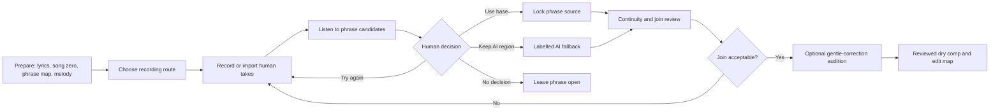

# Whole-song vocal comping web workflow

Prepared: 16 August 2026

Status: product and engineering design with the first reusable phrase-session
and browser-recording increment implemented. It does not yet select, assemble,
correct or render a complete vocal comp.

## Implementation checkpoint — 20 August 2026

The reusable W1/W2 foundation is now implemented on the current research
branch as a dedicated loopback Vocal Session, separate from the larger MIDI
Workbench. It can reopen an exact Musical State, show its reviewed phrase
roster, audition hash-bound human sources and a reference-vocal cue, restore
local draft notes and fold only explicit phrase decisions from an append-only
owner-only store. Playback, dwell and drafts remain zero-authority. The page
cannot yet assemble, tune, correct or train on audio.

The current private *The Heart Sees* pilot has two reviewed phrases, the two
historically preferred common-zero human sources and the exact full-song AI
vocal admitted as an audition and guided-recording cue. The reference is not
AI-fallback render authority. Earlier decisions were deliberately not migrated
into the changed state: each phrase starts open for explicit revalidation.

The page now treats recording as an iterative workflow rather than a terminal
`record_again` decision. Each human source has separate **Play** and **Use**
actions, the active audition is visible, and seeking waits for media metadata.
The singer can hear the original or a human attempt over the exact phrase,
surrounding reviewed section or song-time scope. A saved phrase decision can
be explicitly reopened, or a replacement recording can begin without deleting
the earlier decision. Reopen events and capture-round transitions preserve the
append-only history.

This is the immediate two-phrase vertical slice, not yet the complete
hundred-phrase interface. The next scaling increment is a candidate vault that
keeps rejected and unsaved-to-comp recordings without creating a fresh Musical
State for every audition, plus filters, **Next phrase needing me**, keyboard
shortcuts and section-level checkpoints. A later audition plan must bind the
backing/full-mix asset so phrase, section and song playback can compare the
working comp in music context; the current scope controls audition vocal
sources only.

Before guided pickup recording is admitted, the data contract must distinguish
the immutable bounded microphone capture from its placement on the song clock.
The current source map assumes full-song/common-zero takes. Browser-created
full-song files padded with silence will not become the canonical workaround;
the preferred next increment retains the phrase capture plus guard frames and
records an explicit source-local window and destination-song placement.
The path-free `browser-vocal-capture.v1` receipt enforces that geometry,
the reviewed phrase and exact cue/audio hashes while keeping the stored capture
unreviewed and ineligible for selection, rendering, correction or training.
Admission is now implemented as `sunofriend.vocal-performance-state.v3`: it
copies the exact receipt and WAV into a fresh owner-only state, retains the
complete parent state and earlier evidence unchanged, and exposes the pickup
only to its bound phrase. Existing common-zero full takes retain their v2
decision and source-map shape.

The dedicated Vocal Session now also has an opt-in browser microphone path for
a state with an exact, hash-verified reference-vocal cue. It plays the bounded
cue through headphones, records mono PCM24 with browser processing requested
off, preserves half-second source-local guards, and writes nothing until the
singer presses **Save this recording locally**. The server then verifies the
WAV, cue, phrase, Musical State and placement before creating a fresh v3 state.
Listening, stopping, discarding and unsaved attempts remain zero-write and
zero-authority. The placement records the intended cue clock only: it is not a
claim that browser/device latency has been measured or corrected.

The browser now supports an explicit iterative transition when a new capture is
saved after phrase decisions already exist. The confirmation binds the exact
parent Musical State and exact ordered decision hashes. The capture creates a
fresh child state, reopens its target phrase, and recreates only other decisions
whose reviewed phrase geometry, selected source ID and selected source SHA-256
still validate unchanged. The original decisions remain immutable in their
parent session and the owner-only append-only transition ledger records each
parent-to-child decision hash. A missing, stale or altered transition fails
before the capture directory is created. This is explicit revalidation, not a
silent migration or a claim that the singer listened again.

The transition still creates no comp render, join, correction or training
label. Playback, unsaved attempts and form drafts have no transition or musical
authority. The current increment supports additive browser phrase captures
only; changed lyrics, phrase timing, reference identity, imported takes or
source audio require a separate review workflow rather than this transition.

Companion documents:

- [Implementation and evaluation plan](VOCAL_COMPING_IMPLEMENTATION_PLAN.md)
- [Current ranked-evidence pilot](VOCAL_COMPING_PILOT.md)
- [Product and technical design](VOCAL_COMPING_DESIGN.md)

## Product decision

The recommended whole-song workflow is **a broad human base performance plus
guided phrase pickups**.

This hybrid preserves breath, tone, emotion and room continuity across the
song while retaining the low-stress browser experience that made individual
pickup recording productive. The software should help the singer replace weak
phrases, not encourage an automatic word-by-word mosaic.

The initial product unit is a complete musical phrase or lyric line. A word or
syllable becomes an edit unit only as a reviewed rescue operation with safe
boundaries. The user can always return `no_acceptable_candidate` and record
again.

## Three recording options

| Option | Strength | Cost or risk | Product role |
| --- | --- | --- | --- |
| Guided phrase-by-phrase | Low stress, focused pitch/range effort, immediate feedback | Slow; can lose long-range emotional flow | Always available as Recording mode |
| Several complete takes, then repair | Natural breaths, timbre and expression continuity | Requires at least one broadly usable full take | Available for confident singers and imported sessions |
| One base pass plus guided pickups | Combines continuity with attainable local improvements | Needs a clear song map and transition review | Recommended default |

The user chooses a route during session setup, but all routes use the same
phrase map, take store, review decisions and renderer. A session may switch
from full-take to guided pickup mode without copying or flattening its sources.

## End-to-end experience



The app should reopen exactly where the singer stopped. Recording ten minutes
today and ten tomorrow must be a normal workflow, not a recovery case.

## One-screen workspace

The desktop layout has three stable regions.

### 1. Song map

The left rail shows every musical phrase in order, grouped by song section.
Each phrase has one visible state:

- `not_prepared`: lyrics, timing or target still needs review;
- `ready_to_record`: the phrase can be recorded safely;
- `has_attempts`: at least one aligned take exists;
- `needs_pickup`: no attempt is yet acceptable;
- `candidate_chosen`: a phrase source is selected but its transitions are not;
- `join_review`: adjacent choices are ready for contextual listening;
- `locked`: source and joins are explicitly accepted;
- `ai_fallback`: the user chose a visibly labelled authorised AI region; or
- `blocked`: a technical or source-integrity problem prevents progress.

Progress counts explicit decisions, not recordings or audio playback. A phrase
with ten takes and no choice remains open.

Filters should include `needs me`, `ready to record`, `needs join review`,
`human locked`, `AI fallback` and `all`. A singer can work sequentially or jump
to every difficult high/low-range phrase in one session.

### 2. Phrase stage

The centre remains listening- and recording-led:

- canonical lyric phrase in large type;
- two preceding and following lyric lines as dim context;
- phrase waveform and reviewed melody overlay;
- cue selector: backing only, melody guide, authorised AI reference;
- loop with a configurable pre-roll and post-roll;
- microphone input meter and clipping warning;
- record, stop, keep and discard-last controls;
- take tray with neutral labels until the user listens; and
- contextual playback modes: phrase only, with previous phrase, with next
  phrase, and in the backing mix.

No analysis rank is shown initially. After at least one candidate has been
played, the singer may reveal pitch, timing, coverage and signal evidence. The
interface must still avoid a preselected radio button or a “best take” badge.

### 3. Decision panel

The right panel contains explicit actions rather than a generic Save button:

- `Use as phrase base`;
- `Keep as benchmark and record again`;
- `No acceptable human take`;
- `Keep authorised AI here for now`;
- `Defer this phrase`; and
- `Add a note for the next pickup`.

A later continuity stage replaces those actions with `accept join`, `change
left phrase`, `change right phrase`, `move boundary`, `adjust crossfade` and
`record a bridging pickup`.

## Session setup

The setup screen should remain short but enforce the existing evidence gates.

Required:

- canonical lyrics;
- backing/instrumental or full mix used for cue playback;
- reviewed phrase timeline;
- reviewed monophonic melody target;
- song BPM and tuning;
- rights category;
- microphone choice and a ten-second level check; and
- confirmation that imported complete takes share the same song zero.

Optional:

- one or more imported full human takes;
- authorised AI vocal reference;
- section/chorus labels;
- preferred base take; and
- the singer's comfortable range, used only for coaching and workload order.

Automatic lyric, phrase and melody drafts must enter the existing draft-review
flow. Playback cannot silently approve them.

## Recording mechanics

### Common timeline

Every phrase pickup keeps its own short source frame clock plus an explicit
placement on the reviewed song clock. It is not padded to project zero. The
receipt binds:

- session ID and phrase ID;
- the source-local content window and exact reviewed destination;
- pre-roll and post-roll handles;
- sample rate, channel count and sample format;
- cue type and cue gain;
- browser-requested echo cancellation, noise suppression and automatic-gain
  settings;
- microphone label or stable device alias when available;
- clipping and level descriptors; and
- the exact phrase capture hash and any separately authorised derivative.

The cue never enters the recorded vocal. Headphones remain the safe default.

### Loop behaviour

Recommended first defaults, subject to user testing:

- 1.5 seconds of audible pre-roll;
- 250–500 ms preserved input handle before the reviewed phrase;
- 500–900 ms preserved input handle after the phrase;
- optional preceding-phrase pickup cue for entrances;
- automatic stop after post-roll, with a visible manual stop; and
- immediate neutral playback without analysis badges.

The singer can record several attempts without returning to the song map. A
short note such as “stronger last word” persists into the next attempt and may
be cleared explicitly.

### Input-quality coaching

Real-time coaching is limited to observable recording safety:

- too quiet to analyse reliably;
- clipping;
- input not detected;
- likely cue leakage; and
- recording stopped early.

It must not label live singing “bad,” “off-key” or “wrong.” Musical feedback is
shown after a take and framed as target-relative evidence.

## Lyric and melody evidence

Known lyrics are the authority. Speech-to-text may suggest where related
phonetic material occurs, but cannot replace a word, reassign a phrase or
declare an ad-lib to be a canonical lyric.

For each phrase retain:

- canonical words and optional reviewed phonemes/syllables;
- STT observations and uncertainty per source;
- continuous F0 and confidence;
- discrete note candidates per tracker;
- reviewed target MIDI notes;
- voiced/unvoiced and consonant regions;
- timing displacement and coverage;
- signal descriptors; and
- human notes.

Percussive consonants, guttural closures, breaths and intentional unvoiced
regions must be representable as reviewed non-pitch events. Missing stable F0
there is not a melody failure.

## Candidate proposal and global optimisation

The first whole-song release should not automatically choose phrases. It may
order evidence after listening and suggest what to compare next.

When an automatic comp proposal is later enabled, use a base-take-first global
path rather than independently choosing the top score for every phrase.

Conceptually:

```text
total cost =
  phrase fit cost
  + predicted correction cost
  + take-switch penalty
  + join mismatch cost
  + breath discontinuity cost
  + timbre/level discontinuity cost
  + unreviewed-boundary penalty
  + AI-fallback penalty
```

The optimiser should prefer staying with a credible base take and substitute
only where the expected improvement exceeds the continuity cost. It may return
`no_acceptable_candidate`; it must not fill that state with the least-bad take.

The proposal is a new review layer with full provenance. It does not mutate
phrase decisions or become the default render until accepted.

## Natural assembly

### Edit boundary policy

Prefer boundaries in this order:

1. reviewed silence between phrases;
2. stable low-energy breath/noise region;
3. consonant transition reviewed in context;
4. sustained voiced material only as a last resort.

Retain source handles around every candidate. A phrase display window is not
automatically its edit boundary.

### Join preview

For every switch between sources, render several temporary challengers:

- equal-power crossfade with a conservative default;
- shorter and longer fades within safe handles;
- boundary shifted left or right within the reviewed gap; and
- a no-switch base-take control.

Preview previous phrase + join + next phrase both dry and against the backing.
The user may accept one challenger, move the boundary, restore the base take or
request a bridging pickup. Join review is separate from phrase-quality review.

### Global continuity pass

After all phrases have sources, provide three uninterrupted listens:

- dry vocal only;
- vocal against the backing/instrumental; and
- optional human/AI duet balance when authorised AI regions exist.

Flag source switches, large level/timbre steps, repeated breaths, missing
breaths and regions close to phrase edges. Flags request attention; they do not
automatically alter the comp.

## Optional gentle correction

Correction is downstream of source and join approval.

Per locked phrase, offer:

- `off`;
- `gentle centre` for small sustained-note drift;
- `review notes` for explicit note-by-note bounds; and
- `leave expressive movement` for vibrato, scoops and transitions.

The correction preview must preserve consonants and unvoiced events, limit
maximum cents and transition speed, and never time-stretch a phrase by default.
Display original and corrected alternatives at matched loudness. Keep both
renders and the exact correction map.

For notes outside the comfortable range, first propose a new pickup strategy:
different cue, lower backing level, preceding-word pickup or optional key
decision at the project level. Correction should not become the only answer to
a phrase the singer cannot phonate reliably.

## Human/AI duet rules

An AI vocal may be present because the goal is a gradual human replacement or
a deliberate duet. The interface must therefore support three identities:

- `human`;
- `authorised_ai`; and
- `blend`, created only as an explicit mix decision.

AI fallback regions use a different colour and appear in the export edit map.
They are never scored as if they were another human take or silently substituted
when no human candidate passes.

Repeated chorus reuse is also explicit. “Reuse this phrase choice in matching
choruses” creates review proposals for those locations; it does not copy audio
or decisions until each target region is heard in context.

## Local data model

The web UI should be a view over immutable local artifacts rather than a
browser-only database.

### `vocal-comp-session.v1`

- exact project and source hashes;
- phrase-map and target versions;
- active workflow route;
- session progress summary;
- links to attempts and decisions; and
- no embedded raw audio.

### `vocal-comp-attempt.v1`

- phrase/source/take identity;
- exact timeline geometry and source handles;
- capture receipt and audio hashes;
- cue and recording-chain declaration;
- local evidence links; and
- immutable creation timestamp.

### `vocal-comp-phrase-decision.v1`

- exact candidate evidence hash;
- selected source or explicit no-candidate/AI/defer outcome;
- listening note;
- author and timestamp;
- supersedes pointer for later revisions; and
- zero join/correction authority.

### `vocal-comp-join-decision.v1`

- exact adjacent phrase decisions;
- source edit frames, handles and fade geometry;
- accepted preview hash;
- contextual review mode; and
- supersedes pointer.

### `vocal-comp-correction-decision.v1`

- exact locked source render;
- bounded target notes and correction settings;
- accepted original/corrected outcome; and
- reversible map to the dry comp.

The UI may cache form drafts locally for crash recovery, but only explicit
exports/resolutions create authoritative decisions.

## Implementation increments

### W1 — whole-song navigator and session persistence

- Render all reviewed phrases and states in one local page.
- Reuse the current phrase recorder for any selected row.
- Persist attempts and non-authoritative form drafts.
- Resume safely after closing the browser.
- No selection, assembly or correction.

Acceptance: a singer can cover a complete song over multiple sessions and see
which phrases still need work without inspecting folders or a DAW.

Current status: the local page, owner-only drafts, additive phrase capture and
explicit capture-round transition are implemented. Each transition reopens the
recorded phrase and preserves exact immutable decision lineage; it does not
render an assembled vocal.

### W2 — explicit phrase decisions

- Add immutable phrase-decision artifacts.
- Support human base, benchmark/redo, no candidate, defer and AI fallback.
- Provide section and range filters.
- Keep scores hidden until listening.
- No rendered comp.

Acceptance: every phrase has an explicit reviewed state and no visible default
can become a choice.

### W3 — assembly and join workbench

- Preserve source handles and compute safe-boundary candidates.
- Render temporary join challengers and a no-switch control.
- Add immutable join decisions and an uninterrupted dry-comp preview.
- Do not correct pitch.

Acceptance: the dry comp is sample-reproducible from its edit map, contains no
unreviewed source switch and is judged at least as useful as the best broad
human take.

### W4 — optional gentle correction

- Apply correction only to selected, joined regions.
- Protect unvoiced/consonant events.
- Match loudness for original/corrected review.
- Keep reversible maps and uncorrected export.

Acceptance: the singer prefers the corrected challenger in a blind matched
comparison and no accepted word, breath or join becomes less natural.

### W5 — reviewed global proposal

- Add base-take-first path optimisation with switch and join costs.
- Produce a proposal, comparison rationale and unresolved gaps.
- Never replace human decisions automatically.

Acceptance: review time falls below manual from-scratch comping without adding
unacceptable joins or hiding no-candidate phrases.

## Evaluation

Measure the product, not just pitch extraction:

- time to obtain one acceptable phrase;
- number of attempts before a usable benchmark;
- whole-song completion rate;
- time spent navigating versus singing/listening;
- percentage of phrases using the broad base;
- number of source switches and rejected joins;
- number of pickups requested after analysis;
- correction amount and corrected-region count;
- human/AI duration share;
- comparison with the best complete human take; and
- singer stress/enjoyment after each session.

The strongest success signal is that the singer chooses to continue recording
because the loop feels productive. A higher pitch score with a stressful or
confusing workflow is a product failure.

## Decisions that can wait for the next complete-song trial

- exact pre/post-roll defaults;
- whether the default first screen is the song map or the current phrase;
- how many attempts appear before the tray collapses older takes;
- whether an optional coach orders phrases by section, range or urgency;
- default crossfade challenger lengths;
- how much evidence is useful before it becomes distracting; and
- whether the full-song base is recorded in-browser or imported from a DAW.

These should be resolved by using the W1 navigator on one complete owned song,
not by adding preferences before the full workflow exists.
